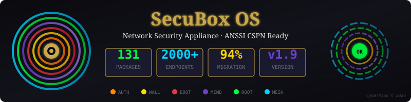

<!--
  SPDX-License-Identifier: LicenseRef-CMSD-1.0
  Copyright (c) 2026 CyberMind — Gérald Kerma <devel@cybermind.fr>
  Source-Disclosed License — All rights reserved except as expressly granted.
  See LICENCE-CMSD-1.0.md for terms.
-->

# SecuBox

<p align="center">
  
</p>

**Your Network Security Appliance — Plug, Protect, Peace of Mind**

[](https://github.com/CyberMind-FR/secubox-deb/releases)
[](https://github.com/CyberMind-FR/secubox-deb/actions/workflows/build-packages.yml)
[](https://github.com/CyberMind-FR/secubox-deb/actions/workflows/build-all-live-usb.yml)
[](https://github.com/CyberMind-FR/secubox-deb/actions/workflows/build-installer-iso.yml)
[](LICENCE-CMSD-1.0.md)

---

## 📡 VILLAGE3B — Cabine Numérique Gondwana ToolBoX

<p align="center">
  
</p>

> **Diagnostic compromission iPhone gratuit · Anonyme · Open Source**
>
> 3 niveaux d'opt-in (R0 bypass complet, R1 analyse passive ✓ recommandée, R2 TLS-break + bandeau).
> Rapport téléchargeable avec 9 widgets metrics : 🌐 connexions · 📡 hôtes · ✅ OK 2xx · 🔒 cert-pinning · 📺 apps · 🍪 trackers · 🌍 pays · 🎯 score · 📱 device.
> Conformité CSPN ANSSI + LCEN. Aucune donnée externe.
>
> - Détails techniques : [docs/AI-HANDOVER-cabine-evolution.md](docs/AI-HANDOVER-cabine-evolution.md)
> - Brief poster + variantes : [docs/marketing/POSTER-grand-public-village3b.md](docs/marketing/POSTER-grand-public-village3b.md)
> - Press kit + candidatures France.gouv : [docs/marketing/PROMPT-claude-presse-gouv.md](docs/marketing/PROMPT-claude-presse-gouv.md)
> - Issue tracking poster : [#497](https://github.com/CyberMind-FR/secubox-deb/issues/497)

### 🕸️ Cartographie sociale — « You Have Been Tracked » (Phase 11)

<p align="center">
  
</p>

> **Le même navigateur, reconnu de site en site.**
>
> En R3 consenti, la cabine corrèle les **cookies tiers** et les
> **fingerprints JA4** par device pour révéler, en temps réel, quels
> acteurs commerciaux reconnaissent votre navigateur à travers les sites
> visités. Un relais ad-tech reliant 4 éditeurs (360yield + seedtag +
> smartadserver + smilewanted via la même IP) saute aux yeux dans le
> graphe force-dirigé.
>
> - Vue per-client : `https://kbin.gk2.secubox.in/social/me` (🕸️ « Ma carto »)
> - Graphe d3 plein écran (pan / pinch-zoom), évidence cross-site,
>   effacement RGPD art. 17, rapport PDF bilingue (Phase 11.C).
> - **Anonyme** : `mac_hash` à sel rotatif 24h, aucune valeur de cookie
>   brute persistée. Tout calculé localement.
> - Tableau opérateur : `admin.gk2.secubox.in/toolbox/#social`.
> - Brief poster : [docs/marketing/POSTER-you-have-been-tracked.md](docs/marketing/POSTER-you-have-been-tracked.md)
> - Plan + design lock : [#502](https://github.com/CyberMind-FR/secubox-deb/issues/502)

---

## 🗡️ kbin — le premier outil du couteau suisse cyber

**kbin** (`kbin.gk2.secubox.in`) est le portail public de la **ToolBoX** SecuBox — la
*cabine numérique* et **première lame du couteau suisse cyber modulaire** de
[cybermind.fr](https://cybermind.fr). On s'y branche, on surfe normalement, et la lame
inspecte et protège le trafic de façon transparente :

| 🗡️ | Lame |
|----|------|
| ⚡ | **Performance transparente** — on ne déchiffre que ce qu'on modifie (SNI-splice sélectif) |
| 🔒 | **Full encrypted** — inspection MITM complète, forge de cert par hôte, fingerprint Chrome uTLS |
| ☠️ | **Injection de poison & smog** — le trafic ad-tech ressort empoisonné, pas seulement bloqué |
| 🚫 | **Bandeau anti-adware** — transparence injectée, immune au CSP, SPA-aware |
| 🛡️ | **Safe browsing** — Vortex DNS + blacklist nft + détection anti-bot |

> **Prochaine lame — 🧅 mode Tor quick-switch ([#683](https://github.com/CyberMind-FR/secubox-deb/issues/683)).**
> Un tap → le surf ressort par le réseau Tor (egress sortant, pseudo-network) : l'inspection
> reste intacte, seule l'**IP de sortie** devient anonyme. Fail-closed, opt-in, sans fuite DNS.

- Use-case : [docs/wiki/Kbin-Toolbox.md](docs/wiki/Kbin-Toolbox.md)
- FAQ : [docs/FAQ-KBIN-TOR.md](docs/FAQ-KBIN-TOR.md)

---

## License — CyberMind Source-Disclosed (CMSD-1.0)

> **Source disclosed, rights reserved.**

This software is released under the **CyberMind Source-Disclosed License v1.0** — a *source-available* license designed for transparency and security auditability while preserving all commercial rights.

| What you CAN do | What you CANNOT do |
|-----------------|-------------------|
| Read and study the source code | Use in production (any environment) |
| Compile for isolated testing/audit | Redistribute or create derivatives |
| Publish security research results | Integrate into other products |
| Quote in academic/journalistic contexts | Provide as hosted service (SaaS) |

**ANSSI CSPN Ready:** The license explicitly authorizes audits by accredited security labs (CESTI, CC equivalents) without prior authorization.

See [LICENCE-CMSD-1.0.md](LICENCE-CMSD-1.0.md) (French, authoritative) or [LICENSE-CMSD-1.0.en.md](LICENSE-CMSD-1.0.en.md) (English, informative).

| Metric | Value |
|--------|-------|
|  | 139 `.deb` packages |
|  | 131/139 modules migrated |
|  | FastAPI + JWT auth |
|  | x86_64 + ARM64 |

SecuBox transforms any compatible device into a complete network security appliance with VPN, firewall, intrusion detection, and web dashboard — all preconfigured and ready to use.

> **Status (2026-06-02)** — Versioning is **dev alpha**. The current line (v2.41.x) is **all-in-the-pipe working** — partly efficient, partly modules-integration-ready, partly upgradeable, **first-point POC**. Design philosophy : **KISS**. SecuBox aims to be a **full operating system for a security tool** — a **Swiss army knife** + **modular OS appliance**. See the [wiki Use-Cases page](https://github.com/CyberMind-FR/secubox-deb/wiki/Use-Cases) for scenario-by-scenario tweaks.

---

## Latest Releases

[](https://github.com/CyberMind-FR/secubox-deb/releases/latest)
[](https://github.com/CyberMind-FR/secubox-deb/releases)
[](https://github.com/CyberMind-FR/secubox-deb/releases)

### `v2.41.0` — WAF Go consolidé, mitmproxy Python éradiqué (2026-08-19)

Le pare-feu applicatif tourne 100 % en Go (**sbxwaf** : 37 Mo RSS, 231 vhosts,
2028 menaces bloquées/24 h) — le reliquat Python mitmproxy est **totalement
retiré** (paquet, LXC, dépendance, `apt purge`). Webui WAF ressuscitée avec un
**rapport historique** exploitant les journaux tournés (34 jours, 362 k menaces,
attaquants persistants). L'orage `occ` de Nextcloud est dompté à la racine
(single-flight `flock`). Le comptage des visiteurs est corrigé (real_ip derrière
HAProxy). Rapport de fréquentation PDF planifié par mail interne. 31 branches
fusionnées purgées, entêtes SPDX Phase C sur tout le dépôt.

### `v2.13.x` — Main system line (2026-05-29 → ongoing)

The current release line. v2.13.4 unblocked the arm64 APT publish (chain
[#425](https://github.com/CyberMind-FR/secubox-deb/issues/425) /
[#427](https://github.com/CyberMind-FR/secubox-deb/issues/427) /
[#431](https://github.com/CyberMind-FR/secubox-deb/issues/431)).
v2.13.10 produced the first working rpi400 kiosk image (chain
[#433](https://github.com/CyberMind-FR/secubox-deb/issues/433) /
[#436](https://github.com/CyberMind-FR/secubox-deb/issues/436)).
v2.13.11 mass-masks non-essential services so the kiosk
boots on a 4 GB Pi 400 ([#442](https://github.com/CyberMind-FR/secubox-deb/issues/442)).
v2.13.12 enables the X cursor on the kiosk for salon-ready operator
visibility ([#444](https://github.com/CyberMind-FR/secubox-deb/issues/444)).

| Target | File | Notes |
|--------|------|-------|
| **VirtualBox / QEMU / KVM** (amd64) | `secubox-vm-x64-bookworm.img.gz` | service cascade in VBox is a known limit, [#422](https://github.com/CyberMind-FR/secubox-deb/issues/422) |
| **Live USB / amd64 PC** | `secubox-live-amd64-bookworm.img.gz` | validated in VBox, boots to kiosk login |
| **MOCHAbin** (Marvell Armada 7040) | `secubox-mochabin-bookworm.img.gz` | primary appliance target |
| **Raspberry Pi 400 / Pi 4** | `secubox-rpi-arm64-bookworm.img.gz` | kiosk-by-default since v2.13.10 |
| **Installer ISO** (any amd64 host) | `secubox-installer-amd64-bookworm.iso.gz` | dual format `.iso` + `.img` |
| **APT repository** | `https://apt.secubox.in/` | signed arm64 + amd64 since v2.13.4 |
| **SHA256SUMS** | `SHA256SUMS` | verify every download |

All artefacts are attached to the [latest release page](https://github.com/CyberMind-FR/secubox-deb/releases/latest) — links above are illustrative ; the shield at the top of this section follows the latest stable tag automatically.

### `v2.2.1-eye-remote` — Round display (2026-05-11)

Side-line image for the Pi Zero W round-display dashboard. Not part of the main `v2.x.y` line — refreshed independently when the kiosk stack moves.

| Target | Download |
|--------|----------|
| **Pi Zero W + HyperPixel 2.1 Round** | [`secubox-eye-remote-2.2.1.img.xz`](https://github.com/CyberMind-FR/secubox-deb/releases/download/v2.2.1-eye-remote/secubox-eye-remote-2.2.1.img.xz) |

### Verifying downloads

Every release attaches a `SHA256SUMS` file alongside the artifacts. Verify before flashing:

```bash
sha256sum -c SHA256SUMS 2>&1 | grep -v 'OK$' || echo "all hashes match"
```

For the amd64 VirtualBox target there's a turn-key tester bundle under [`output/ci-vm-x64-25983593168/`](output/ci-vm-x64-25983593168/) — drop-in `verify.sh` + `raw_to_vdi.py` (no `qemu-img`/`VBoxManage` needed) + step-by-step `README.md`. Boot in 4 commands; see [`output/ci-vm-x64-25983593168/FIX-PXE.md`](output/ci-vm-x64-25983593168/FIX-PXE.md) if the VBox EFI ever lands on the PXE screen.

[**→ See all releases on GitHub**](https://github.com/CyberMind-FR/secubox-deb/releases)

---

## What You Get

- **VPN Server** — WireGuard with QR codes for mobile devices
- **Intrusion Detection** — CrowdSec IDS/IPS with automatic threat blocking
- **WAF Active Enforcement** — mitm pattern detection → CrowdSec → `nft` kernel
  drop (~12s round-trip). Plus pre-mitm rate-limit (slowloris kill) and nginx
  honeypot routes. See [wiki](https://github.com/CyberMind-FR/secubox-deb/wiki/WAF-active-enforcement).
- **R3 Portable Tunnel** — WireGuard + transparent mitm so the cabine's
  privacy analysis follows you anywhere (4G, public WiFi). Multi-OS install
  guide [here](https://github.com/CyberMind-FR/secubox-deb/wiki/R3-WireGuard-install).
- **Network Monitoring** — Real-time traffic analysis and bandwidth control
- **Web Dashboard** — Modern dark-themed interface accessible from any browser
- **Automatic Updates** — Security patches applied automatically

---

## Quick Start

### Option 1: VirtualBox (Try It Now)

Download and run in VirtualBox — no hardware required:

```bash
# One-liner: download the latest amd64 image + create & launch the VM
# (requires VirtualBox; uses gh if available, else curl/wget)
./image/create-vbox-vm.sh --download

# …or point it at a local image (.img, .img.gz or .vdi)
./image/create-vbox-vm.sh output/secubox-live-amd64-bookworm.img
```

**Access:** Open https://localhost:9443 in your browser
**Login:** `admin` / `secubox`

### Option 2: Live USB (Any PC)

Boot from USB on any x86_64 computer:

```bash
# Download
wget https://github.com/CyberMind-FR/secubox-deb/releases/latest/download/secubox-live-amd64-bookworm.img.gz

# Flash to USB (replace /dev/sdX with your USB device)
zcat secubox-live-amd64-bookworm.img.gz | sudo dd of=/dev/sdX bs=4M status=progress
```

Boot from USB, then access the dashboard at `https://<device-ip>/`

### Option 3: Dedicated Hardware

For 24/7 operation, flash to dedicated hardware:

| Device | Best For | Image |
|--------|----------|-------|
| Raspberry Pi 4/5 | Home use | `secubox-rpi-arm64-*.img.gz` |
| ESPRESSObin | Small office | `secubox-espressobin-v7-*.img.gz` |
| MOCHAbin | Enterprise | `secubox-mochabin-*.img.gz` |
| Any x86_64 PC | Repurposed hardware | `secubox-live-amd64-*.img.gz` |

---

## Features

### Security Dashboard
Central control panel showing system health, active threats, and quick actions.

### VPN (WireGuard)
Create VPN connections with one click. Scan QR codes on mobile devices.

### Intrusion Detection (CrowdSec)
Automatic threat detection and IP blocking with community threat intelligence.

### Network Control
- Bandwidth management (QoS)
- Device access control
- Deep packet inspection
- Virtual hosts with SSL

### System Management
- Service control
- Log viewer
- Automatic backups
- Easy updates

---

## CTL Grammar — modular tools box

> *Copyright spiritual concept · Gérald Kerma · 1991*

Each SecuBox module exposes its capability through three surfaces — a
web UI, a FastAPI API, and a CTL command (`/usr/sbin/<module>ctl`). The
CTL is the **grammar** of the system: each verb is a sentence addressed
to a specific layer of the operator's expressive control over their own
infrastructure.

| Layer                | Verb                                              |
|----------------------|---------------------------------------------------|
| ROUTING              | `haproxyctl     vhost  add/remove`                |
| INTERCEPTION         | `mitmproxyctl   route  add/remove/list`           |
| REPLICATION          | `giteactl       repo   mirror add/remove`         |
| IDENTITY             | `giteactl       user   add/remove`                |
| CI EXECUTION         | `giteactl       runner add/remove/list`           |
| PUBLISHING           | `publishctl post` / `dropletctl publish` / `metablogizerctl site` |
| EMANCIPATE           | `metablogizerctl tor    expose/revoke`            |
| HOSTING              | `streamlitctl   app    deploy/.../info`           |
| DEV WORKBENCH        | `streamforgectl project create/.../templates`     |
| OPS MONITORING       | `healthctl      check/list/status/alert`          |

Composing the verbs expresses end-to-end workflows in three lines of
shell. See [`docs/grammar.md`](docs/grammar.md) for the conceptual
frame and the layered architecture map.

To **add a 9th verb**, follow [`HOWTO-grammar.md`](HOWTO-grammar.md) —
the six-step recipe takes about an hour for a Bash CTL.

---

## Eye Remote — External Dashboard

<p align="center">
  
</p>

A **standalone round display** that connects to SecuBox via USB OTG, showing real-time metrics with a cyberpunk 3D visualization.

| Feature | Description |
|---------|-------------|
| **Hardware** | Raspberry Pi Zero W + HyperPixel 2.1 Round (480×480) |
| **Connection** | USB OTG composite gadget (network + serial) |
| **Display** | 3D rotating cube + rainbow ring metrics |
| **Metrics** | CPU, Memory, Disk, Temperature, WiFi RSSI |

### Quick Start

```bash
# Download Eye Remote image
wget https://github.com/CyberMind-FR/secubox-deb/releases/download/v2.2.1-eye-remote/secubox-eye-remote-2.2.1.img.xz

# Flash to SD card
xzcat secubox-eye-remote-2.2.1.img.xz | sudo dd of=/dev/sdX bs=4M status=progress
```

1. Insert SD in Pi Zero W with HyperPixel display
2. Connect USB **DATA** port (middle) to SecuBox
3. Dashboard appears automatically (~60s boot)

**SSH:** `pi@10.55.0.2` (password: `raspberry`)

📖 **Full documentation:** [remote-ui/round/README.md](remote-ui/round/README.md)

---

## Default Credentials

| Service | Username | Password |
|---------|----------|----------|
| Web Dashboard | `admin` | `secubox` |
| SSH | `root` | `secubox` |

**Change these immediately after first login!**

---

## Support

- **Wiki:** [github.com/CyberMind-FR/secubox-deb/wiki](https://github.com/CyberMind-FR/secubox-deb/wiki)
- **Issues:** [github.com/CyberMind-FR/secubox-deb/issues](https://github.com/CyberMind-FR/secubox-deb/issues)
- **Email:** support@secubox.in

---

## License

**CMSD-1.0** (CyberMind Source-Disclosed License) © 2026 [CyberMind](https://cybermind.fr) · Gérald Kerma
See [LICENCE-CMSD-1.0.md](LICENCE-CMSD-1.0.md) for terms.

---

<details>
<summary><h2>Technical Reference (Click to Expand)</h2></summary>

### Architecture

```
OpenWrt / LuCI                   →    Debian bookworm
─────────────────────────────────────────────────────────
RPCD shell backend               →    FastAPI + Uvicorn (Unix socket)
UCI config /etc/config/          →    TOML /etc/secubox/secubox.conf
luci-app-*/htdocs/ (JS/CSS/HTML) →    Conservé + XHR réécrits
OpenWrt packages (.ipk)          →    Paquets Debian (.deb)
opkg                             →    apt + repo apt.secubox.in
```

### Supported Hardware

| Board | SoC | RAM | Network | Profile |
|-------|-----|-----|---------|---------|
| MOCHAbin | Armada 7040 Quad 1.8GHz | 4 GB | 2× SFP+ 10GbE + 4× GbE | Pro |
| ESPRESSObin v7 | Armada 3720 Dual 1.2GHz | 1–2 GB | WAN + 2× LAN DSA | Lite |
| ESPRESSObin Ultra | Armada 3720 Dual 1.2GHz | 2 GB | WAN PoE + 4× LAN + Wi-Fi | Lite+ |
| Raspberry Pi 4/400 | BCM2711 Quad 1.5-1.8GHz | 2-8 GB | GbE + USB | Lite |
| Raspberry Pi 5 | BCM2712 Quad 2.4GHz | 4-8 GB | GbE + USB | Full |
| VM x86_64 | Any | 2+ GB | Virtio/NAT | Full |

### Packages (126 modules)

**Core:** secubox-core, secubox-hub, secubox-portal, secubox-system

**Security:** secubox-crowdsec, secubox-wireguard, secubox-auth, secubox-nac, secubox-waf, secubox-users

**Network:** secubox-netmodes, secubox-dpi, secubox-qos, secubox-vhost, secubox-haproxy

**Monitoring:** secubox-netdata, secubox-mediaflow, secubox-cdn

**DNS/Email:** secubox-dns, secubox-mail, secubox-webmail

**Publishing:** secubox-droplet, secubox-streamlit, secubox-metablogizer, secubox-publish

### API Reference

All modules expose REST APIs at `/api/v1/<module>/`

```bash
# Login
curl -X POST https://localhost/api/v1/portal/login \
  -H 'Content-Type: application/json' \
  -d '{"username":"admin","password":"secubox"}'

# Use token
curl https://localhost/api/v1/hub/status \
  -H 'Authorization: Bearer <token>'
```

**Key Endpoints:**
- `GET /api/v1/hub/dashboard` — Dashboard data
- `GET /api/v1/crowdsec/decisions` — Active bans
- `POST /api/v1/crowdsec/ban` — Ban IP
- `GET /api/v1/wireguard/peers` — VPN peers
- `GET /api/v1/wireguard/qrcode/{peer}` — Peer QR code

### Configuration

Main config: `/etc/secubox/secubox.conf` (TOML)

```toml
[general]
hostname = "secubox"
timezone = "Europe/Paris"

[auth]
jwt_secret = "your-secret-key"
session_timeout = 86400

[network]
wan_interface = "eth0"
lan_interface = "eth1"
```

### Development

```bash
# Setup
bash setup-dev.sh && source .venv/bin/activate

# Run module API
cd packages/secubox-crowdsec
uvicorn api.main:app --reload --port 8001

# Build package
dpkg-buildpackage -us -uc -b

# Build image
sudo bash image/build-image.sh --board vm-x64 --vdi
```

### UI Design Guidelines

**Color Palette (Cyberpunk/Hermetic):**

| Variable | Color | Usage |
|----------|-------|-------|
| `--cosmos-black` | `#0a0a0f` | Background |
| `--gold-hermetic` | `#c9a84c` | Accents, titles |
| `--cinnabar` | `#e63946` | Alerts, errors |
| `--matrix-green` | `#00ff41` | Success |
| `--void-purple` | `#6e40c9` | Links |
| `--cyber-cyan` | `#00d4ff` | Info, hover |
| `--text-primary` | `#e8e6d9` | Main text |

**Typography:** Cinzel (titles), IM Fell English (body), JetBrains Mono (code)

### Documentation

- [Live USB Guide](docs/LIVE-USB.md)
- [User Guide](docs/USER-GUIDE.md)
- [API Reference](docs/API-REFERENCE.md)
- [Migration Map](.claude/MIGRATION-MAP.md)
- [Developer Guide](CLAUDE.md)

</details>
