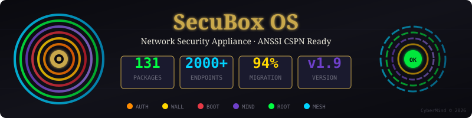
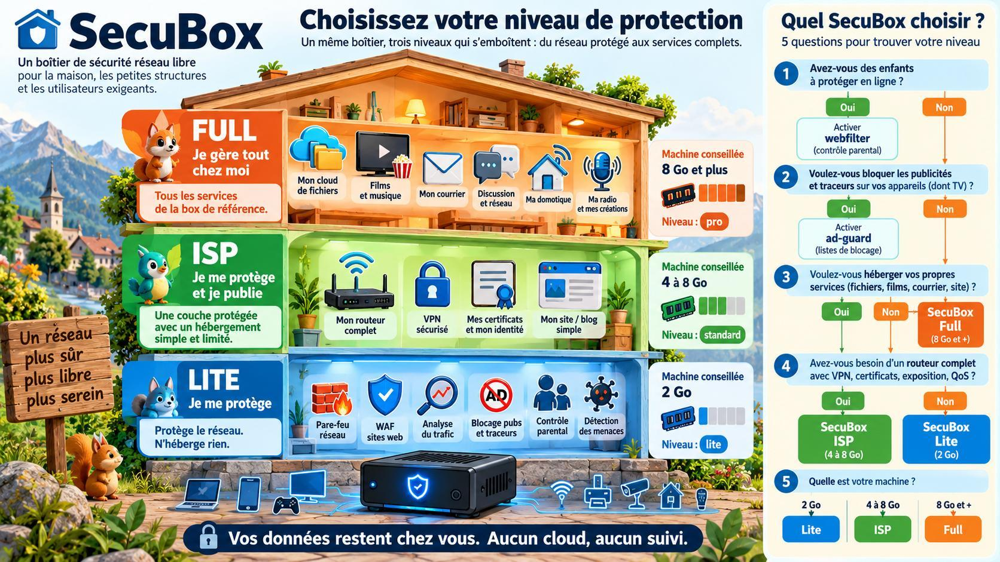

<!--
  SPDX-License-Identifier: LicenseRef-CMSD-1.0
  Copyright (c) 2026 CyberMind — Gérald Kerma <devel@cybermind.fr>
  Source-Disclosed License — All rights reserved except as expressly granted.
  See LICENCE-CMSD-1.0.md for terms.
-->

# SecuBox

<p align="center">
  
</p>

<p align="center"><b>Your network security appliance — plug it in, own your data, sleep at night.</b></p>

<p align="center">
  <a href="https://github.com/CyberMind-FR/secubox-deb/releases"></a>
  <a href="https://github.com/CyberMind-FR/secubox-deb/actions/workflows/build-packages.yml"></a>
  <a href="https://github.com/CyberMind-FR/secubox-deb/actions/workflows/build-all-live-usb.yml"></a>
  <a href="LICENCE-CMSD-1.0.md"></a>
</p>

<p align="center">
  <a href="#-quick-start">Quick Start</a> ·
  <a href="#-profiles">Profiles</a> ·
  <a href="#-quick-demo">Quick Demo</a> ·
  <a href="#-quick-deploy">Quick Deploy</a> ·
  <a href="https://github.com/CyberMind-FR/secubox-deb/wiki">Docs</a> ·
  <a href="https://github.com/CyberMind-FR/secubox-deb/wiki/Roadmap">Roadmap</a> ·
  <a href="#-contributing">Contributing</a>
</p>

---

SecuBox turns a small ARM board — or any x86 PC — into a complete, self-hosted
security appliance: firewall, VPN, intrusion detection, WAF, DNS filtering and a
suite of sovereign services, all behind one web dashboard. It runs on **Debian 13 (Trixie)**, the base
of SecuBox from alpha 9 ([#1294](https://github.com/CyberMind-FR/secubox-deb/issues/1294)).
Packages are built as `~trixie1` and published in the `trixie` suite of
`apt.secubox.in`.

## Why SecuBox

- **Your hardware, your rules.** Everything runs on the box you own. No cloud
  account, no telemetry, no third-party cookie ever leaves the appliance.
- **Whole stack, one install.** About 110 packages (plus 57 meta-packages for profiles, services and functions)
  covering security, networking, applications and operations — instead of a weekend of glue work.
- **Sized to the machine.** Three profiles, from a 2 GB board to a full home
  server, each installing only what that machine can carry.
- **Runs on what you already have.** Raspberry Pi, ESPRESSObin, MOCHAbin,
  a repurposed laptop, or a VM on your desktop.
- **Auditable by design.** Source-disclosed licence, modular `ctl` grammar,
  every module documented.

## Key features

| | |
|---|---|
| 🛡️ **Firewall & WAF** | nftables with a default-drop policy, and `sbxwaf` in front of every web service — pattern detected → kernel drop, no third-party service in the path |
| 🔐 **VPN** | WireGuard with QR-code enrolment for phones |
| 🧹 **Ad blocking** | `ad-guard` removes ads and trackers at the DNS level for TVs, streamers and other devices, per device |
| 👨‍👩‍👧 **Web filtering** | `webfilter` classifies DNS queries (adult, gambling, phishing/malware) and can block them per device and per profile. It starts in observe-only mode: nothing is blocked until you choose |
| 🚨 **Intrusion detection** | HTTP, SSH, SMTP and IMAP watched together — `sbxwaf` + `sbx-authwatch` feed one ban set |
| 📊 **Web dashboard** | One interface for the whole box, from any browser |
| ☁️ **Sovereign services** | Nextcloud, mail, Gitea, Jellyfin, PeerTube, radio, blog publishing… each in its own LXC container |
| 🔄 **Automatic updates** | Security patches applied on their own |
| 🎭 **Decoy & watermark** | Unrouted hosts and bait paths get a plausible, inert page — watermarked, so a fake credential replayed later is recognised as ours. Learning only: no bans follow |
| 🧬 **Actor intelligence** | Scanners correlated across addresses and countries; a walking subdomain dictionary is regrouped into one campaign instead of dozens of fragments |

> A visual tour of the dashboard lives in the
> [wiki gallery](https://github.com/CyberMind-FR/secubox-deb/wiki/MODULES-EN).

---

## ⚡ Quick Start

**Fastest path — a VM on your own machine, no hardware needed.**

```bash
git clone https://github.com/CyberMind-FR/secubox-deb.git
cd secubox-deb
./image/create-vbox-vm.sh --download      # downloads the latest amd64 image, creates & boots the VM
```

Then open **https://localhost:9443** and log in with `admin` / `secubox`.

> Change that password before the box ever sees a network it does not own.

Prefer QEMU on an ARM host? Use
[`create-qemu-arm64-vm.sh`](https://github.com/CyberMind-FR/secubox-deb/releases/latest)
from the release assets.

## 🧩 Profiles

A **profile** decides which modules are installed; a **tier** decides what the
machine can carry. Pick the profile that matches your hardware and your needs.

| | **lite** | **isp** | **full** |
|---|---|---|---|
| For | Protection only, 2 GB RAM | A protected layer with simple, limited hosting, 4 GB and up | The whole current fleet, like the reference box, 8 GB and up |
| Includes | Firewall, WAF (`sbxwaf`), DPI, MITM engine (`sbxmitm`), ad-guard, webfilter, threat detection, anti-rootkit, access control, WireGuard | lite + routing, QoS, certificates, Tor, mesh, supervision, simple site hosting (`metablogizer`, `publish`) | isp + every module of the reference box: Nextcloud, Gitea, Jellyfin, PeerTube, mail, radio, Zigbee, AI, voice… |
| Typical machine | ESPRESSObin | Raspberry Pi 400, MOCHAbin, x86 PC | MOCHAbin, x86 PC |

<p align="center"></p>

Side-by-side table, glossary and a popularisation prompt:
[docs/PROFILS-COMPARATIF.md](docs/PROFILS-COMPARATIF.md).

## 📘 Official AMD64 Installation

Install and reproduce the GK2 development box on an AMD64 PC, VirtualBox,
KVM or QEMU: [Official AMD64 GK2 Clone installation guide](docs/INSTALL-AMD64-GK2.md).

## 🎬 Quick Demo

**Boot it from a USB stick on any x86_64 PC — nothing is written to the disk.**

Download the live image from the
[latest release](https://github.com/CyberMind-FR/secubox-deb/releases/latest),
then write it to a USB stick:

```bash
zcat secubox-live-amd64-trixie.img.gz | sudo dd of=/dev/sdX bs=4M status=progress   # /dev/sdX = your USB device
```

Boot from the stick, then reach the dashboard at `https://<device-ip>/`.
Full walkthrough and troubleshooting: [Live USB](https://github.com/CyberMind-FR/secubox-deb/wiki/Live-USB).

## 🚀 Quick Deploy

**For 24/7 operation on dedicated hardware.** Image names follow
`secubox-<profile>-<board>-<suite>` — check the release assets for what a given
release actually ships.

| Target | Best for | Image | Suite |
|---|---|---|---|
| VirtualBox / QEMU | Lab & demo | `secubox-full-vm-x64-trixie.img.gz` | Debian 13 |
| Raspberry Pi 4 / 400 | Desktop appliance, kiosk | `secubox-full-rpi-arm64-trixie.img.gz` | Debian 13 |
| Any x86_64 PC | Repurposed hardware | `secubox-live-amd64-trixie.img.gz` (live) | Debian 13 |
| Any x86_64 PC | Permanent install — **headless auto-install** to the first disk | `secubox-installer-amd64-trixie.iso.gz` | Debian 13 |
| MOCHAbin | Enterprise | `secubox-mochabin-live-usb.img.gz` | Debian 13 |
| ESPRESSObin v7 / Ultra | Small gateway | `lite` and `isp` images (7 GB, microSD) | Debian 13 |

The profile genuinely selects which modules are installed. An ESPRESSObin
image is written to a microSD card; `secubox-install-emmc` then copies the
running system to the eMMC and refuses clearly if it does not fit (4 GB eMMC:
lite yes, isp maybe not).

Flashing, U-Boot and first-boot steps:
[Installation](https://github.com/CyberMind-FR/secubox-deb/wiki/Installation) ·
[ARM / U-Boot](https://github.com/CyberMind-FR/secubox-deb/wiki/ARM-Installation) ·
[Supported hardware](https://github.com/CyberMind-FR/secubox-deb/wiki/Hardware)

### 🧪 Current release: `v3.0.0-alpha.11`

This is a **pre-release line**: run it on a test box, not on the link your
household depends on. What it brings, on top of alpha 10:

- **Actor Intelligence 2.0.** The detection engine now *acts*, gradually and reversibly:
  delay, proof-of-work challenge, tarpit, temporary ban — and, for a device on your own
  network, automatic isolation by the NAC (its quarantine zone; you validate it to release it).
  Risk and confidence are scored separately, a ban needs evidence from the address itself,
  and verified search-engine crawlers are never banned. A new *Radar des acteurs* card in the
  Hall shows it live. Activation procedure: [`docs/ACTOR-INTELLIGENCE-ACTIVATION.md`](docs/ACTOR-INTELLIGENCE-ACTIVATION.md).
- **Admin in six spaces** (overview, protection, monitoring, services, identity, system) with
  global search and a device sheet that shows the detected OS *and the evidence for it*.
- **Live and ephemeral posts.** The posts feed updates itself — a new post or a new comment
  pops to the top with an animation — and MetaNews publishes five-minute posts that fade away.
- **Headless auto-install.** The installer image (`secubox-installer-amd64-trixie`) installs
  SecuBox on the first disk with no screen and no keyboard. It **wipes that disk**.
- **Auto-Load groundwork.** Provisioning infrastructure, client agent, admin panel and an
  end-to-end test bench are in; automatic first-boot provisioning is not shipped yet.
- Debian 13 (Trixie) base, redefined profiles (`lite`, `isp`, `full`), ad blocking and web
  filtering, zram and a collective memory ceiling, the nDPI 6.x engine — as in alpha 9 and 10.

Guided path: [Démarrage rapide Alpha](https://github.com/CyberMind-FR/secubox-deb/wiki) —
VM in one command, or real arm64 hardware — first section of the wiki home.

### Verifying downloads

Every release ships `SHA256SUMS`. Always check before flashing:

```bash
sha256sum -c SHA256SUMS --ignore-missing
```

---

## 📚 Documentation

| | |
|---|---|
| [Wiki home](https://github.com/CyberMind-FR/secubox-deb/wiki) | Portal — every guide starts here |
| [Configuration](https://github.com/CyberMind-FR/secubox-deb/wiki/Configuration) | First-boot settings, network modes |
| [Modules](https://github.com/CyberMind-FR/secubox-deb/wiki/MODULES-EN) | Every module, one by one |
| [API reference](https://github.com/CyberMind-FR/secubox-deb/wiki/API-Reference) | 2000+ endpoints |
| [Architecture](https://github.com/CyberMind-FR/secubox-deb/wiki/Modules-Architecture) | The 6-layer model |
| [Troubleshooting](https://github.com/CyberMind-FR/secubox-deb/wiki/Troubleshooting) | When it does not boot |
| [Project overview](docs/PROJECT-OVERVIEW.md) | Long form: flagship programmes, release history, CTL grammar |
| [Cryptographic policy](docs/POLITIQUE-CRYPTO.md) | Which algorithms, why, and the two protocol-imposed exceptions — the reference document for CSPN evaluation |

## 🤝 Contributing

Issues and pull requests are welcome at
[CyberMind-FR/secubox-deb](https://github.com/CyberMind-FR/secubox-deb/issues).
Read [Module guidelines](docs/MODULE-GUIDELINES.md) first — module layout and
the `ctl` grammar are conventions, not suggestions.
Hardware test reports go to
[Board feedback](https://github.com/CyberMind-FR/secubox-deb/wiki/Board-Feedback).

## 📄 License

**CyberMind Source-Disclosed License (CMSD-1.0)** — the source is published and
auditable; redistribution and commercial use are restricted. Full terms in
[LICENCE-CMSD-1.0.md](LICENCE-CMSD-1.0.md).

---

<p align="center"><sub>SecuBox — CyberMind · Your services. Your hardware. Your rules.</sub></p>
