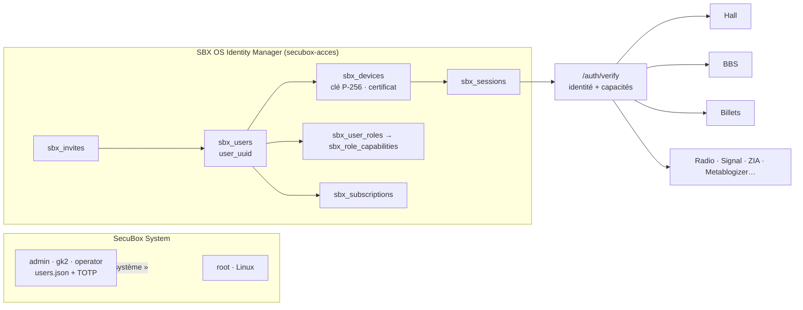
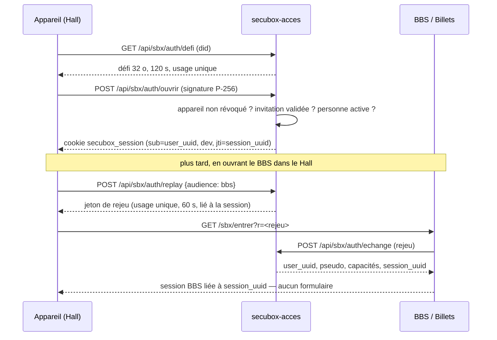

# AUTH v2 — SBX OS Identity Manager

> #1405 · 2026-09-25 · modèle cible. L'état de départ est dans
> [AUDIT_AUTHENTICATION.md](AUDIT_AUTHENTICATION.md).
>
> **Maquette interactive** (référence validée) : [design/sbxos-identite-maquette.html](design/sbxos-identite-maquette.html),
> servie sur la box à `/acces/maquette.html`. Six écrans : Mes appareils (certificat, révocation,
> déconnexion des autres), connexion sans formulaire (rejeu 60 s à usage unique), administration SBX OS
> (invitations par lien, rôles, suspension, journal d'audit, matrice des capacités), abonnements,
> Identity Mesh, séparation Système / SBX OS.

## 1. Deux mondes qui ne se touchent pas

| | **SecuBox System** | **SBX OS** |
|---|---|---|
| Qui | l'exploitant de la box | les humains qui l'utilisent |
| Comptes | `root` (Linux), `admin`, `gk2`, `operator` | `user_uuid` |
| Où | Linux (`/etc/shadow`) · `/etc/secubox/users.json` | `/var/lib/secubox/acces/sbx.db` |
| Connexion | mot de passe **+ TOTP** (`secubox-auth`) ; SSH pour root | **appareil** : clé signée, sans formulaire |
| Donne | l'administration système (réseau, WAF, paquets…) | des **capacités** SBX OS : modules et fonctionnalités |
| Jamais | visible dans SBX OS | SSH, sudo, root, réglages système |

Un compte système n'est **jamais** migré dans `sbx_users`. Une personne qui administre
la box *et* poste sur le BBS a **deux** identités : son compte système (TOTP) et son
`user_uuid` SBX OS (rôle `sbx_operator` si elle administre SBX OS). C'est voulu :
l'identité qui écrit sur un forum n'est pas celle qui ouvre le pare-feu.

## 2. Une identité, plusieurs appareils



- **`user_uuid`** (UUIDv4) : la personne. Pseudo, courriel, statut.
- **`device_uuid`** : une **preuve de confiance**, pas une identité. Clé ECDSA P-256
  non exportable (WebCrypto, déjà en place), certificat signé par le nœud.
- **Session** : un appareil, pour une personne, pour un temps. Révocable seule.

### Pourquoi `secubox-acces` et pas un nouveau module

`secubox-acces` porte déjà l'admission des appareils, le défi signé, le rattachement à un
compte, la révocation par `jti`. La refonte **l'étend** (base SQLite au lieu de deux JSON,
`user_uuid` au lieu de `sbx-<empreinte>`), plutôt que d'ajouter une septième identité.
`secubox-users` reste le gestionnaire des comptes **système**.

## 3. Rôles = profils de capacités

Une capacité ouvre un **module ou une fonctionnalité SBX OS**, rien d'autre. Le code ne
teste jamais un rôle, seulement une capacité.

| Capacité | guest | member | subscriber | beta_tester | moderator | sbx_operator |
|---|:-:|:-:|:-:|:-:|:-:|:-:|
| `hall.read` | ✓ | ✓ | ✓ | ✓ | ✓ | ✓ |
| `hall.write` | | ✓ | ✓ | ✓ | ✓ | ✓ |
| `bbs.read` | ✓ | ✓ | ✓ | ✓ | ✓ | ✓ |
| `bbs.write` | | ✓ | ✓ | ✓ | ✓ | ✓ |
| `bbs.moderate` | | | | | ✓ | ✓ |
| `billets.read` | ✓ | ✓ | ✓ | ✓ | ✓ | ✓ |
| `billets.publish` | | ✓ | ✓ | ✓ | ✓ | ✓ |
| `radio.listen` · `radio.chat` | ✓ · | ✓ · ✓ | ✓ · ✓ | ✓ · ✓ | ✓ · ✓ | ✓ · ✓ |
| `metablog.publish` | | | ✓ | ✓ | | ✓ |
| `peertube.upload` · `nextcloud.files` | | | ✓ | ✓ | | ✓ |
| `reelbox.use` · `reelbox.beta` | | | ✓ · | ✓ · ✓ | | ✓ · |
| `modules.experimental` | | | | ✓ | | |
| `admin.users` · `admin.invites` | | | | | | ✓ |
| `admin.modules` · `admin.audit` | | | | | | ✓ |

Les rôles se **cumulent** (`member` + `beta_tester`) : les capacités sont l'union.
Aucune capacité ne s'appelle `ssh`, `sudo`, `root` ni `system.*` — et le générateur de la
table le refuse (test).

Le certificat d'appareil porte la projection de ces capacités au moment de l'émission :

```yaml
apiVersion: sbxos/v1
identity:
  node: did:plc:983c…            # le nœud émetteur (clé Ed25519 de la fédération)
  user: 7f3a91c2-…               # user_uuid
  device: 9c21e4b0-…             # device_uuid
  device_key: "p256:04a1…"       # la clé que l'appareil prouve à chaque session
  pseudo: alice
roles: [member]
capabilities: [hall.read, hall.write, bbs.read, bbs.write, billets.read, billets.publish, radio.listen, radio.chat]
restrictions: {vault: own-only, system: none}
issued: 2026-09-25T10:00:00Z
expires: 2027-09-25T00:00:00Z
signature: {issuer: did:plc:983c…, algorithm: ed25519, value: "…"}
```

Il est signé comme les certificats fédéraux (JSON canonique, Ed25519 du nœud). Il sert à
**présenter** l'appareil à un autre nœud (SIM, §9) ; sur le nœud d'origine la base fait
foi, et une révocation y est immédiate.

## 4. Modèle de données

```sql
-- /var/lib/secubox/acces/sbx.db — SQLite WAL, propriétaire secubox, 0640
CREATE TABLE sbx_users (
  user_uuid   TEXT PRIMARY KEY,                -- UUIDv4
  pseudo      TEXT NOT NULL UNIQUE COLLATE NOCASE,
  email       TEXT,
  status      TEXT NOT NULL DEFAULT 'active' CHECK (status IN ('invited','active','suspended','deleted')),
  home_node   TEXT NOT NULL,                   -- did:plc du nœud qui l'héberge (SIM)
  created_at  INTEGER NOT NULL
);
CREATE TABLE sbx_roles        (role_id TEXT PRIMARY KEY, label TEXT NOT NULL);
CREATE TABLE sbx_capabilities (capability TEXT PRIMARY KEY CHECK (capability NOT GLOB 'ssh*' AND capability NOT GLOB 'sudo*' AND capability NOT GLOB 'root*' AND capability NOT GLOB 'system.*'));
CREATE TABLE sbx_role_capabilities (role_id TEXT REFERENCES sbx_roles, capability TEXT REFERENCES sbx_capabilities, PRIMARY KEY (role_id, capability));
CREATE TABLE sbx_user_roles   (user_uuid TEXT REFERENCES sbx_users, role_id TEXT REFERENCES sbx_roles, granted_by TEXT, granted_at INTEGER, PRIMARY KEY (user_uuid, role_id));

CREATE TABLE sbx_devices (
  device_uuid  TEXT PRIMARY KEY,
  user_uuid    TEXT REFERENCES sbx_users,      -- NULL tant que l'invitation n'est pas validée
  device_name  TEXT NOT NULL,
  device_kind  TEXT,                           -- iphone | ipad | mac | android | linux | windows
  did          TEXT NOT NULL UNIQUE,           -- did:sbx:<sha256(clé)[:32]> — LIÉ à la clé
  public_key   TEXT NOT NULL,                  -- P-256 brute (hex)
  trust_level  TEXT NOT NULL DEFAULT 'pending' CHECK (trust_level IN ('pending','verified','trusted')),
  cert_serial  TEXT, cert_expires INTEGER,
  last_seen_at INTEGER, created_at INTEGER NOT NULL,
  revoked_at   INTEGER
);
CREATE TABLE sbx_sessions (
  session_uuid TEXT PRIMARY KEY,               -- = jti du cookie
  user_uuid    TEXT NOT NULL REFERENCES sbx_users,
  device_uuid  TEXT NOT NULL REFERENCES sbx_devices,
  created_at   INTEGER NOT NULL, expires_at INTEGER NOT NULL,
  ip TEXT, user_agent TEXT,
  revoked_at   INTEGER
);
CREATE TABLE sbx_replay (                      -- jetons de rejeu : usage unique, 60 s
  replay_id    TEXT PRIMARY KEY,               -- stocké haché
  session_uuid TEXT NOT NULL REFERENCES sbx_sessions,
  audience     TEXT NOT NULL,                  -- bbs | billets | radio | …
  expires_at   INTEGER NOT NULL, used_at INTEGER
);
CREATE TABLE sbx_invites (
  invite_uuid  TEXT PRIMARY KEY,
  email        TEXT, pseudo_propose TEXT,
  role_propose TEXT REFERENCES sbx_roles DEFAULT 'member',
  device_uuid  TEXT REFERENCES sbx_devices,    -- l'appareil qui a demandé, s'il y en a un
  code_hash    TEXT,                           -- lien d'invitation (haché), si émise par un admin
  created_by   TEXT, created_at INTEGER NOT NULL, expires_at INTEGER NOT NULL,
  validated_by TEXT, validated_at INTEGER, refused_at INTEGER, motif TEXT
);
CREATE TABLE sbx_subscriptions (
  subscription_uuid TEXT PRIMARY KEY,
  user_uuid    TEXT NOT NULL REFERENCES sbx_users,   -- JAMAIS l'appareil
  reelbox_uuid TEXT,                                 -- ReelBox n'existe pas encore : réservé
  tier         TEXT NOT NULL CHECK (tier IN ('free','premium','association')),
  started_at INTEGER NOT NULL, expires_at INTEGER, renewed_at INTEGER, auto_renew INTEGER DEFAULT 0
);
CREATE TABLE sbx_app_links (                   -- l'identité dans chaque application
  user_uuid TEXT REFERENCES sbx_users, app TEXT, app_id TEXT, app_handle TEXT,
  PRIMARY KEY (app, app_id)
);
```

Un abonnement actif ajoute ses capacités (`premium` → celles de `subscriber`) : le rôle
`subscriber` est **dérivé** de `sbx_subscriptions`, pas attribué à la main.

## 5. Connexion : l'appareil, jamais un formulaire



`POST /api/sbx/auth/replay` : (1) cookie SBX valide, (2) appareil non révoqué,
(3) invitation validée et personne active, (4) émet un jeton **à usage unique, 60 s,
lié à la session et à une audience**, (5) l'application l'échange et ouvre sa session.
Le jeton ne passe jamais par `localStorage` ni par un fragment d'URL persistant.

**Révocation.** Une application ne garde jamais une session plus longtemps que celle
dont elle dérive : elle revérifie `session_uuid` (cache ≤ 30 s). Révoquer un appareil
coupe **toutes** ses sessions, partout, en moins de 30 s.

## 6. Vérifier : un seul point de vérité

`/auth/verify` (déjà appelé par nginx pour le BBS) devient la seule vérification :

- `Remote-User: <pseudo>`, `X-Sbx-User: <user_uuid>`, `X-Sbx-Device: <device_uuid>`,
  `X-Sbx-Caps: hall.read,bbs.write,…`
- nginx **écrase** ces en-têtes à chaque requête (ils ne viennent jamais du client).

Côté code :

```python
# secubox_core — FastAPI
@router.post("/admin/invite", dependencies=[Depends(require_capability("admin.invites"))])
```

```go
// paquet sbxcap, partagé par BBS, radio, socialrelay, signal
mux.Handle("POST /bbs/post", sbxcap.Require("bbs.write", creerMessage))
```

`sbxcap` n'a **pas** de vérificateur JWT propre : il interroge `/auth/verify` sur
`auth.sock` (avec cache court). Les trois copies Go actuelles, qui ignorent la
révocation, disparaissent.

## 7. « Mes appareils » et l'administration SBX OS

- **Mes appareils** (dans le Hall, origine unique) : nom, type (iPhone, iPad, Mac,
  Android…), dernière activité, niveau de confiance ; **Renommer**, **Révoquer**
  (effet immédiat : `revoked_at`, sessions coupées). `GET/PATCH/DELETE /api/sbx/devices`.
- **Administration SBX OS** (capacités `admin.*`), distincte de l'administration
  système : invitations à valider, personnes, rôles, abonnements, journal. Les comptes
  système n'y apparaissent pas.

## 8. Migration — sans rien casser

1. **Ombre** : `sbx.db` est construit à partir de `appareils.json`, `demandes.json` et du
   BBS, **sans changer aucun comportement** ; un rapport liste chaque correspondance.
2. **Personnes** : une par appareil rattaché ou compte BBS humain ; `user_uuid` généré ;
   pseudo = `display_name` BBS, sinon nom de l'appareil. Les comptes système (`admin`,
   `gk2`, `operator`, `root`) ne sont **jamais** migrés.
3. **Contenus** : `sbx_app_links(bbs, <id BBS>)` → messages BBS et billets restent où ils
   sont, rattachés par l'identifiant d'application — aucune ligne de contenu réécrite.
4. **Rôles** : appareil `guest` → `guest` ; `user` → `member` ; appareil rattaché à un
   admin → `sbx_operator` ; BBS `sysop` → `moderator` (+ `sbx_operator` si c'est
   l'exploitant, sur décision).
5. **Sessions** : les `jti` vivants de `sessions.json` qui portent un appareil deviennent
   des `sbx_sessions` ; les autres expirent naturellement (24 h).
6. Sauvegarde (`sqlite .backup` + copie des JSON) avant, retour arrière documenté après.

## 9. Préparer le SBX Identity Mesh (SIM)

L'identité est **hébergée** par un nœud (`home_node`), jamais possédée par lui. Migration
de GK4-3 vers GK4-2 : demande reçue par GK4-2 → accueil approuvé par l'admin de GK4-2 →
transfert approuvé par GK4-3 → **certificat de migration** signé par les deux clés de nœud
→ synchronisation du `user_uuid`, des appareils autorisés, des préférences, des abonnements.
Transport : l'annuaire (déjà signé, déjà répliqué). Le modèle v2 est prêt : `user_uuid`
global, `home_node`, certificats d'appareil signés par le nœud.

## 10. Phases

| Phase | Contenu | Risque |
|---|---|---|
| **P0** | Failles S1–S7 de l'audit (redaction users, permissions API users, ZIA, radio, vault, 0666, ISO sudo) | faible, urgent |
| **P1** | `sbx.db` + migration **en ombre** + `/auth/verify` rend capacités ; tests | nul (lecture) |
| **P2** | Connexion appareil → `user_uuid` ; `/api/sbx/auth/replay` + échange ; BBS et Billets branchés, leurs logins locaux retirés | moyen : sauvegarde + retour arrière |
| **P3** | « Mes appareils » + administration SBX OS (invitations, rôles) | faible |
| **P4** | `require_capability` / `sbxcap` dans les modules (Billets, metablogizer, ZIA, radio, signal, socialrelay) | moyen |
| **P5** | Abonnements (Free / Premium / Association, expiration, renouvellement) | faible |
| **P6** | Nettoyage : API portail, `localStorage`, avatar, auth.toml en clair, users.db vide | faible |
| **P7** | SIM : migration multi-nœuds | à concevoir sur P1–P6 |

Chaque phase = une issue, un worktree, un déploiement vérifié sur gk2, comme le reste.
