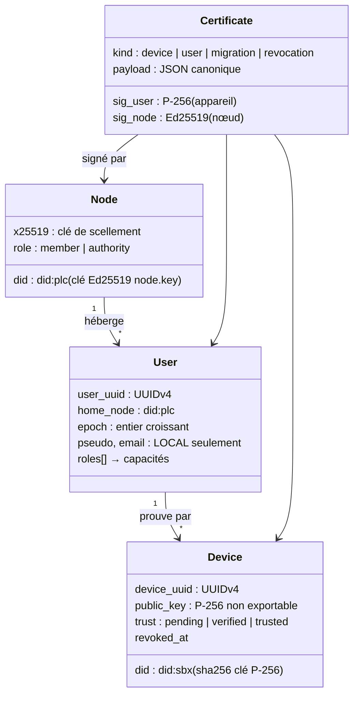
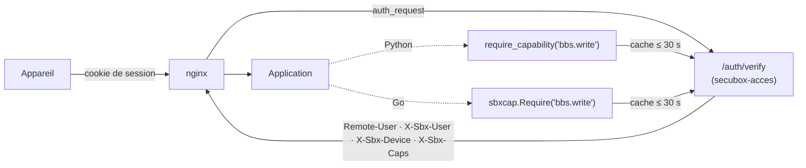
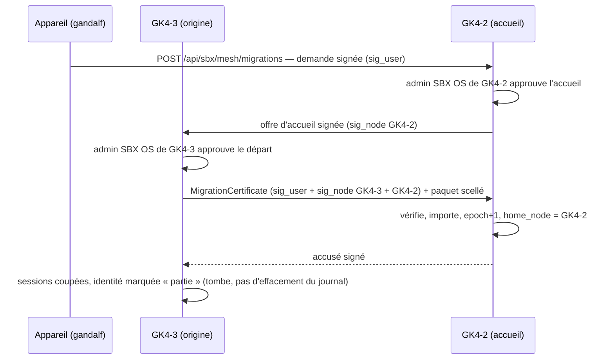

# AUTH v3 — SBX Identity Mesh (SIM)

> #1417 · 2026-09-25 · prolonge [AUTH_V2.md](AUTH_V2.md) (modèle local : `user_uuid`,
> appareils, rôles-capacités, rejeu 60 s) vers **plusieurs nœuds**.
> État de départ : [AUDIT_AUTHENTICATION.md](AUDIT_AUTHENTICATION.md),
> [AUDIT_SBX_IDENTITY.md](AUDIT_SBX_IDENTITY.md).
> Maquette de référence : [design/sbxos-identite-maquette.html](design/sbxos-identite-maquette.html).

## 0. Invariants

1. **Aucun compte Linux n'est touché.** `root`, les comptes système (`admin`, `gk2`,
   `operator`) et les utilisateurs de service restent hors SIM. Tout passe par
   `user_uuid` et des certificats.
2. **Une capacité n'ouvre qu'un module SBX OS.** Aucune ne s'appelle `ssh*`, `sudo*`,
   `root*`, `system.*` — refusé par la base, par la bibliothèque et par les tests.
3. **Un nœud héberge une identité, il ne la possède pas.** Changer de nœud ne change
   pas le `user_uuid`.
4. **Aucune donnée personnelle dans le journal public** (indélébile, répliqué partout) :
   il ne porte que des UUID, des empreintes de clés, un nœud d'accueil, une époque.
5. **Deux signatures, jamais une seule** pour tout acte qui engage une personne :
   la sienne (par un de ses appareils) et celle de son nœud d'accueil.

## 1. Les quatre entités



| Entité | Identifiant | Où vit-elle |
|---|---|---|
| **Node** | `did:plc` de `secrets/annuaire/node.key` — **la seule** clé de nœud | annuaire (`NodeRecord`) |
| **User** | `user_uuid` | `sbx.db` du nœud d'accueil (profil complet) · journal (`UserRecord` minimal) |
| **Device** | `device_uuid` + `did:sbx` **lié à sa clé** (le serveur recalcule le DID) | `sbx.db` · journal (empreinte, révocation) |
| **Certificate** | `serial` (UUID) | journal (forme signée) · présentation YAML `sbxos/v1` |

## 2. La double signature

Un certificat engage **la personne** (par la clé non exportable d'un appareil qui lui
appartient) **et** **son nœud d'accueil** (par `node.key`). L'une sans l'autre est
refusée.

```
payload  = { kind, serial, user_uuid, device_uuid, device_key_sha256,
             home_node, epoch, capabilities[], issued, expires, … }   # jamais de flottant
m_user   = canonical_bytes(payload)
sig_user = ECDSA-P256-SHA256(clé de l'appareil, m_user)         # dans le navigateur, WebCrypto
m_node   = canonical_bytes(payload ∪ {sig_user, signer_device})
sig_node = Ed25519(node.key, m_node)                              # sur le nœud d'accueil
```

**Vérifier** (tout nœud du maillage) : (1) `sig_node` avec la clé du `did:plc`
`home_node` ; (2) `sig_user` avec la clé de `signer_device`, dont l'empreinte doit
figurer dans un certificat d'appareil **antérieur et non révoqué** de la même personne ;
(3) `epoch` ≥ dernière époque connue pour ce `user_uuid` ; (4) `expires` non dépassé.

**Cas particuliers :**

| Acte | Signataire « personne » | Signataire « nœud » |
|---|---|---|
| Premier appareil (invitation validée) | le nouvel appareil lui-même (preuve de possession) | le nœud, **après validation par un admin SBX OS** |
| Appareil suivant | un appareil déjà de confiance **ou** le nouvel appareil + validation admin | nœud d'accueil |
| Révocation d'un appareil perdu | un autre appareil de la personne | nœud d'accueil — **ou le nœud seul** si c'est l'admin qui révoque (journalisé comme tel) |
| Migration | un appareil de confiance | **les deux** nœuds (départ et accueil) |

Dans le journal de l'annuaire, l'**auteur** de l'entrée est le nœud (contrainte
existante : auteur = `did:plc`) ; `sig_user` voyage **dans** la charge utile.

## 3. Ce qui va où

| Donnée | Journal public (répliqué, indélébile) | `sbx.db` du nœud d'accueil | Paquet scellé de migration |
|---|:-:|:-:|:-:|
| `user_uuid`, `home_node`, `epoch` | ✓ | ✓ | ✓ |
| empreintes de clés d'appareils, révocations | ✓ | ✓ | ✓ |
| pseudo, courriel, statut | | ✓ | ✓ |
| rôles, capacités | | ✓ | ✓ |
| préférences (Hall : thème, cardlets, favoris…) | | ✓ | ✓ |
| abonnements (tier, échéance, `reelbox_uuid`) | | ✓ | ✓ |
| sessions | | ✓ (locales) | ✗ — **jamais** transférées |
| fichiers et contenus d'applications | | dans chaque application | ✓ via adaptateurs (§6) |

Le paquet est scellé pour la seule clé X25519 du nœud d'accueil (`seal_for`,
X25519 → HKDF → AES-256-GCM) et transite point à point sur le maillage WireGuard.

## 4. Un seul middleware



- `/auth/verify` est **le** point de vérité : session vivante, appareil non révoqué,
  personne active, capacités. nginx **écrase** les en-têtes `X-Sbx-*` à chaque requête.
- Un appareil d'une personne hébergée **ailleurs** présente son certificat : le nœud le
  vérifie (double signature, nœud d'origine fédéré) et accorde au plus `guest` +
  les capacités que sa politique ouvre aux visiteurs.

## 5. Migration entre nœuds



| API (nœud d'accueil) | Rôle |
|---|---|
| `POST /api/sbx/mesh/migrations` | demande (signée par un appareil de la personne) |
| `GET /api/sbx/mesh/migrations[/{id}]` | suivi |
| `POST /api/sbx/mesh/migrations/{id}/accept` | admin d'accueil (`admin.users`) |
| `POST /api/sbx/mesh/migrations/{id}/release` *(sur l'origine)* | admin de départ |
| `GET /api/sbx/mesh/migrations/{id}/bundle` *(sur l'origine)* | paquet scellé, tiré par l'accueil |
| `POST /api/sbx/mesh/migrations/{id}/finalize` | import, nouvelle époque, accusé |

**Rôles** : transférés tels quels, puis **plafonnés par la politique du nœud d'accueil**
(un `sbx_operator` à GK4-3 n'administre pas GK4-2). **Abonnements** : tier, échéance,
renouvellement suivent le `user_uuid`. **Sessions** : jamais transférées ; les appareils
rouvrent une session sur le nouveau nœud avec le même certificat.

## 6. Fichiers et contenus : un adaptateur par application

| Application | Adaptateur | Phase |
|---|---|---|
| Préférences Hall | déplacées du `localStorage` vers `sbx.db` (clé `user_uuid`) | M4 |
| BBS | export par personne (messages `author:`, fichiers, quota, carnet) → réimport par `handle` | M5 |
| Courrier | Maildir de l'adresse + règles Sieve | M5 |
| Nextcloud | `occ user:export/import` (application user_migration) | M6 |
| Métablogs | `.sbx` signé (déjà existant) — exige d'abord un **propriétaire** par site | M6 |
| PeerTube, Billets, PhotoPrism | exigent d'abord un propriétaire par personne | plus tard |

## 7. Administration

L'écran d'administration SBX OS de la maquette (invitations, personnes, rôles, journal,
matrice des capacités) plus un onglet **Migrations** (demandes entrantes, départs à
approuver, certificats). Réservé aux capacités `admin.*` ; les comptes système n'y
apparaissent pas.

## 8. Plan

| Phase | Contenu |
|---|---|
| **M0** | Prérequis : S8 (oracle `/identity/sign`), S9 (clones qui dupliquent `node.key`), S10 (une seule clé de nœud) |
| **M1** | Bibliothèque `secubox_core.sbxid` : entités, capacités, forme canonique, **double signature** (signer, vérifier), YAML `sbxos/v1` ; schéma `sbx.db` ; tests. **Aucun changement de comportement.** |
| **M2** | Annuaire : `USER_PUBLISH`, `DEVICE_CERTIFY`, `DEVICE_REVOKE`, `MIGRATION_OFFER`, `MIGRATION_ACCEPT` (flotte mise à jour avant la première publication) |
| **M3** | `/auth/verify` + capacités, `require_capability`, `sbxcap` Go, rejeu SSO (AUTH v2 P2) |
| **M4** | Mes appareils + administration (d'après la maquette), préférences Hall côté serveur |
| **M5** | API de migration + paquet scellé + adaptateurs BBS et courrier |
| **M6** | Adaptateurs Nextcloud, métablogs ; propriétaires par personne |
