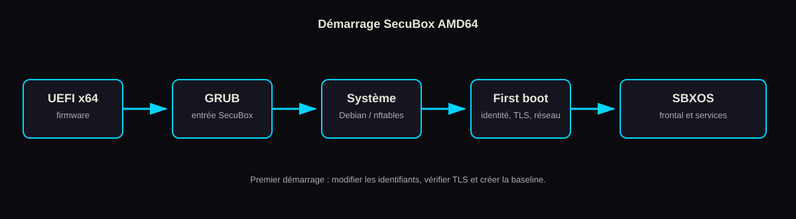

# Premier démarrage SecuBox AMD64

Cette procédure sécurise une SecuBox-DEB AMD64 immédiatement après son premier démarrage. Elle s’applique à une GK2 Clone virtuelle comme à une installation sur matériel physique.



## Table des matières

- [1. Connexion HTTPS](#1-connexion-https)
- [2. Changement du mot de passe](#2-changement-du-mot-de-passe)
- [3. Certificat TLS](#3-certificat-tls)
- [4. Hostname](#4-hostname)
- [5. Fuseau horaire](#5-fuseau-horaire)
- [6. Sauvegarde initiale](#6-sauvegarde-initiale)

## 1. Connexion HTTPS

Pour une VM VirtualBox créée avec les paramètres par défaut, ouvrez :

```text
https://localhost:9443
```

Pour une machine présente directement sur le LAN, trouvez son adresse depuis la console :

```bash
hostname -I
```

Puis accédez à `https://<adresse-ip>/`. L’initialisation génère un certificat auto-signé dans `/etc/secubox/tls/`. Le navigateur signale donc une autorité inconnue ; vérifiez que le nom ou l’adresse affiché correspond bien à la machine que vous venez d’installer avant d’accepter l’exception locale.

> **Warning**
>
> Un avertissement TLS est normal uniquement lors du premier accès à votre instance identifiée. Il ne justifie jamais l’acceptation d’un certificat pour une adresse inattendue, un portail captif ou un réseau public.

## 2. Changement du mot de passe

Connectez-vous au portail avec `admin` et le mot de passe de bootstrap. Par défaut, il s’agit de `secubox`; un fichier `/boot/admin_password` fourni avant le premier démarrage remplace cette valeur. Le compte est marqué pour imposer un changement au premier accès.

Choisissez une phrase de passe unique, longue et stockée dans un gestionnaire de mots de passe. Changez aussi les mots de passe système si l’accès SSH par mot de passe est maintenu pendant la phase de laboratoire :

```bash
passwd
passwd secubox
```

En récupération console, l’outil livré par l’image réinitialise le compte du portail :

```bash
sudo secubox-passwd
```

Cet outil demande le nouveau mot de passe et redémarre les services de portail concernés. Ne placez pas de mot de passe en argument de ligne de commande ou dans l’historique du shell.

## 3. Certificat TLS

Le certificat initial est créé localement avec une clé RSA 4096 bits et une validité de 10 ans. Inspectez-le avant toute mise en service :

```bash
sudo openssl x509 -in /etc/secubox/tls/cert.pem -noout -subject -issuer -dates -ext subjectAltName
```

Pour une utilisation de développement locale, importez l’autorité ou le certificat dans le magasin de confiance de votre poste seulement si son empreinte a été vérifiée par un canal sûr. Pour une exposition réseau, remplacez le certificat de bootstrap par un certificat émis pour le nom DNS réellement utilisé et conservez la clé privée avec des permissions restrictives.

```bash
sudo stat -c '%a %U:%G %n' /etc/secubox/tls/key.pem /etc/secubox/tls/cert.pem
```

## 4. Hostname

Choisissez un nom DNS court, unique et sans espace, par exemple `gk2-clone-dev`. Appliquez-le :

```bash
sudo hostnamectl set-hostname gk2-clone-dev
hostnamectl status
```

Ajoutez ensuite une entrée locale cohérente, puis redémarrez le frontal TLS pour que les journaux et les interfaces reflètent le nouveau nom :

```bash
sudoedit /etc/hosts
sudo systemctl restart nginx
```

Le certificat créé avant ce changement garde son ancien nom. Régénérez ou remplacez-le avec un certificat qui contient le nouveau DNS dans le SAN avant une utilisation de confiance.

## 5. Fuseau horaire

Vérifiez l’horloge et le service de synchronisation :

```bash
timedatectl status
```

Exemple pour Paris :

```bash
sudo timedatectl set-timezone Europe/Paris
timedatectl status
```

Une heure exacte est essentielle à TLS, aux journaux et aux corrélations de sécurité. Corrigez d’abord la connectivité réseau si `System clock synchronized` reste à `no` après quelques minutes.

## 6. Sauvegarde initiale

Après sécurisation du compte et validation du réseau, créez un snapshot logique si la partition de snapshots est montée :

```bash
mountpoint /persist/snapshots
sudo secubox-snapshot create first-boot-secured
sudo secubox-snapshot list
```

Sur une VM, créez aussi un snapshot de l’hyperviseur à l’arrêt ou après une synchronisation disque. Exemple VirtualBox :

```bash
VBoxManage controlvm "GK2-Clone" acpipowerbutton
VBoxManage snapshot "GK2-Clone" take "first-boot-secured" \
  --description "Compte bootstrap remplacé, TLS et réseau vérifiés"
```

Exportez périodiquement les données nécessaires vers un support chiffré distinct. Les snapshots facilitent un retour en arrière ; ils ne protègent ni contre la perte de l’hôte ni contre la compromission du support qui les contient.
