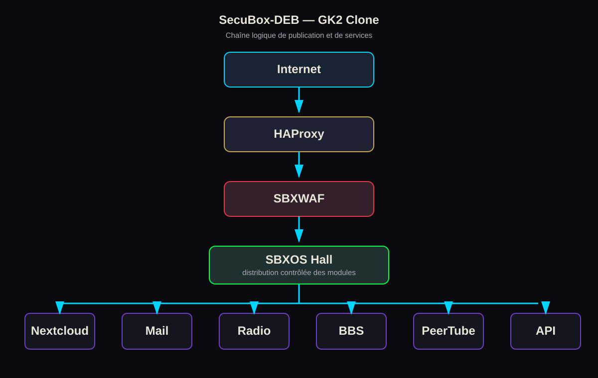

# Installation officielle AMD64 — GK2 Clone

Ce guide installe une SecuBox-DEB AMD64 sur un PC, dans VirtualBox ou sur un hôte KVM/QEMU, afin de reproduire la box de développement **GK2**. Il est la procédure de référence pour un environnement de développement isolé.

> **Important**
>
> Une image AMD64 ne remplace pas les images ARM64 destinées à MOCHAbin ou Raspberry Pi. Utilisez exclusivement une image `secubox-live-amd64-*` ou `secubox-installer-amd64-*` pour ce guide.



## Table des matières

- [1. Présentation de GK2 Clone](#1-présentation-de-gk2-clone)
- [2. Architecture matérielle](#2-architecture-matérielle)
- [3. Prérequis AMD64](#3-prérequis-amd64)
- [4. Installation VirtualBox](#4-installation-virtualbox)
- [5. Installation Bare Metal](#5-installation-bare-metal)
- [6. Premier démarrage](#6-premier-démarrage)
- [7. Accès à SBXOS](#7-accès-à-sbxos)
- [8. Configuration réseau](#8-configuration-réseau)
- [9. Vérification des services](#9-vérification-des-services)
- [10. Création d'un snapshot de référence](#10-création-dun-snapshot-de-référence)

## 1. Présentation de GK2 Clone

GK2 Clone est l’instance AMD64 reproductible de la box de développement GK2. Elle fournit une base Debian/SecuBox pour valider les services, les flux réseau et les parcours opérateur sans modifier une box physique.


Le clone démarre avec une chaîne réseau de sécurité : HAProxy reçoit les flux exposés, SBXWAF les inspecte, puis SBXOS Hall distribue les services tels que Nextcloud, Mail, Radio, BBS, PeerTube et l’API. Consultez [l’architecture détaillée](ARCHITECTURE-GK2.md) avant d’exposer une instance hors d’un réseau de développement.

## 2. Architecture matérielle

| Ressource | Minimum | Référence GK2 Clone |
|---|---:|---:|
| Processeur | AMD64/x86_64, 2 cœurs | 4 vCPU |
| Mémoire | 4 Gio | 8 Gio |
| Stockage | 32 Gio SSD | 80 Gio SSD/NVMe |
| Firmware | UEFI x86_64 | UEFI x86_64 activé |
| Réseau | 1 interface Ethernet | NAT + réseau privé/bridgé |

VirtualBox crée par défaut une VM Debian 64 bits avec 4 Gio, 4 vCPU, EFI x64, contrôleur SATA et carte VirtIO. Le script configure le premier adaptateur en NAT et redirige l’hôte vers l’invité : SSH `2222 → 22`, HTTPS `9443 → 443`, HTTP `8080 → 80`.

## 3. Prérequis AMD64

Sur l’hôte, installez Git et VirtualBox avec son outil `VBoxManage`. Sous Debian/Ubuntu :

```bash
sudo apt update
sudo apt install --yes git virtualbox
VBoxManage --version
```

Récupérez le dépôt et placez-vous à sa racine :

```bash
git clone https://github.com/CyberMind-FR/secubox-deb.git
cd secubox-deb
```

La virtualisation matérielle (Intel VT-x ou AMD-V/SVM) doit être activée dans l’UEFI de l’hôte. Allouez la RAM et les cœurs à la VM sans saturer l’hôte ; gardez au moins 2 Gio et un cœur pour celui-ci.

> **Sécurité**
>
> Ne connectez pas une instance initialisée avec les identifiants de démarrage à un réseau non maîtrisé. Préférez le NAT pour les essais et n’utilisez le mode bridge qu’après le premier changement de mot de passe.

## 4. Installation VirtualBox

Le script canonique télécharge la dernière image AMD64 publiée, la décompresse si nécessaire, la convertit en VDI et crée la VM EFI :

```bash
bash image/create-vbox-vm.sh --download
```

Pour une VM GK2 nommée explicitement et exécutée sans fenêtre :

```bash
bash image/create-vbox-vm.sh \
  --download \
  --name GK2-Clone \
  --memory 8192 \
  --cpus 4 \
  --headless
```

Pour créer la VM sans démarrer, ajoutez `--no-start`, puis démarrez-la :

```bash
VBoxManage startvm "GK2-Clone" --type headless
```

L’accès initial depuis l’hôte est alors :

```bash
ssh -p 2222 root@localhost
```

Ouvrez `https://localhost:9443` dans le navigateur. Si ces ports sont déjà utilisés, choisissez des ports hôte libres :

```bash
bash image/create-vbox-vm.sh --download \
  --name GK2-Clone \
  --ssh 22222 --https 19443 --http 18080
```

Voir [VM GK2 Clone](VM-GK2-CLONE.md) pour VirtualBox, KVM et QEMU.

## 5. Installation Bare Metal

Pour un déploiement sur PC AMD64, écrivez l’image d’installation ou l’image live AMD64 sur une clé USB. Identifiez d’abord le périphérique ; la commande suivante est destructive pour la clé ciblée.

```bash
lsblk -o NAME,SIZE,MODEL,TRAN
```

Écrivez l’image sur la clé, en remplaçant `/dev/sdX` par le disque complet de la clé USB, jamais une partition comme `/dev/sdX1` :

```bash
zcat secubox-installer-amd64-bookworm.img.gz | \
  sudo dd of=/dev/sdX bs=4M status=progress conv=fsync
sync
```

> **Warning**
>
> `dd` efface irréversiblement le périphérique indiqué. Confirmez son modèle et sa taille avec `lsblk` avant validation.

Démarrez le PC cible en UEFI sur la clé. Dans GRUB, sélectionnez **SecuBox Install** pour l’installation automatisée, ou **SecuBox Install (Expert)** si vous devez confirmer les choix. L’installateur crée une table GPT avec ESP, racine et données, puis installe GRUB pour `x86_64-efi`.

Après l’installation, retirez la clé USB avant le redémarrage. Pour une démonstration ou une récupération sans écriture sur le disque interne, choisissez **SecuBox Live**.

## 6. Premier démarrage

Au premier démarrage, le service `secubox-firstboot` initialise les répertoires SecuBox, génère les secrets locaux et le certificat TLS, prépare le compte `admin`, détecte le réseau et applique le pare-feu nftables.

Suivez immédiatement le guide [Premier démarrage](FIRST-BOOT.md) : connexion HTTPS, remplacement des secrets initiaux, certificat, nom d’hôte, fuseau horaire et sauvegarde.

Le journal de l’initialisation est disponible avec :

```bash
journalctl -u secubox-firstboot --no-pager
```

## 7. Accès à SBXOS

En VirtualBox NAT, ouvrez :

```text
https://localhost:9443
```

Sur réseau direct, récupérez l’adresse de la SecuBox depuis la console :

```bash
hostname -I
```

Puis ouvrez `https://<adresse-ip>/`. Le certificat initial est auto-signé : l’avertissement du navigateur est attendu pendant l’initialisation locale. Ne contournez jamais cet avertissement pour un nom de domaine ou une adresse IP inattendus.

Le compte `admin` est fourni avec le mot de passe de bootstrap `secubox`, sauf si `/boot/admin_password` a été fourni avant le premier démarrage. L’application impose le changement de ce mot de passe au premier accès.

## 8. Configuration réseau

Vérifiez l’adressage et la route par défaut :

```bash
ip -brief address
ip route
resolvectl status
```

Pour une VM de développement, gardez le NAT comme accès WAN et ajoutez, si nécessaire, un second adaptateur Host-Only ou Internal Network pour les essais LAN. N’exposez aucun port de gestion depuis l’hôte sans règle réseau explicite.

Après un changement de câblage ou d’adaptateur virtuel, forcez la redétection :

```bash
sudo secubox-net-reset
ip -brief address
```

Le flux logique est décrit dans [la vue réseau](assets/svg/network-overview.svg). Pour les modes de virtualisation, voir [VM GK2 Clone](VM-GK2-CLONE.md).

## 9. Vérification des services

Contrôlez les services SecuBox et le frontal HTTPS :

```bash
systemctl status 'secubox-*' --no-pager
systemctl is-active nginx
systemctl is-active haproxy
curl -kI https://127.0.0.1/
```

Le statut `inactive` d’un module applicatif non déployé n’est pas une panne du socle. Pour isoler une erreur, consultez les journaux de l’unité concernée :

```bash
journalctl -u nginx -u haproxy -u secubox-firstboot --since "-15 min" --no-pager
```

Pour le diagnostic guidé, voir [Dépannage AMD64](TROUBLESHOOTING-AMD64.md).

## 10. Création d'un snapshot de référence

Une fois les identifiants modifiés, le réseau vérifié et les services attendus contrôlés, capturez un état de référence. Dans la SecuBox, si la partition snapshots est disponible :

```bash
sudo secubox-snapshot create gk2-baseline
sudo secubox-snapshot list
```

Complétez ce snapshot interne par un checkpoint de l’hyperviseur. Avec VirtualBox :

```bash
VBoxManage snapshot "GK2-Clone" take "gk2-baseline" \
  --description "Premier démarrage validé, réseau et accès SBXOS contrôlés"
```

> **Important**
>
> Un snapshot d’hyperviseur ne remplace pas une sauvegarde exportée. Conservez une copie chiffrée hors de l’hôte, et ne stockez jamais de clés privées ou d’archives contenant des secrets dans un dépôt Git.
