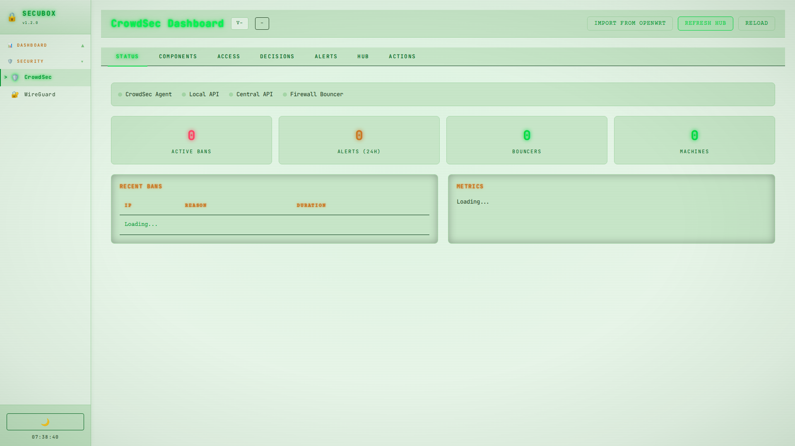
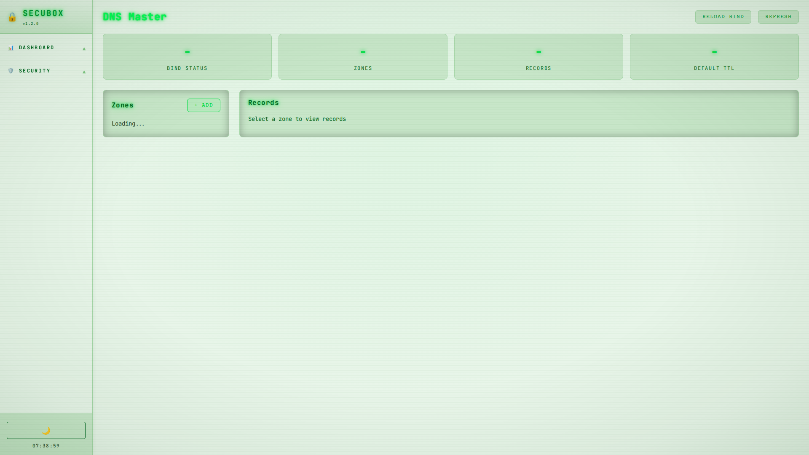

# SecuBox UI Guide

## CRT P31 Phosphor Theme System

SecuBox uses a retro CRT terminal aesthetic with P31 phosphor green colors, available in both light and dark themes.

### Theme Toggle
- Located in sidebar footer (moon/sun icon)
- Persists via `localStorage` key `sbx_theme`
- Default: Light theme

---

## Navbar/Sidebar Integration

### Required Elements

Every module page must include:

```html
<!DOCTYPE html>
<html lang="en">
<head>
    <!-- Theme CSS -->
    <link rel="stylesheet" href="/shared/crt-light.css">
    <link rel="stylesheet" href="/shared/sidebar-light.css">
</head>
<body class="crt-light">
    <!-- Sidebar container (populated by JS) -->
    <nav class="sidebar" id="sidebar"></nav>

    <!-- Main content with margin for sidebar -->
    <div class="main-content" style="margin-left: 220px; padding: 1.5rem;">
        <!-- Your content here -->
    </div>

    <!-- Sidebar script (must be before </body>) -->
    <script src="/shared/sidebar.js"></script>
</body>
</html>
```

### Sidebar Features
- **Collapsible categories**: Click category title to expand/collapse
- **Active page highlight**: Current page highlighted with blinking cursor
- **Theme toggle**: Moon/sun icon switches between light/dark
- **Clock**: Real-time clock display
- **User info**: Current user and logout button

---

## Menu Categories

| Category | Icon | Order | Description |
|----------|------|-------|-------------|
| Dashboard | 📊 | 0 | Main dashboard and portals |
| Security | 🛡️ | 1 | Security tools and VPN |
| Network | 🌐 | 2 | Network configuration |
| Monitoring | 📈 | 3 | System monitoring |
| Publishing | 📤 | 4 | Content publishing |
| Applications | 🎯 | 5 | Installed apps |
| System | 📦 | 99 | System administration |

---

## Module List

### Dashboard (📊)

| Module | Path | Description |
|--------|------|-------------|
| Dashboard | `/` | SecuBox Control Center |
| Portal | `/portal/` | Authentication Portal |
| System Hub | `/system/` | System configuration |
| SOC | `/soc/` | Security Operations Center |

### Security (🛡️)

| Module | Path | Description |
|--------|------|-------------|
| Users | `/users/` | Unified Identity Management |
| WireGuard VPN | `/wireguard/` | VPN tunnel management |
| CrowdSec | `/crowdsec/` | Collaborative security engine |
| WAF | `/waf/` | Web Application Firewall |
| MITM Proxy | `/mitmproxy/` | Traffic inspection |
| Hardening | `/hardening/` | Kernel and system hardening |
| Auth Guardian | `/auth/` | Authentication management |
| Vortex Firewall | `/vortex-firewall/` | nftables threat enforcement |
| NAC | `/nac/` | Network access control |
| Tor | `/tor/` | Anonymity network |
| ZKP | `/zkp/` | Zero-Knowledge Proof |

### Network (🌐)

| Module | Path | Description |
|--------|------|-------------|
| DNS | `/dns/` | BIND Zone Management |
| Vortex DNS | `/vortex-dns/` | DNS firewall with RPZ |
| Traffic Shaping | `/traffic/` | TC/CAKE QoS |
| Network Modes | `/netmodes/` | Network topology |
| DPI | `/dpi/` | Deep packet inspection |
| QoS | `/qos/` | Bandwidth Manager |
| Virtual Hosts | `/vhost/` | Nginx vhost management |
| CDN Cache | `/cdn/` | Content delivery cache |
| HAProxy | `/haproxy/` | Load balancer |
| Exposure | `/exposure/` | Unified exposure settings |
| Mesh DNS | `/meshname/` | Mesh network resolution |

### Monitoring (📈)

| Module | Path | Description |
|--------|------|-------------|
| Metrics | `/metrics/` | Metrics Dashboard |
| Netdata | `/netdata/` | Real-time monitoring |
| Media Flow | `/mediaflow/` | Media traffic analytics |
| Device Intel | `/device-intel/` | Asset discovery |

### Publishing (📤)

| Module | Path | Description |
|--------|------|-------------|
| Droplet | `/droplet/` | File publisher |
| MetaBlogizer | `/metablogizer/` | Static site publisher |
| Publish | `/publish/` | Publishing Platform |

### Applications (🎯)

| Module | Path | Description |
|--------|------|-------------|
| Mail | `/mail/` | Email Server |
| Webmail | `/webmail/` | Roundcube/SOGo |
| Streamlit | `/streamlit/` | Streamlit app platform |
| C3Box | `/c3box/` | Services Portal |
| Gitea | `/gitea/` | Git Server |
| Nextcloud | `/nextcloud/` | File Sync |
| StreamForge | `/streamforge/` | App development |

### System (📦)

| Module | Path | Description |
|--------|------|-------------|
| APT Repo | `/repo/` | Repository management |
| Backup | `/backup/` | Backup Manager |
| Watchdog | `/watchdog/` | Health monitoring |
| Roadmap | `/roadmap/` | Migration tracking |

---

## Color Palette

### Light Theme (crt-light.css)

| Variable | Color | Usage |
|----------|-------|-------|
| `--tube-light` | `#e8f5e9` | Background |
| `--tube-pale` | `#c8e6c9` | Cards, panels |
| `--tube-soft` | `#a5d6a7` | Borders |
| `--p31-peak` | `#00dd44` | Primary accent |
| `--p31-mid` | `#009933` | Text |
| `--p31-dim` | `#006622` | Muted text |

### Dark Theme (crt-system.css)

| Variable | Color | Usage |
|----------|-------|-------|
| `--tube-black` | `#0a0e14` | Background |
| `--tube-deep` | `#1a1f2e` | Cards, panels |
| `--tube-bezel` | `#252a3a` | Borders |
| `--p31-peak` | `#33ff66` | Primary accent |
| `--p31-hot` | `#66ffaa` | Highlights |
| `--p31-mid` | `#22cc44` | Text |

---

## Menu Configuration

Menu entries are JSON files in `/usr/share/secubox/menu.d/` or `/etc/secubox/menu.d/`.

### Format

```json
{
    "id": "module-id",
    "name": "Display Name",
    "icon": "🔧",
    "path": "/module/",
    "category": "dashboard",
    "order": 10,
    "description": "Module description"
}
```

### Fields

| Field | Required | Description |
|-------|----------|-------------|
| `id` | Yes | Unique identifier |
| `name` | Yes | Display name in sidebar |
| `icon` | Yes | Emoji icon |
| `path` | Yes | URL path (use `path`, not `url`) |
| `category` | Yes | Category ID |
| `order` | Yes | Sort order within category |
| `description` | No | Tooltip/description |

---

## Maintenance Script

Use `scripts/fix-navbar.sh` to check and fix navbar integration:

```bash
# Check local packages
./scripts/fix-navbar.sh packages/

# Check deployed site
./scripts/fix-navbar.sh /usr/share/secubox/www/
```

---

## Screenshots

> Screenshots to be added for each module

### Dashboard


### Security - CrowdSec


### Network - DNS


### Theme Toggle


---

## Changelog

- **2026-03-26**: Initial UI guide with CRT theme documentation
- Light/dark theme toggle implemented
- Collapsed categories by default (except active)
- Blue-tinted dark theme synchronized across all modules
