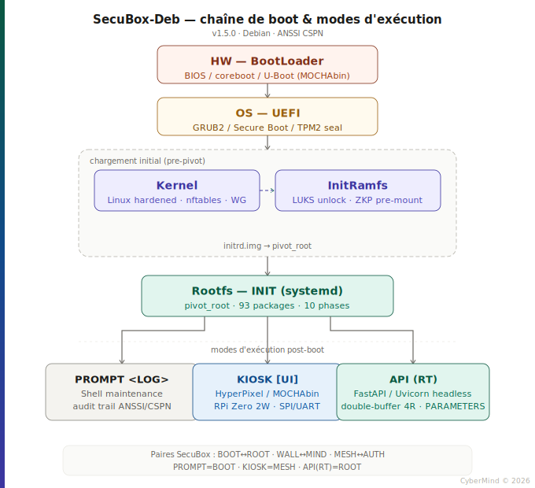

# Architecture de boot — SecuBox-Deb

> **Document** : `boot-architecture.md`  
> **Version** : 1.5.0  
> **Statut** : Référence technique — ANSSI/CSPN  
> **Auteur** : CyberMind — Gérald Kerma (GK²)  
> **Dernière mise à jour** : Avril 2026

---

## Vue d'ensemble

SecuBox-Deb repose sur une chaîne de démarrage en cinq couches successives, du firmware matériel jusqu'à l'espace utilisateur. À l'issue du boot, trois modes d'exécution exclusifs sont proposés selon le contexte opérationnel : maintenance (`PROMPT`), affichage (`KIOSK`) ou production (`API`).



> Le diagramme suit la charte graphique SecuBox (bande ROOT→MESH→MIND, palette officielle, typos Space Grotesk + JetBrains Mono). Une version PNG haute résolution (1360 × 1240 px) est disponible dans le même répertoire sous le nom `secubox_boot_architecture.png`.

---

## Chaîne de boot

### Couche 1 — HW / BootLoader

Le point d'entrée est le firmware du matériel cible. SecuBox-Deb est qualifié sur deux plateformes de référence :

| Plateforme | Firmware | Notes |
|---|---|---|
| Lenovo ThinkCentre M710q | BIOS/UEFI standard | x86_64, Secure Boot activable |
| MOCHAbin (Marvell Armada 7040) | U-Boot | ARM64, boot depuis eMMC ou NVMe |

Le BootLoader a pour seule responsabilité de localiser et charger le second étage (GRUB2 ou U-Boot chainloading). Aucune logique applicative SecuBox ne réside à ce niveau.

---

### Couche 2 — OS / UEFI (GRUB2)

GRUB2 assure la sélection du noyau, la vérification de la signature du binaire (Secure Boot) et le déverrouillage optionnel du TPM2 pour les secrets de scellement (`tpm2_unseal`).

Points de configuration critiques pour la conformité CSPN :

- La partition `/boot` est en clair (FAT32 / ext4) mais protégée par la vérification de signature UEFI.
- Le paramètre de ligne de commande noyau est figé en production (pas de modification possible sans accès physique).
- Le mot de passe GRUB est obligatoire sur les cibles de production.

---

### Couche 3 — Kernel + InitRamfs (chargement initial)

Ces deux composants sont chargés ensemble par GRUB2 et constituent le périmètre de chargement initial, avant `pivot_root`.

#### Kernel Linux (hardened)

Le noyau SecuBox-Deb est compilé avec le profil de durcissement ANSSI recommandé :

```
CONFIG_SECURITY_LOCKDOWN_LSM=y
CONFIG_SECURITY_LOCKDOWN_LSM_EARLY=y
CONFIG_MODULE_SIG=y
CONFIG_MODULE_SIG_ALL=y
CONFIG_MODULE_SIG_SHA512=y
CONFIG_HARDENED_USERCOPY=y
CONFIG_RANDOMIZE_BASE=y   # KASLR
```

Les modules intégrés au noyau (non chargés à chaud en production) incluent notamment : `nftables`, `WireGuard`, `eBPF` (restreint), pilotes réseau MOCHAbin (Marvell mvneta/mvpp2 — contribution GK²).

#### InitRamfs

L'initrd réalise les opérations suivantes, dans l'ordre strict :

1. Détection et montage du disque chiffré LUKS2 (`cryptsetup luksOpen`).
2. Vérification de la preuve ZKP pré-montage (GK·HAM-HASH L1 — NIZKProof hamiltonien, rotation 24h PFS).
3. Montage de la racine chiffrée sur `/sysroot`.
4. `switch_root` vers le Rootfs.

> **Point CSPN** : aucune clé LUKS n'est stockée en clair dans l'initrd. La dérivation passe par le TPM2 (scellement aux PCR 0+7+14) ou saisie interactive.

---

### Couche 4 — Rootfs / INIT (systemd)

Après `pivot_root`, systemd prend la main. Il orchestre les 10 phases de démarrage SecuBox-Deb et charge les 93 packages de la stack.

#### Stack de services (phases principales)

| Phase | Services | Paires SecuBox |
|---|---|---|
| Phase 1 — Réseau | nftables, WireGuard, Tailscale | MESH↔AUTH |
| Phase 2 — Sécurité périmétrique | CrowdSec, HAProxy | WALL↔MIND |
| Phase 3 — DPI dual-stream | nDPId (actif/shadow) | WALL↔MIND |
| Phase 4 — Runtime API | FastAPI/Uvicorn, double-buffer 4R | BOOT↔ROOT |
| Phase 5 — ZKP auth | GK·HAM-HASH (L1/L2/L3) | BOOT↔ROOT |
| Phase 6 — MirrorNet P2P | WireGuard + did:plc | MESH↔AUTH |
| Phase 7 — Notarisation | ALERTE·DÉPÔT blind notarization | WALL↔MIND |
| Phase 8 — Display | HyperPixel / coprocesseur RPi Zero 2W | MESH↔AUTH |
| Phase 9 — Monitoring | Métriques, alertes, SIEM | WALL↔MIND |
| Phase 10 — Finalization | Health-check, seal TPM2 | BOOT↔ROOT |

La convention **double-buffer PARAMETERS 4R** (Read / Route / Rollback / Record) est appliquée sur les couches L2 (Routing twins actif/shadow, swap atomique conditionné par ZKP) et L3 (Endpoint twins service/witness MirrorNet P2P).

---

## Modes d'exécution post-boot

À l'issue de la Phase 10, systemd active l'une des trois cibles d'exécution selon la configuration présente dans `/etc/secubox/runtime.conf` (clé `MODE=`).

### PROMPT `<LOG>` — Mode maintenance

**Cible systemd** : `secubox-prompt.target`

Activé lors des interventions de maintenance, des audits CSPN ou des mises à jour. Ce mode correspond à la paire **BOOT** dans la nomenclature SecuBox.

Caractéristiques :

- Shell interactif accessible via console physique ou session SSH restreinte (liste blanche d'adresses IP source).
- Journalisation exhaustive de toutes les commandes (`auditd` + `systemd-journal`, rétention 90 jours minimum).
- Les services de production (API, DPI, MirrorNet) sont arrêtés.
- Accès en lecture seule aux journaux des autres modes via `journalctl -M`.
- Conformité ANSSI/CSPN : traçabilité complète exigée pour la certification, chaque session génère un rapport d'audit signé (ALERTE·DÉPÔT).

```bash
# Activer le mode PROMPT
echo "MODE=PROMPT" > /etc/secubox/runtime.conf
systemctl isolate secubox-prompt.target
```

---

### KIOSK `[UI]` — Mode affichage

**Cible systemd** : `secubox-kiosk.target`

Interface graphique verrouillée pour l'affichage des métriques SecuBox sur un écran HyperPixel connecté au MOCHAbin ou géré par le coprocesseur RPi Zero 2W via SPI/UART. Ce mode correspond à la paire **MESH** dans la nomenclature SecuBox.

Caractéristiques :

- Application UI dédiée (Wayland/wlroots ou framebuffer direct selon la cible matérielle).
- Aucun accès shell, aucune interface réseau entrante.
- Communication avec le bus SecuBox via socket Unix local (lecture seule).
- Le RPi Zero 2W agit comme coprocesseur d'affichage indépendant : il reçoit les métriques par UART et pilote l'écran HyperPixel sans exposer la surface d'attaque du MOCHAbin.
- Redémarrage automatique en cas de crash (`Restart=always`, délai 2 s).

```bash
# Activer le mode KIOSK
echo "MODE=KIOSK" > /etc/secubox/runtime.conf
systemctl isolate secubox-kiosk.target
```

---

### API `(RT)` — Mode production (runtime)

**Cible systemd** : `secubox-api.target`

Mode headless de production, activé par défaut au démarrage des unités déployées. Ce mode correspond à la paire **ROOT** dans la nomenclature SecuBox et est le seul mode soumis à qualification CSPN.

Caractéristiques :

- FastAPI/Uvicorn exposé sur socket Unix local (HAProxy assure le TLS en façade).
- Double-buffer 4R actif sur L2 (routing twins actif/shadow, swap atomique conditionné par ZKP, rollback automatique en cas d'échec de preuve).
- nDPId dual-stream en écoute (flux actif et shadow traités en parallèle).
- CrowdSec en mode agent (pas de console cloud en production souveraine).
- Aucun shell interactif, aucun accès SSH depuis l'extérieur.
- Health-check exposé sur port local uniquement (`/healthz`, `127.0.0.1:8080`).

```bash
# Activer le mode API (défaut production)
echo "MODE=API" > /etc/secubox/runtime.conf
systemctl isolate secubox-api.target
```

---

## Correspondance avec les paires SecuBox

La nomenclature de couleurs et de paires SecuBox reflète directement les niveaux de la chaîne de boot et des modes d'exécution.

| Couleur | Code hex | Couche / Mode |
|---|---|---|
| BOOT | `#803018` | HW / BootLoader |
| WALL | `#9A6010` | OS / UEFI |
| MIND | `#3D35A0` | Kernel + InitRamfs |
| ROOT | `#0A5840` | Rootfs / INIT — Mode API (RT) |
| MESH | `#104A88` | Mode KIOSK [UI] |
| AUTH | `#C04E24` | Mode PROMPT \<LOG\> |

Les paires **BOOT↔ROOT**, **WALL↔MIND** et **MESH↔AUTH** définissent des relations d'asymétrie complémentaire avec séparation formelle des privilèges (voir `GK2-HASM-v3.0.pdf` pour la formalisation cryptographique).

---

## Points de contrôle CSPN

Les éléments suivants font l'objet d'une vérification lors de l'évaluation CSPN (cible 2027) :

- [ ] Signature du noyau et des modules vérifiée par Secure Boot (clé GK² enrôlée dans le firmware).
- [ ] Initrd sans secret en clair (vérifiable par `lsinitrd | grep -i key`).
- [ ] Scellement TPM2 aux PCR 0+7+14 validé après chaque mise à jour noyau.
- [ ] Mode PROMPT uniquement accessible depuis la console physique ou SSH avec authentification par certificat.
- [ ] Journaux d'audit exportés et signés avant chaque session PROMPT.
- [ ] Mode API ne démarrant pas si la preuve ZKP L1 échoue (systemd `ConditionPathExists=/run/secubox/zkp-ok`).
- [ ] Cloisonnement réseau entre les trois modes vérifié par `nft list ruleset`.

---

## Références

- `GK2-HASM-v3.0.pdf` — Architecture ZKP GK·HAM-HASH (arXiv cs.CR / IACR ePrint)
- `CLAUDE.md` — Contraintes de développement SecuBox-Deb pour Claude Code
- `AGENTS.md` — Gouvernance des agents IA sur le dépôt
- `parameters-4r.md` — Convention double-buffer PARAMETERS 4R
- [ANSSI — Référentiel CSPN](https://www.ssi.gouv.fr/entreprise/certification_cspn/)
- [ANSSI — Guide de configuration GNU/Linux](https://www.ssi.gouv.fr/guide/recommandations-de-securite-relatives-a-un-systeme-gnulinux/)

---

*CyberMind © 2026 — Document confidentiel, diffusion restreinte aux contributeurs SecuBox-Deb.*
