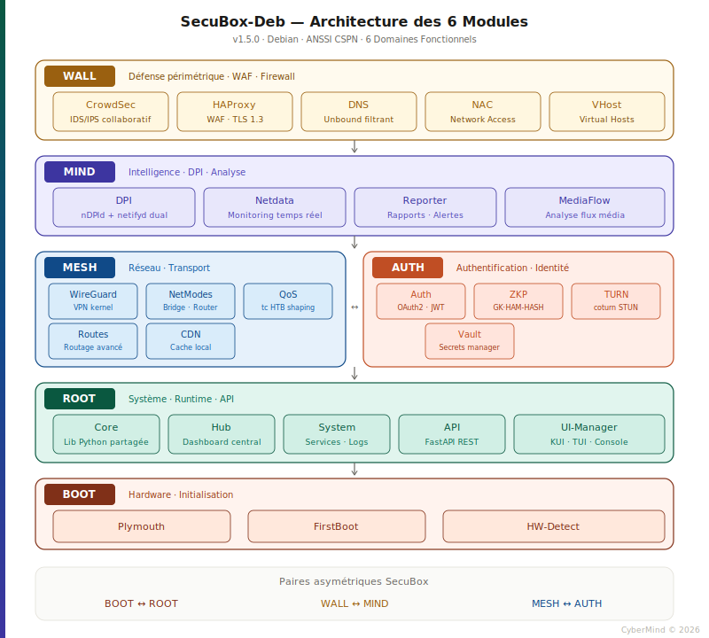
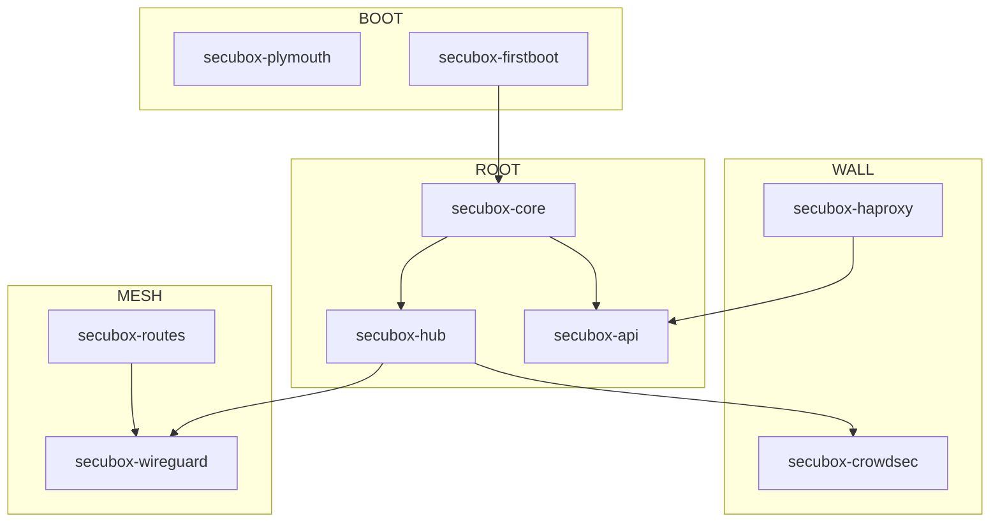

# Architecture des modules — SecuBox-Deb

> **Document** : `modules-architecture.md`
> **Version** : 1.5.0
> **Statut** : Référence technique — ANSSI/CSPN
> **Auteur** : CyberMind — Gérald Kerma (GK²)
> **Dernière mise à jour** : Avril 2026

---

## Vue d'ensemble

SecuBox-Deb s'organise en **6 domaines fonctionnels** représentés par les couleurs de la charte graphique. Chaque domaine regroupe des modules cohérents selon leur responsabilité dans l'architecture de sécurité.



> Le diagramme suit la charte graphique SecuBox (palette 6 modules, typos Space Grotesk + JetBrains Mono).

---

## Les 6 Domaines

### BOOT — Hardware & Initialisation
**Couleur** : `#803018` (brun-rouge)

Domaine fondamental responsable de l'amorçage matériel et de l'initialisation du système.

| Module | Rôle | Statut |
|--------|------|--------|
| `secubox-plymouth` | Splash screen animé au boot | ✅ |
| `secubox-firstboot` | Configuration initiale (SSH, hostname) | ✅ |
| `secubox-hw-detect` | Détection et configuration matérielle | ✅ |

---

### WALL — Défense périmétrique
**Couleur** : `#9A6010` (ambre)

Domaine de protection frontale : WAF, firewall, filtrage DNS.

| Module | Rôle | Statut |
|--------|------|--------|
| `secubox-crowdsec` | IDS/IPS collaboratif | ✅ |
| `secubox-haproxy` | Load balancer / WAF TLS 1.3 | ✅ |
| `secubox-vhost` | Gestion des virtual hosts | ✅ |
| `secubox-dns` | Unbound DNS filtrant | ✅ |
| `secubox-nac` | Network Access Control | ✅ |

---

### MIND — Intelligence & Analyse
**Couleur** : `#3D35A0` (indigo)

Domaine d'analyse en profondeur : DPI, métriques, inspection du trafic.

| Module | Rôle | Statut |
|--------|------|--------|
| `secubox-dpi` | Deep Packet Inspection (nDPId + netifyd) | ✅ |
| `secubox-netdata` | Monitoring temps réel | ✅ |
| `secubox-reporter` | Rapports et alertes | ✅ |
| `secubox-mediaflow` | Analyse des flux média | ✅ |

---

### ROOT — Système & Runtime
**Couleur** : `#0A5840` (vert sombre)

Domaine système : API runtime, gestion des services, configuration centralisée.

| Module | Rôle | Statut |
|--------|------|--------|
| `secubox-core` | Bibliothèque Python partagée | ✅ |
| `secubox-hub` | Dashboard central | ✅ |
| `secubox-system` | Gestion système (services, logs) | ✅ |
| `secubox-api` | FastAPI REST backend | ✅ |
| `secubox-ui-manager` | Gestionnaire UI unifié | ✅ |

---

### MESH — Réseau & Transport
**Couleur** : `#104A88` (bleu cobalt)

Domaine réseau : VPN, P2P mesh, routage, QoS.

| Module | Rôle | Statut |
|--------|------|--------|
| `secubox-wireguard` | VPN WireGuard | ✅ |
| `secubox-netmodes` | Modes réseau (bridge, router, AP) | ✅ |
| `secubox-routes` | Gestion du routage | ✅ |
| `secubox-qos` | Quality of Service (tc HTB) | ✅ |
| `secubox-cdn` | Cache CDN local | ✅ |

---

### AUTH — Authentification & Identité
**Couleur** : `#C04E24` (vermillon)

Domaine d'identité : authentification ZKP, gestion des accès, TURN/STUN.

| Module | Rôle | Statut |
|--------|------|--------|
| `secubox-auth` | Authentification centralisée | ✅ |
| `secubox-zkp` | Preuves zero-knowledge (GK·HAM-HASH) | 🔄 |
| `secubox-turn` | Serveur TURN/STUN (coturn) | ✅ |
| `secubox-vault` | Gestion des secrets | ✅ |

---

## Paires asymétriques

Les domaines fonctionnent en paires complémentaires :

| Paire | Relation | Flux |
|-------|----------|------|
| **BOOT ↔ ROOT** | Initialisation → Runtime | Le boot prépare, le runtime exécute |
| **WALL ↔ MIND** | Défense → Analyse | Le mur bloque, l'esprit comprend |
| **MESH ↔ AUTH** | Transport → Identité | Le réseau connecte, l'auth valide |

---

## Architecture en couches

```
┌─────────────────────────────────────────────────────────────┐
│                        WALL (Périmètre)                      │
│  CrowdSec · HAProxy · DNS · NAC                             │
├─────────────────────────────────────────────────────────────┤
│                        MIND (Analyse)                        │
│  nDPId · Netdata · Reporter · MediaFlow                     │
├───────────────────────┬─────────────────────────────────────┤
│      MESH (Réseau)    │         AUTH (Identité)             │
│  WireGuard · Routes   │  ZKP · TURN · Vault                 │
│  QoS · NetModes · CDN │  OAuth2 · JWT                       │
├───────────────────────┴─────────────────────────────────────┤
│                        ROOT (Système)                        │
│  Core · Hub · System · API · UI-Manager                     │
├─────────────────────────────────────────────────────────────┤
│                        BOOT (Base)                           │
│  Plymouth · FirstBoot · HW-Detect                           │
└─────────────────────────────────────────────────────────────┘
```

---

## Dépendances inter-modules

### Dépendances critiques



### Ordre de démarrage

1. **BOOT** : Plymouth → FirstBoot → HW-Detect
2. **ROOT** : Core → API → Hub → System
3. **MESH** : WireGuard → Routes → NetModes
4. **WALL** : DNS → NAC → HAProxy → CrowdSec
5. **MIND** : Netdata → nDPId → Reporter
6. **AUTH** : Vault → ZKP → TURN

---

## Points de contrôle CSPN

| Domaine | Contrôle | Critère |
|---------|----------|---------|
| WALL | Isolation réseau | DROP par défaut, whitelist explicite |
| MIND | Journalisation | Logs immuables, horodatés RFC 3339 |
| ROOT | Séparation privilèges | Users dédiés par service |
| AUTH | Secrets | Pas de secret en clair, TPM2 seal |
| MESH | Chiffrement | TLS 1.3, WireGuard obligatoire |
| BOOT | Intégrité | Secure Boot, signature noyau |

---

## Références

- `graphic-charter.md` — Charte graphique et codes couleurs
- `boot-architecture.md` — Chaîne de boot complète
- `parameters-4r.md` — Convention double-buffer PARAMETERS 4R
- `CLAUDE.md` — Guide de développement

---

*CyberMind © 2026 — Document confidentiel, diffusion restreinte aux contributeurs SecuBox-Deb.*
