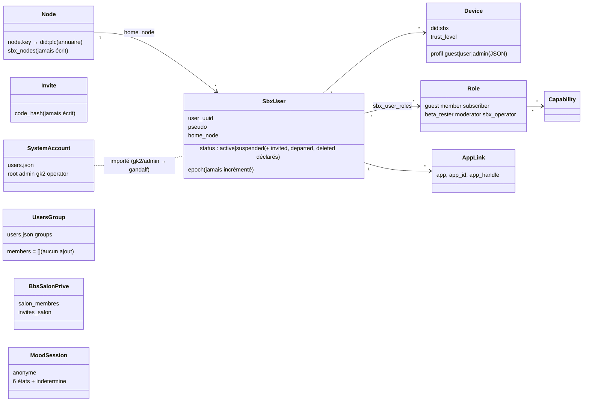
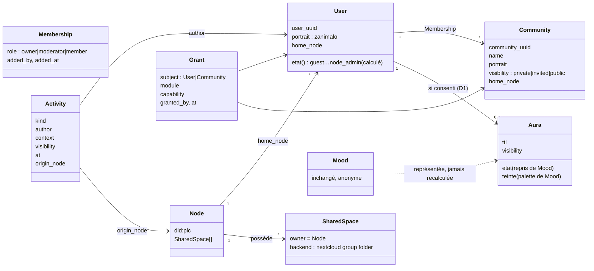

<!--
  SPDX-License-Identifier: LicenseRef-CMSD-1.0
  Copyright (c) 2026 CyberMind — Gérald Kerma <devel@cybermind.fr>
  Source-Disclosed License — All rights reserved except as expressly granted.
  See LICENCE-CMSD-1.0.md for terms.
-->

# Audit — SBXOS Community Refactor (phase 1 : l'existant)

> #1509 · 2026-09-27 · mission : [PROMPT-COMMUNITY-REFACTOR.md](PROMPT-COMMUNITY-REFACTOR.md)
> Complète sans les répéter : [AUDIT_SBX_IDENTITY.md](../AUDIT_SBX_IDENTITY.md) (#1417),
> [AUTH_V2.md](../AUTH_V2.md), [AUTH_V3.md](../AUTH_V3.md), [AUDIT_AUTHENTICATION.md](../AUDIT_AUTHENTICATION.md).
>
> **Aucun code n'est modifié par ce document.** Il établit ce qui existe (chemins
> relatifs à la racine du dépôt, `fichier:ligne`), l'écart avec la cible, et un
> plan par couches dont chaque étape s'appuie sur l'existant. Les décisions
> ouvertes sont en §9 ; rien ne se code avant qu'elles soient tranchées.

## 0. En une page

| Entité cible | Ce qui existe déjà | Écart principal |
|---|---|---|
| **Node** | clé `node.key` → `did:plc` (annuaire) ; `sbx_nodes` et `sbx_users.home_node` (`common/secubox_core/sbxid.py:420-424`) | `sbx_nodes` n'est jamais écrit ; le Node ne possède rien (aucun espace, aucune liste de membres) |
| **User** | personne SBX OS dans `sbx.db` (`sbx_users`, rôles, appareils, certificats, liens de comptes) — `packages/secubox-sbxid` | pas d'état de cycle de vie lisible ; pas d'identité reconnue hors de sa box ; avatar et préférences hors de `user_uuid` |
| **Community** | **rien d'opérant** : `groups` de `secubox-users` sans membres ni effet ; salons privés BBS (un salon à la fois) | entité entièrement à créer |
| **Shared Space** | un montage Nextcloud `PhotoLibrary` visible de tous, non déclaré | aucun espace possédé par le Node ; isolation photos en `0777` |
| **Activity** | sept journaux indépendants ; seul le journal signé de l'annuaire porte auteur + nœud et voyage entre boxes | pas de schéma commun, pas de bus, pas de nœud d'origine sur le social |
| **Mood → Aura** | Mood : 6 états + `indetermine`, anonyme par construction ; un seul consommateur (lampe du Hall) | pas de couche Aura ; **Mood n'est lié à aucune personne, volontairement** (§9-D1) |

Trois constats transverses conditionnent tout le reste :

1. **Le schéma cible est déjà à moitié écrit, pas le code.** `sbx.db` déclare
   `sbx_invites`, `sbx_migrations`, `sbx_nodes`, `sbx_sessions`, `sbx_replay`, le
   statut `invited` et le niveau de confiance `pending` — aucun n'est écrit par le
   code (§1.2). L'extension passe par *faire vivre* ces tables, pas par en créer
   d'équivalentes.
2. **Quatre systèmes d'identité et de rôles coexistent** : `users.json` (comptes
   système), `sbx.db` (personnes SBX OS), le registre d'appareils
   (`demandes.json` + `appareils.json`), et les rôles locaux BBS/Radio. Les ponts
   sont partiels et `sbx.db` est **dérivé** de `demandes.json` à chaque requête
   (`packages/secubox-sbxid/api/store.py:88-133`).
3. **Beaucoup de capacités sont déclarées mais jamais vérifiées** : `hall.*`,
   `bbs.read/write`, `radio.*`, `nextcloud.files`, `peertube.upload`… (§3.1). Les
   permissions par communauté ne serviront que si les modules consultent enfin les
   capacités.

---

## 1. User — identité et cycle de vie

### 1.1 Modèle de données

Magasin : `/var/lib/secubox/sbxid/sbx.db` (`packages/secubox-sbxid/api/store.py:30`),
schéma dans `common/secubox_core/sbxid.py:418-461`, créé par `initialise()` (`:464-477`).

| Table | Rôle | Écrite par le code ? |
|---|---|---|
| `sbx_users` (`:421-425`) | personne : `user_uuid`, `pseudo` UNIQUE NOCASE, `email`, `status`, `home_node`, `epoch` ; CHECK pseudo ∉ comptes système | oui |
| `sbx_roles`, `sbx_capabilities`, `sbx_role_capabilities`, `sbx_user_roles` (`:426-431`) | rôles et capacités ; CHECK : aucune capacité `ssh*`, `sudo*`, `root*`, `system.*` | oui |
| `sbx_devices` (`:432-436`) | appareils (DID `did:sbx:…`, clé P-256, `trust_level`) | oui |
| `sbx_certificates` (`:437-439`) | certificats `sbxos/v1` doublement signés | oui |
| `sbx_preferences` (`:454`) | clé/valeur par personne | **à peine** (seulement `mdp_propre:<svc>`, `packages/secubox-sbxid/api/comptes.py:111,241,248`) |
| `sbx_app_links` (`:455`) | comptes de services rattachés (BBS, Nextcloud, PeerTube, mail) | oui |
| `sbx_audit` (`:460`) | journal d'administration | oui |
| `sbx_invites` (`:446-449`) | invitations avec `code_hash` | **non** |
| `sbx_migrations` (`:456-459`) | migration inter-nœuds (`requested → … → finalized`) | **non** (lecture seule, `api/main.py:670`) |
| `sbx_nodes`, `sbx_sessions`, `sbx_replay` | nœuds, sessions, rejeu | **non** |

Magasins encore faisant foi hors `sbx.db` : `/var/lib/secubox/acces/demandes.json`
(file d'admission, `packages/secubox-sbxid/acces/api/profileur.py:71-105`),
`/etc/secubox/appareils.json` (`common/secubox_core/appareils.py:52`),
`/etc/secubox/users.json` (comptes système), `/var/lib/secubox/auth/sessions.json`.

### 1.2 États existants face aux six états cibles

| Cible | Existant | Verdict |
|---|---|---|
| `guest` | rôle `guest` (`sbxid.py:58`) ; profil d'appareil `guest` (`profileur.py:45`) ; défaut non authentifié (`common/secubox_core/capacites.py:96-98`) | **existe** (trois fois) |
| `invitation_requested` | `Demande.etat = "en_attente"` (`profileur.py:54`, `:226-236`) — **par appareil**, en JSON | partiel : à hisser au niveau personne |
| `invited` | `sbx_users.status='invited'` et `sbx_invites` — schéma seul | **déclaré, jamais écrit** |
| `member` | rôle `member` (`sbxid.py:59`) ; défaut de l'admission (`Decision.role="member"`, `packages/secubox-sbxid/api/main.py:600`) | **existe** |
| `community_assigned` | aucune notion de communauté pour une personne | **absent** |
| `node_admin` | éclaté : `users.json role=admin` (toutes capacités, `capacites.py:107-109`), profil d'appareil `admin` (`acces/api/main.py:171-204`), rôle `sbx_operator` → `admin.users` (`sbxid.py:64-66`) | **existe mais en trois morceaux** |

Autres états présents : `sbx_users.status` ∈ `invited|active|suspended|departed|deleted`
(seuls `active`/`suspended` sont réellement posés, `api/main.py:565-578`) ;
`trust_level` ∈ `pending|verified|trusted` (`pending` jamais écrit).

### 1.3 Invitations et codes

- Demande d'accès d'appareil : `POST /invitation/demande`, non authentifiée,
  5/h/IP (`packages/secubox-sbxid/acces/api/main.py:56-57,160-166,255-273`).
- Lien d'entrée à usage unique (le plus proche d'un « e-code ») : 32 octets,
  6 h, **en mémoire seulement** (`acces/api/lien.py`) — perdu au redémarrage.
- Décision : `POST /admin/demandes/{did}/accepter` (rôle, personne existante
  optionnelle) — `packages/secubox-sbxid/api/main.py:614-649`, journal `invite.validated`.
- **Aucune validation de code d'invitation** : `sbx_invites.code_hash` n'est lu
  ni écrit nulle part.

### 1.4 Portabilité entre boxes

Existe : DID d'appareil lié à sa clé (`sbxid.py:176-182`) ; certificats
`sbxos/v1` doublement signés, vérifiés sur nœud, personne, `epoch`, expiration
(`:296-395`), dont un type *migration* à seconde signature (`:386-395`) ;
octets canoniques identiques à l'annuaire (`:130-133`).

N'existe pas : **aucun DID par personne** (un `user_uuid` local + `home_node`) ;
`epoch` jamais incrémenté ; aucune opération d'annuaire pour personnes ou
certificats (`packages/secubox-annuaire/annuaire/model.py:52-95`) ; aucun endpoint
de migration. Les clés d'appareil sont par origine et par navigateur : une
seconde machine ne récupère l'identité que par un administrateur qui la rattache.

---

## 2. Community

### 2.1 Ce qui ressemble à un groupe

| Objet | Fait | Effet réel |
|---|---|---|
| `secubox-groupd` | regroupe des **modules** dans un interpréteur (`packages/secubox-groupd/sbin/secubox-groupd:5,38-47`) | sans rapport avec les personnes |
| `groups` de `secubox-users` | `GET /groups`, `POST /group`, `DELETE /group/{name}` (`packages/secubox-users/api/main.py:843-880`) ; créé avec `members: []` | **aucun endpoint d'ajout de membre** ; permissions jamais évaluées (`get_user_permissions`, `:359-390`) ; l'UI n'affiche qu'un compteur |
| Salons privés BBS (Go) | `categories.prive`, `salon_membres(category_id, user_id, ajoute_par, ajoute_le)`, `invites_salon(code_sha256, …)` (`packages/secubox-bbs/internal/store/migrations/0017_salons_prives.sql:18,30,60`) ; fonctions `AjouteMembre`, `PeutVoirSalon`… (`internal/store/salons_prives.go:29-219`) | **seule liste nominative qui fonctionne**, limitée à un salon |
| Rôles SBX | `guest`, `member`, `subscriber` (dérivé), `beta_tester`, `moderator`, `sbx_operator` (`sbxid.py:57-68`) | des rôles, pas des groupes nommés |

« Community » n'apparaît ailleurs que pour des **boxes** : niveau de fédération
`tier: community` (`packages/secubox-federation/internal/federation/config.go:74,116`)
et domaines d'isolement de l'annuaire.

### 2.2 Conséquence

`Community` est la seule entité réellement neuve. Elle a sa place dans `sbx.db`
(à côté de `sbx_users` et `sbx_user_roles`), pas dans `users.json` : les comptes
système n'ont pas vocation à être membres de communautés (règle permanente).
Les salons privés BBS en sont le modèle d'usage le plus proche (membres nommés,
invitation par code haché) — voir §9-D4.

---

## 3. Permissions par module

### 3.1 Le modèle commun existe, il est peu utilisé

Chaîne `capacites_du_porteur` (`common/secubox_core/capacites.py:101-121`) :
admin système → toutes capacités ; sinon demande acceptée → DID → `sbx.db`
(statut, rôles, abonnement, `:62-93`) ; repli sur le profil d'appareil
(`:96-98`). Cache 30 s (`:42`). Garde de route : `require_capability(cap)` (`:193-201`).

Vérifiées par du code : `metablog.publish` (metablogizer), `billets.publish`
(Billets, `api/routes/jwt_admin.py:110`), `bbs.moderate` (lu par la messagerie,
`packages/secubox-messagerie/api/main.py:115,117`), `admin.users` (sbxid).
**Déclarées, jamais vérifiées** : `hall.*`, `bbs.read/write`, `billets.read`,
`radio.listen/chat`, `peertube.upload`, `nextcloud.files`, `reelbox.*`,
`admin.invites/modules/audit`.

### 3.2 Module par module

| Module | Mécanisme actuel | Stockage | Granularité | UI d'administration |
|---|---|---|---|---|
| sbxid | `admin.users` ou admin système | `sbx.db` | personne | `packages/secubox-sbxid/www/identite/index.html` |
| metablogizer, Billets | `require_capability` | `sbx.db` | personne via rôle | idem |
| messagerie | lecture de `bbs.moderate` | `sbx.db` | personne | idem |
| users | `require_permission` (autre modèle, `packages/secubox-users/api/main.py:398-416`) | `users.json` + `roles.json` | compte via rôle | `www/users/index.html` |
| accès (appareils) | profil d'appareil `admin` | `demandes.json` + `appareils.json` | appareil | `acces/www/acces/index.html` |
| BBS salons | sysop, ou salon privé + `salon_membres` | SQLite BBS | personne nommée, par salon | `/sysop` du BBS |
| BBS catégories | colonnes `min_role_read/write` (`0001_socle.sql:38-39`) | SQLite BBS | — | **colonnes mortes** |
| Radio | secret partagé sysop (`cmd/secubox-radiod/main.go:158-209`) | fichier secret | aucune | aucune |
| Hall (accès délégués) | le porteur ne gère que les siens (`packages/secubox-webos/api/acces.py:53-70`) | `webos-acces/<qui>/` | personne × service | libre-service seulement |
| ~107 API d'état | `require_lecture` (jeton ou lecture LAN, `common/secubox_core/auth.py:334-392`) | `secubox.conf` | aucune | — |

### 3.3 Conséquence

« Allow User + Allow Community » n'a pas de page à étendre partout : il n'existe
qu'**une** liste nominative (salons BBS). Le point d'extension naturel est
`capacites_du_porteur` : y ajouter les autorisations accordées à la personne et à
ses communautés rend l'effet immédiat pour tous les modules qui appellent déjà
`require_capability`, puis module par module pour les autres.

---

## 4. Shared Space

| Espace | Existant | Propriétaire de fait |
|---|---|---|
| Nextcloud `PhotoLibrary` | stockage externe sur `/media/photos` **sans restriction** (`packages/secubox-nextcloud/sbin/nextcloudctl:449-471`) | visible de tous les comptes — seul espace partagé de fait, non déclaré |
| Nextcloud `Photos-<user>` | créé seulement par `user-provision` (`nextcloudctl:587-598`) | la personne |
| `/data/shared/photos` | 0777, dossiers `<user>/` 0777 (`nextcloudctl:145-146`, `photoprismctl:101-102`) | personne, mais sans isolation |
| SMB | partages des seuls médias externes montés (`packages/secubox-smb/sbin/smbctl:140-170`) | personne |
| Hall « Cloud » | toujours le compte **personnel** du porteur (`packages/secubox-webos/api/nc_super.py`, `acces.py:212-265`) | la personne |

Aucune table ne dit qu'un espace appartient au Node. Nextcloud n'a **ni groupes ni
Group Folders** (aucun `occ group:*`). Deux chemins de création de comptes
divergent : `sbxid` → `secubox-usersctl-services` → `user add` (sans montage
photo) et `secubox-user-sync` → `user-provision` (avec).

**Constat de sécurité à traiter indépendamment du refactor** : `/data/shared/photos`
et ses sous-dossiers en `0777`, et `PhotoLibrary` sans restriction, laissent
probablement chaque compte Nextcloud voir les photos de tous. C'est l'inverse de
« personnel = à la personne » (§8, P0).

---

## 5. Activity

### 5.1 Sept journaux, aucun schéma commun

| Producteur | Stockage | Auteur | Visibilité | Nœud d'origine |
|---|---|---|---|---|
| Messagerie (mur) | `messages.db` (`packages/secubox-messagerie/api/main.py:59-71`) ; fusion radio + Billets + BBS **à la lecture** (`/fil`, `:357-368`) | oui | `prive` 0/1 | non |
| Hall (diffusion) | `broadcast.json` + historique 80 (`packages/secubox-webos/api/main.py:115,139`) | `par` **libre, non authentifié** | aucune | non |
| Radio | table `chat` ; événements vers le BBS (`internal/web/web.go:177-233`) | oui | membres | non |
| BBS | `threads`/`posts` (`local`/`public`), `audit`, **`content_event` append-only** (`0024_content.sql`, `POST /api/v1/bbs/content/{id}/event`) | oui | `local`/`public`/`community` | non |
| Billets | `event_log` chaîné BLAKE2b (`packages/secubox-billets/api/services/eventlog.py`) | partiel | — | non |
| sbxid | `sbx_audit` : `user.created`, `invite.validated`, `roles.set`, `link.*`… | oui (acteur) | admin | non (mais `home_node` existe) |
| **Annuaire** | journal signé `log(height, op, prev_hash, payload, author=did:plc, sig, created_at)` (`packages/secubox-annuaire/annuaire/log.py:35-47`), **répliqué** par `mesh_sync` (`mesh_sync.py:96-113`) | **oui, signé** | — | **oui** |

S'y ajoutent `audit.log` d'auth (JSONL), les JSONL de ZIA, et une dizaine de
formats libres dans `/var/log/secubox/audit.log`. Rien n'est poussé : tout est
interrogé toutes les 8 à 15 s.

### 5.2 Événements cibles

| Cible | Existant | Statut |
|---|---|---|
| `user_joined` | `sbx_audit` `user.created` / `invite.validated` | à normaliser |
| `community_joined` | `salon_membres` (non journalisé) ; `AUTO_ADD` de l'annuaire (nœuds) | **manquant** |
| `file_shared` | `files` du BBS (sans événement) | **manquant** |
| `bbs_post` | lignes `threads`/`posts`, courriel de notification | à normaliser |
| `radio_live` | diffusion du Hall **et** `content_event` `broadcast` — deux notions | à unifier |
| `mood_changed` | `resume` Mood, anonyme par construction | **manquant, et conflictuel** (§9-D1) |
| `avatar_changed` | `users.avatar_file` BBS ; `secubox-avatar` (`log.info` seul) | **manquant** |
| `permission_granted` | `sbx_audit` `roles.set` ; `sbx_user_roles.granted_by/at` ; `grant_issue` annuaire | à normaliser |

### 5.3 Conséquence

Deux briques existent et ne doivent pas être réinventées : la **forme** d'un
événement générique (`content_event` du BBS : objet, genre, acteur, charge,
horodatage) et le **transport signé inter-boxes** (journal de l'annuaire). Le
moteur d'activités cible est la jonction des deux, écrit dans `secubox_core`
(aucun module Python n'a d'assistant d'événements aujourd'hui).

---

## 6. Mood → Aura

### 6.1 Mood, tel qu'il est (à ne pas modifier)

- États : `indetermine`, `calm`, `joy`, `stress`, `anger`, `fatigue`, `focus`
  (`packages/gabriel-mood/internal/ser/ser.go:110-121`) ; `indetermine` est une
  réponse normale, avec motifs `bruit`, `voix-insuffisante`, `etalonnage`, `ambiance` (`:92-99`).
- API : `/api/mood?session=`, `/api/mood/commun`, `/api/mood/historique`, `/ws/mood`
  (image 20 Hz) — `internal/api/http.go:82-89`, `internal/moteur/moteur.go:95-147`.
- **Garanties testées** : plafond de confiance `0.72` (`ser.go:136`,
  `ser_test.go:47`) ; lecture commune publiée seulement à **3 sessions** ou plus
  (`internal/api/commun.go:39`, `SeuilAnonymat = 3`), base partagée idem
  (`internal/ser/partage.go:43`, tests `partage_test.go:28-48`).
- **Anonymat par construction** : sessions jetables, aucun lien à un JWT ni à un
  `user_uuid` (`internal/store/store.go:24`).
- Palette : dans l'interface web de Mood seulement (`webui/src/lib/couleur.ts:29,39-45`) ;
  `indetermine` n'a **délibérément aucune teinte** (`ser/couleur_test.go:60`).
- Seul consommateur : le Hall relaie la couleur vers une lampe Zigbee
  (`packages/secubox-webos/www/hall/index.html:3642-3688`) — règle écrite dans le
  code : « la couleur vient de Mood, pas d'ici » (`:3651`).

### 6.2 Conséquence

« Aura ne calcule rien » est compatible avec l'existant : elle reprend l'état et
la teinte. Mais une aura **par personne**, **entre boxes**, exige un lien
personne ↔ état que Mood refuse par conception. C'est la principale décision
ouverte (§9-D1).

---

## 7. Avatars et onboarding

### 7.1 Quatre sens du mot « avatar » à ne pas mélanger

| Sens | Où |
|---|---|
| image d'identité téléversée | `packages/secubox-avatar` (`identities.json`, non lié à `user_uuid`) — qui héberge **aussi** un coffre de jetons de rejeu (`/cred/*`, `/vault/*`) |
| profil de témoins (rejeu) | `packages/secubox-cookies/api/capture.py:18-21`, `secubox-webos/api/acces.py:56-62` |
| glyphe d'acteur réseau | `secubox-waf-ng/www/actor/index.html` |
| image de compte BBS | `users.avatar_file` (`packages/secubox-bbs/internal/store/media.go:287-316`) |

Le Hall affiche un 🧙 fixe (`index.html:1151-1152`). La cible (Zanimalo choisi
par la personne) est un cinquième sens : il faut un nom qui ne se confonde pas
avec les quatre autres (proposition : « **portrait** »).

### 7.2 Zanimalos

32 figures au nom fixe `01_peek` … `32_solko` (`docs/zanimalos-pack-contract.md:25-40`),
32 PNG + `manifest.json` livrés dans `secubox-bbs/.../stickers/zanimalos/` et
`secubox-billets/.../stickers/zanimalos/`. Aujourd'hui **tampons de statut de
contenu**, pas des avatars (`zanimalos-pack-contract.md:84-86`). Rien dans le
Hall ni dans sbxid.

### 7.3 Onboarding actuel

Hall → `/i/acces/` (même origine, pour garder la clé d'appareil) → formulaire
nom/appareil/courriel → clé P-256 → `POST /invitation/demande` → l'administrateur
compare l'empreinte et choisit un rôle → appareil `sbx-…` provisionné, personne
importée dans `sbx.db` → session par défi signé. **Pas de code d'invitation, pas
de choix d'avatar, pas de présence des personnes dans le Hall** (le compteur
« en ligne » compte des services, `index.html:1529,1717`).

---

## 8. Plan par couches (proposition — à valider, §9)

Chaque couche étend une brique existante nommée ; aucune ne remplace un module.

| Couche | Étend | Contenu |
|---|---|---|
| **P0 — hygiène préalable** | `nextcloudctl`, `secubox-users`, `secubox-avatar` | isolation `/data/shared/photos` (0777 → propriétaire) et `PhotoLibrary` ; brancher le rappel d'audit du moteur `secubox-users` (probablement perdu hors `secubox-auth`) ; nommer « portrait » le futur avatar SBX |
| **P1 — modèle** (migration `sbx.db`) | `sbxid.py` `SCHEMA` + `initialise()` | tables `sbx_communities`, `sbx_community_members`, `sbx_grants` (sujet = personne **ou** communauté, module, capacité), `sbx_activity` ; **faire vivre** `sbx_invites`, `status='invited'`, `sbx_nodes` ; état de cycle de vie **calculé** (une fonction qui projette les six états depuis les colonnes existantes) plutôt qu'une colonne de plus qui divergerait |
| **P2 — ACL User + Community** | `capacites_du_porteur` | capacités = rôles ∪ autorisations de la personne ∪ autorisations de ses communautés ; puis garde `require_capability` posée sur les capacités déclarées-non-vérifiées, module par module (Hall, BBS, Radio, Nextcloud) ; page « Communautés » dans l'Identity Manager |
| **P3 — onboarding et portrait** | `acces` + `sbx_invites.code_hash` | code d'invitation validé côté serveur (haché, durée de vie) ; choix d'un des 32 Zanimalos (pack déjà versionné, contrat existant) ; rattachement au Node ; bandeau « Personnes » dans le Hall |
| **P4 — moteur d'activités** | forme `content_event` (BBS) + `secubox_core` | `secubox_core.activite.emet(kind, auteur, contexte, visibilite)` → `sbx_activity` ; producteurs : sbxid, salons BBS, fichiers, radio ; le mur de la messagerie et le Hall lisent ce flux |
| **P5 — Aura** | image `/ws/mood` + palette de Mood | représentation seulement (halo du portrait, Hall, BBS, radio, fil) ; `indetermine` = pas d'aura ; mode d'alimentation selon §9-D1 et D2 |
| **P6 — Shared Space** | `nextcloudctl` | groupe Nextcloud des membres du Node + Group Folder possédé par le Node, déclaré dans `sbx.db` ; carte Cloud du Hall en deux onglets distincts (personnel / partagé) |
| **P7 — portabilité mesh** | certificats `sbxos/v1` + `sbx_migrations` + transport signé de l'annuaire | fiche de personne signée par son nœud d'origine, communautés et aura publiées selon leur visibilité, reconnues par les autres boxes ; la box d'origine reste l'autorité |

**Avancement** (mis à jour à chaque couche) :

| Couche | État |
|---|---|
| P0 | PhotoLibrary restreint aux administrateurs Nextcloud, déployé sur gk2 (#1514) ; permissions 0777 des dossiers photo : #1516 |
| P1 | fait (#1517) : tables `sbx_communities`, `sbx_community_members`, `sbx_grants`, `sbx_activity` ; `etat_personne()`, `cree_communaute()`, `ajoute_membre()`, `accorde()`, `capacites_accordees()`, `emet_activite()` dans `common/secubox_core/sbxid.py` ; 25 tests ; migré sur gk2 (sauvegarde `/var/backups/sbxid/sbx-avant-1517-*.db`) |
| P2 | fait (#1519) : `capacites_du_porteur` et `store.personne` = rôles ∪ autorisations de la personne ∪ de ses communautés ; `admin.*` jamais accordable (vient du rôle `sbx_operator`) ; API `/admin/communautes`, `/admin/autorisations` ; onglet « Communautés » de l'Identity Manager ; salons privés BBS ouvrables à une communauté (migration BBS 0027, lecture seule de `sbx.db`, refus en cas d'erreur) ; déployé sur gk2 (core 1.5.21, sbxid 0.4.0, bbs 0.36.0) |
| P3 – P7 | à faire ; la console sysop du BBS migre vers la webui d'administration (#1523) |

Migration SQL : additive seulement (nouvelles tables, aucune colonne supprimée),
`CREATE TABLE IF NOT EXISTS` comme le schéma actuel, sauvegarde `.backup` avant
(`sqlite` en WAL). Les `groups` de `secubox-users` (toujours vides) deviennent des
communautés sans membres, puis l'objet est retiré de `secubox-users`.

## 9. Décisions

### 9.0 Tranchées le 2026-09-27 (Gandalf, #1511)

| # | Décision | Conséquence pour le plan |
|---|---|---|
| D1 | **Les deux** : aura collective par défaut (lecture commune de Mood, ≥ 3 sessions) **et** aura individuelle sur consentement explicite | P5 livre d'abord l'aura collective (aucune donnée personnelle) ; l'aura individuelle n'existe que si la personne l'active : son navigateur relaie son propre état vers sbxid (état + horodatage, durée de vie courte, visibilité choisie). Mood reste inchangé et anonyme ; le seuil 3 et le plafond 0.72 ne sont jamais contournés. |
| D2 | **Mood expose sa palette en lecture** | ajout additif à gabriel-mood (palette servie depuis la même source que `couleur.ts`, testée par les mêmes tests) ; aucun changement de calcul. |
| D3 | **Étendre le journal signé de l'annuaire** | nouveaux genres d'opération pour personne, communauté, aura (et activité publique) dans `annuaire/model.py` ; ces opérations sont **signées par le nœud d'origine seul**, hors des règles de quorum de gouvernance (`ONE_NODE_ONE_VOICE`), et répliquées par `mesh_sync`. À concevoir en P7 sans modifier la sémantique des opérations existantes. |
| D4 | **Salons privés BBS adossés aux communautés** | un salon privé peut être ouvert à une communauté ; `salon_membres` reste pour les ajouts nominatifs ; le BBS (Go) lit l'appartenance aux communautés — à réaliser en P2. |

### 9.1 Formulation d'origine des questions

- **D1 — Aura et anonymat de Mood.** Mood ne connaît personne, et ses garanties
  (seuil 3, plafond 0.72) sont testées. Une aura par personne ne peut donc venir
  que d'un **consentement explicite** : le navigateur de la personne, qui reçoit
  déjà sa propre image `/ws/mood`, publie son état dans sbxid (état + horodatage,
  durée de vie courte, visibilité choisie). Mood reste inchangé et anonyme ;
  l'aura n'existe que pour qui l'active. Alternative : aura **collective**
  seulement (lecture commune ≥ 3), sans aucune aura individuelle.
- **D2 — Source de la palette.** Mood seul la détient (`couleur.ts`, testée).
  Soit Mood expose sa palette en lecture (petit ajout additif, sans toucher au
  calcul), soit l'Aura la recopie (risque de divergence).
- **D3 — Transport inter-boxes.** Étendre le journal signé de l'annuaire avec des
  genres « personne », « communauté », « aura » (déjà répliqué, mais journal de
  gouvernance à opérations fermées), ou un journal propre à sbxid répliqué par le
  même mécanisme.
- **D4 — Salons privés BBS.** Les adosser aux communautés (un salon ouvert à une
  communauté) ou les laisser autonomes et seulement les journaliser.

## 10. Livrables de la mission

| Livrable | État |
|---|---|
| Audit du code existant | ce document |
| Diagrammes UML des entités | §11 (existant et cible) |
| Migration SQL | esquissée en §8 (P1), à écrire après D1-D4 |
| Refactor ACL User → User + Community | P2 |
| Intégration Aura avec Mood | P5, selon D1-D2 |
| Maquettes Hall mises à jour | à faire sur la base des maquettes fournies (« AVANT / APRÈS ») après P1 |
| Documentation développeur | ce dossier `docs/sbxos/`, complété à chaque couche |

## 11. UML

### 11.1 Existant

### 11.2 Cible (proposition, sous réserve de §9)

