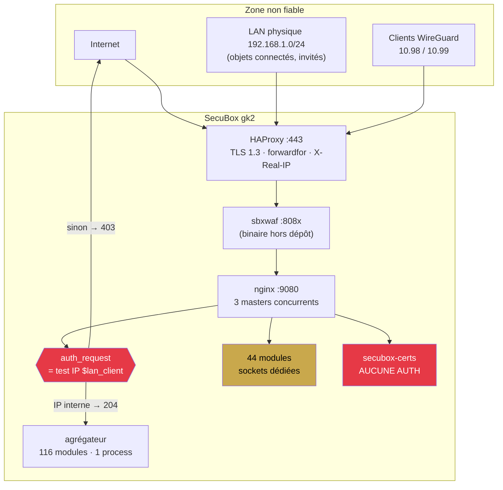
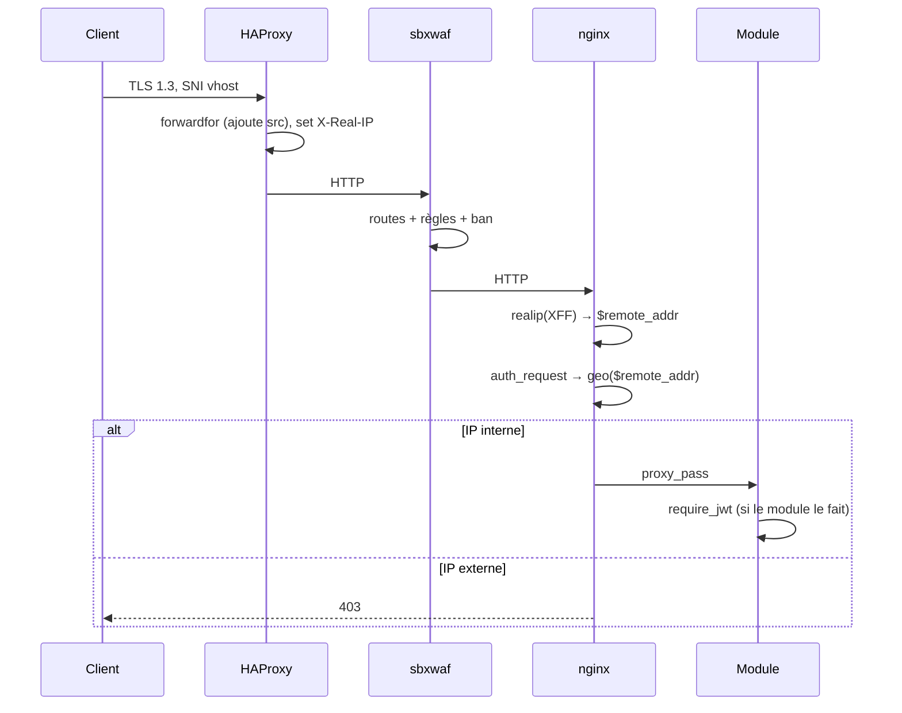
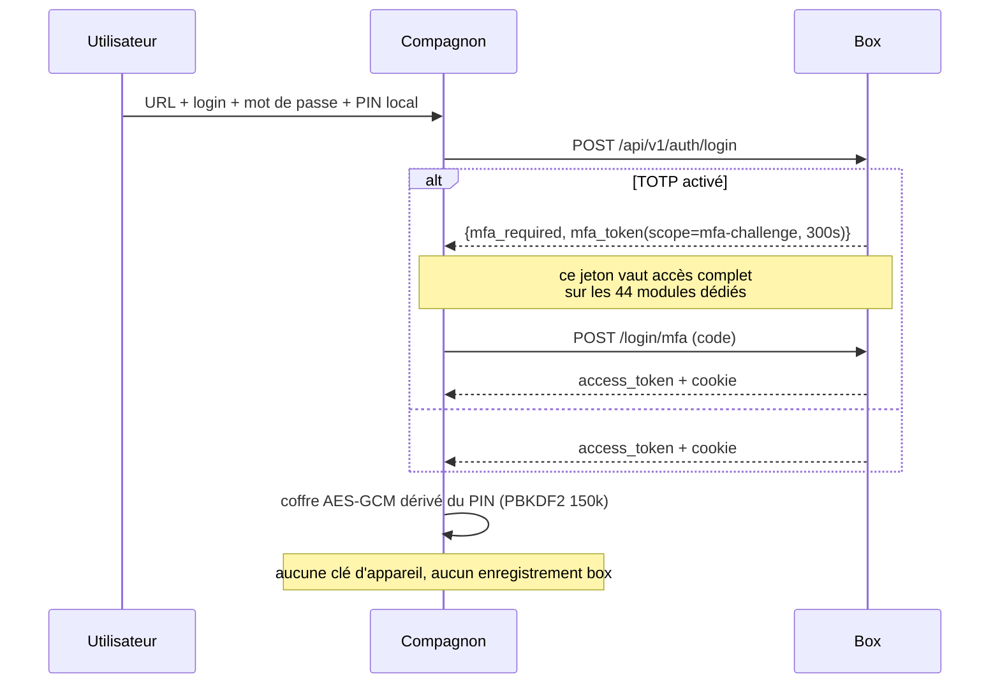
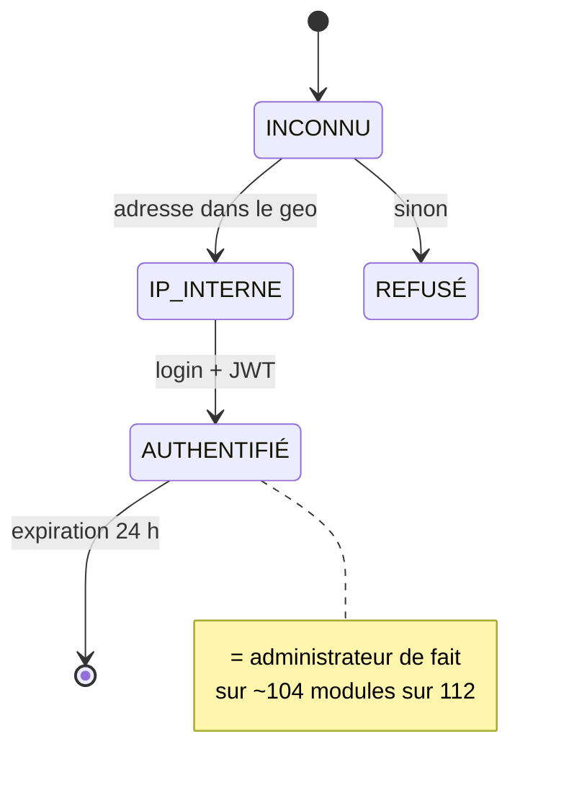
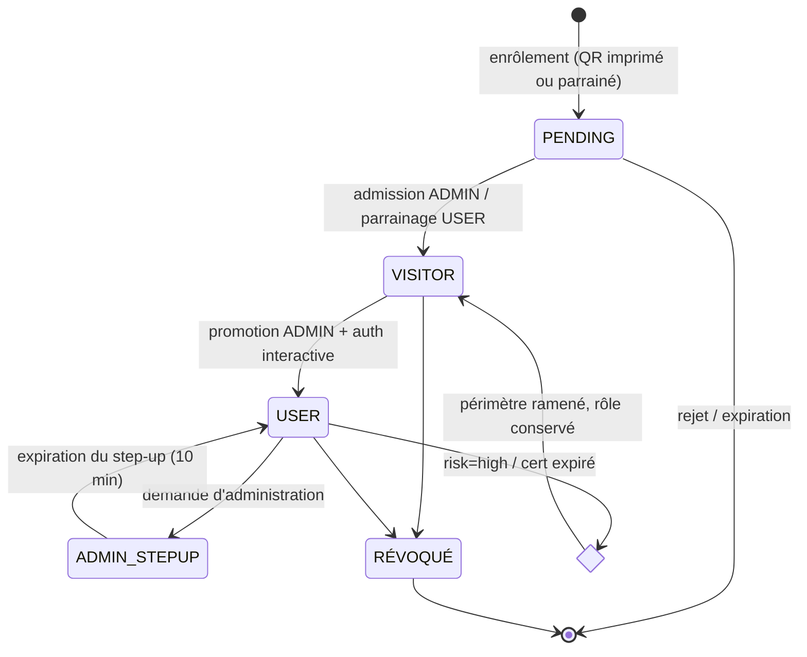
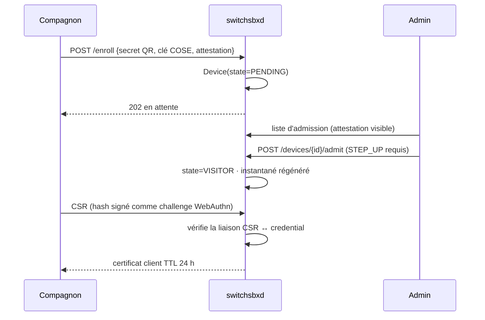
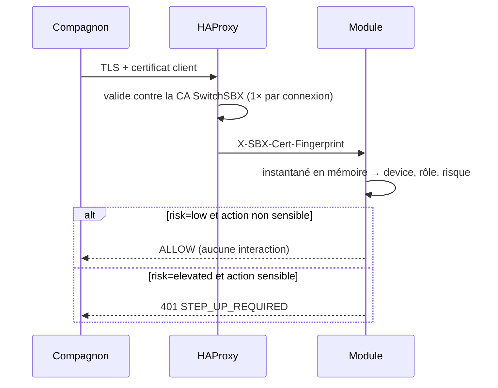
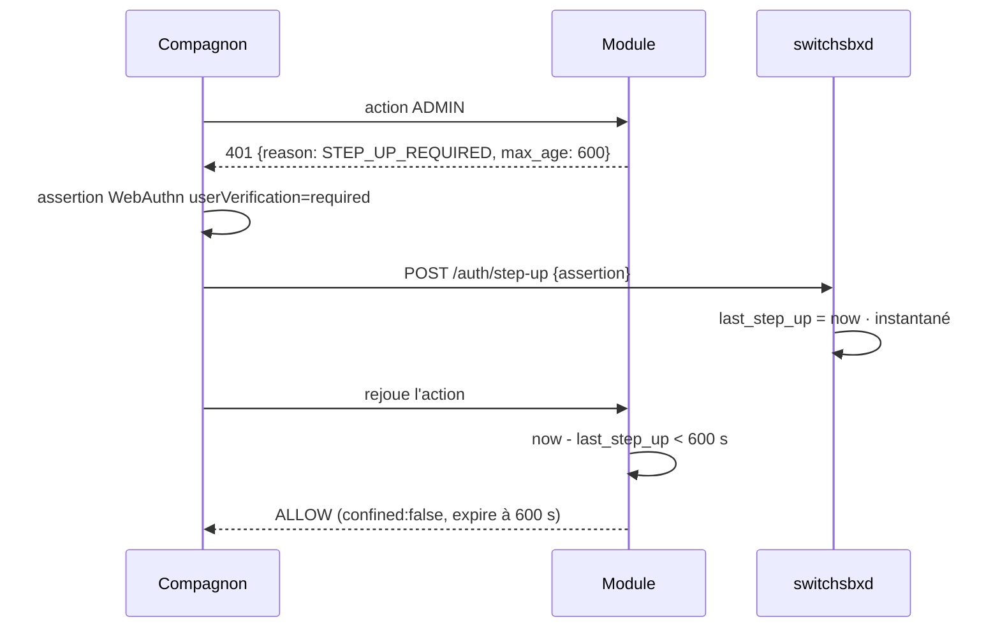

# SwitchSBX — Audit d'architecture de l'accès sécurisé

**Date :** 2026-07-31 · **Statut :** rapport d'analyse — aucune modification de code
**Complète :** [`2026-07-31-switchsbx-design.md`](2026-07-31-switchsbx-design.md) (design), qu'il corrige sur deux points
**Méthode :** lecture du code du dépôt + vérifications **en production sur gk2** (lecture seule, GET uniquement)

---

## 0. Ce que l'audit change par rapport au design du même jour

Le design daté du 2026-07-31 était juste sur le fond. L'audit le corrige sur deux
points factuels et lui ajoute quatre constats qu'il n'avait pas vus.

**Corrections :**

1. **La topologie processus est inversée.** Le design annonçait « 119 des 144 services
   tournent dans leur propre processus ». C'est le contraire : sur gk2, **116 modules
   sont montés in-process dans l'agrégateur** et **44 sont routés par nginx vers leur
   socket dédiée**. Comme `auth` figure dans `/etc/secubox/aggregator.toml` (ligne 10),
   son `set_session_validator()` au chargement s'applique **à tout le processus
   agrégateur**. Le rayon d'action réel des failles (A) est donc **les 44 modules à
   socket dédiée**, pas 119. C'est moins large — mais la liste est pire que le nombre
   (§2.1).
2. **Le CORS `*` n'est pas sur le proxy d'API.** Il porte uniquement sur l'alias
   statique `/shared/` ([secubox-shared.conf:9](../../../packages/secubox-hub/nginx/snippets/secubox-shared.conf#L9)).
   L'API `secubox-certs` n'est donc pas atteignable en cross-origin *par ce biais* —
   elle l'est directement, ce qui est pire (§2.2).

**Ajouts :**

3. **Le contrôle d'accès aux vhosts est une décision d'adresse IP**, pas d'identité (§3).
4. **Le tunnel WireGuard ne confère aucun droit** : ses sous-réseaux ne sont dans aucune
   zone de confiance (§4).
5. **La politique effective sur gk2 n'est pas observable** : trois masters nginx
   concurrents, et le garde a laissé passer une requête dont l'en-tête annonçait
   `8.8.8.8` (§5).
6. Un rôle `operator` existe en base et **n'est appliqué nulle part** (§2.4).

---

# A. ÉTAT DE L'EXISTANT

## A.1 Inventaire des composants

| Composant | Fichiers | Responsabilité réelle | Maturité | Risque |
|---|---|---|---|---|
| **SwitchSBX** | *aucun* | n'existe pas | — | — |
| Noyau d'auth | [common/secubox_core/auth.py](../../../common/secubox_core/auth.py) (277 l.) | JWT HS256, cookie SSO, `require_jwt` | production | **critique** |
| Magasin utilisateurs | [common/secubox_core/user_store.py](../../../common/secubox_core/user_store.py) | argon2, rôles, `enabled` | production | élevé |
| Auth applicative | [packages/secubox-auth/api/main.py](../../../packages/secubox-auth/api/main.py) (1061 l.) | login branchant, TOTP, `sessions.json`, audit | production | moyen |
| Pile concurrente | [packages/secubox-portal/api/main.py](../../../packages/secubox-portal/api/main.py) | 2ᵉ auth, SHA-256 non salé | production | **critique** |
| Agrégateur | [packages/secubox-aggregator/aggregator/main.py](../../../packages/secubox-aggregator/aggregator/main.py) | monte 116 modules dans un interpréteur | production | élevé (SPOF) |
| Garde vhost | [zz-sbx-authgate.conf](../../../packages/secubox-hub/nginx/zz-sbx-authgate.conf) + [secubox-lan-geo.conf](../../../packages/secubox-hub/nginx/secubox-lan-geo.conf) | `auth_request` → test d'IP | production | **critique** |
| HAProxy | [packages/secubox-haproxy/sbin/haproxyctl](../../../packages/secubox-haproxy/sbin/haproxyctl) | terminaison TLS 1.3, `forwardfor`, `X-Real-IP` | production | moyen |
| sbxwaf | `packages/secubox-waf-ng/` — **binaire hors dépôt** | routage vhost, règles, ban | production | **non auditable ici** |
| Certificats | [packages/secubox-certs/api/main.py](../../../packages/secubox-certs/api/main.py) | TLS **serveur** (certbot) | production | **critique** |
| WireGuard | [packages/secubox-wireguard/api/main.py](../../../packages/secubox-wireguard/api/main.py) | `wg-admin`, `wg-mesh`, `wg-toolbox` | production | moyen |
| Compagnon | [secubox-companion/www/core/auth.js](../../../secubox-companion/www/core/auth.js) | login mot de passe + coffre PIN | production | élevé |
| mTLS / cert client | *aucun* | inexistant | — | — |

## A.2 Secrets manipulés

- **Un seul secret HS256 partagé** par tous les modules, lu depuis `api.jwt_secret` ou
  `SECUBOX_JWT_SECRET`, avec repli **`"CHANGEME_INSECURE"`**
  ([auth.py:56-61](../../../common/secubox_core/auth.py#L56-L61)). Aucun échec au
  démarrage si le secret est absent.
- Hachés argon2 dans `/etc/secubox/users.json` (et SHA-256 non salé si `portal` écrit).
- Clés privées WireGuard côté box.
- CA MITM `ca-wg` (toolbox), distribuée à tous les clients.
- Aucune clé privée d'appareil : **il n'existe aucune identité d'appareil**.

---

# B. CONSTATS VÉRIFIÉS

## B.1 §2.1 — Le validateur de session est permissif par défaut, et 44 modules le gardent

```python
_session_validator: Callable[[str], bool] = lambda jti: True   # auth.py:32
```

`_validate_token()` ([auth.py:128-143](../../../common/secubox_core/auth.py#L128-L143))
vérifie signature, `sub`, `jti` via ce validateur, et `is_enabled`. **Il ne lit jamais
`scope`.** Or `create_token()` émet des jetons portant `scope`
([auth.py:95-110](../../../common/secubox_core/auth.py#L95-L110)) :

| Jeton | Émis quand | TTL | Ligne |
|---|---|---|---|
| `set-password` | compte `must_change_password`, **mot de passe vide** | 900 s | [main.py:289](../../../packages/secubox-auth/api/main.py#L289) |
| `mfa-challenge` | mot de passe correct, **avant** vérification TOTP | 300 s | [main.py:303](../../../packages/secubox-auth/api/main.py#L303) |
| `totp-enroll` | admin sans TOTP, exigence active | 900 s | [main.py:312](../../../packages/secubox-auth/api/main.py#L312) |

Dans `secubox-auth` ces jetons sont inoffensifs : leur `jti` n'est jamais écrit dans
`sessions.json` (seul `login_success` écrit, [main.py:197-208](../../../packages/secubox-auth/api/main.py#L197-L208)),
donc `_session_validator` les rejette. **Ailleurs, ils ouvrent tout.**

`set_session_validator` n'est appelé que par `secubox-auth`
([main.py:220](../../../packages/secubox-auth/api/main.py#L220)) — vérifié par grep sur
tout le dépôt, hors tests. Les processus qui ne chargent pas ce fichier gardent
`lambda jti: True`.

**Mesuré sur gk2 :** 116 modules montés dans l'agrégateur (qui charge `auth`, donc
protégé par effet de bord), et **44 modules routés par nginx vers leur socket dédiée** :

```
annuaire antirootkit appstore assist auth certs cookies dns-guard exposure fmrelay
frigate grafana ipblock jellyfin lyrion maigret meshtastic metrics mitmproxy modem
mqtt ndpid netboot netifyd p2p peertube photoprism picobrew podcaster profiles
reality release rtty rustdesk security-posture sentinelle-gsm soc soc-gateway
spiderfoot vhost voip vortex-firewall yacy zigbee
```

Ce sont ceux qui comptent : `exposure` (publication de services), `vhost` (routage),
`profiles` (actionneur root), `ipblock`, `p2p`, `soc`, `security-posture`, `netboot`,
`certs`. **Un `mfa_token` — obtenu avec le seul mot de passe, sans le second facteur —
y vaut un accès complet pendant 300 s, renouvelable.** Le compte admin `0` de gk2 a
TOTP activé : c'est exactement le compte dont le 2FA est contournable ainsi.

**Aggravant : la protection des 116 autres est un effet de bord.** Elle tient à ce que
`auth` figure dans `aggregator.toml` et que son import exécute `set_session_validator`
au niveau module. Si `auth` échoue à monter (`_LOAD_ERRORS`), l'agrégateur démarre
quand même et **116 modules retombent silencieusement en validateur permissif**. Aucun
test ne couvre ce cas ; aucune alarme ne le signale.

## B.2 §2.2 — `secubox-certs` n'a aucune authentification (vérifié en production)

`Depends` est importé ([main.py:2](../../../packages/secubox-certs/api/main.py#L2)) et
`require_jwt` n'apparaît nulle part dans le fichier.

Vérification depuis un poste du LAN (192.168.1.14), à travers la chaîne complète
HAProxy → sbxwaf → nginx, **sans aucun identifiant** :

```
GET https://admin.gk2.secubox.in/api/v1/certs/list   → 200
GET https://admin.gk2.secubox.in/api/v1/certs/status → 200
```

Les endpoints d'écriture `POST /issue` ([main.py:464](../../../packages/secubox-certs/api/main.py#L464))
et `DELETE /revoke/{domain}` ([main.py:595](../../../packages/secubox-certs/api/main.py#L595))
sont sur le **même routeur sans dépendance d'authentification**. Je ne les ai pas
appelés — ce serait destructif. Par construction, ils sont dans le même état.

**Conséquence :** n'importe quel appareil du LAN — y compris un objet connecté
compromis — peut émettre ou révoquer les certificats TLS de la box.

## B.3 §2.3 — `secubox-portal`, seconde pile d'authentification

- Pointe sur le même `/etc/secubox/users.json` ([main.py:52](../../../packages/secubox-portal/api/main.py#L52))
- Hache en **SHA-256 non salé** ([main.py:554](../../../packages/secubox-portal/api/main.py#L554),
  [:722](../../../packages/secubox-portal/api/main.py#L722), [:777](../../../packages/secubox-portal/api/main.py#L777))
- Crée `admin` / `secubox` si le fichier manque ([main.py:169](../../../packages/secubox-portal/api/main.py#L169))
- **Est monté dans l'agrégateur** (`aggregator.toml` ligne 77) : il tourne.

Une écriture de `portal` rétrograde argon2 → SHA-256 pour le compte touché.

## B.4 §2.4 — Le rôle n'existe pas là où il compte

- **Absent du JWT** : la charge utile est `{sub, iat, exp, jti}` (+ `scope`)
  ([auth.py:102-110](../../../common/secubox_core/auth.py#L102-L110)).
- **Défaut ouvert** : `entry.get("role", "admin")`
  ([user_store.py:69](../../../common/secubox_core/user_store.py#L69) et
  [:201](../../../common/secubox_core/user_store.py#L201)) — une entrée sans champ
  `role` est lue **administrateur**.
- **Vérifié 8 fois sur ~112 fichiers** utilisant `require_jwt`.
- **Rôle fantôme** : gk2 porte un compte `role=operator`. Aucun code ne distingue
  `operator` de quoi que ce soit — il est traité comme n'importe quel authentifié,
  c'est-à-dire comme un administrateur sur la quasi-totalité des modules.

**Réponse à la question posée en préambule** — « le mode USER sans authentification
est-il sûr ? » : la question est mal posée pour ce dépôt. **Il n'existe pas de rôle
USER.** Il existe « authentifié », qui vaut administrateur presque partout. Le caillou
n'est pas un USER trop généreux : c'est l'absence de la marche USER.

## B.5 §3 — Le garde des vhosts est un test d'adresse IP

```nginx
location = /__sbx_auth_verify {
    internal;
    if ($lan_client) { return 204; }   # zz-sbx-authgate.conf
    return 403;
}
```

`$lan_client` est un `geo` sur `$remote_addr`
([secubox-lan-geo.conf](../../../packages/secubox-hub/nginx/secubox-lan-geo.conf)).
Les vhosts « protégés par SSO » — yacy, grafana, lyrion, spiderfoot, maigret, torrent,
fmrelay, rustdesk — appellent `auth_request /__sbx_auth_verify`. **Ce garde ne consulte
ni identité, ni session, ni cookie, ni certificat.** Il répond à une seule question :
« l'adresse source est-elle dans une plage déclarée interne ? »

C'est précisément l'anti-pattern que la mission interdit (§22 : *ne pas faire confiance
à une IP seule*). Le commentaire du fichier l'assume : « the dashboard at admin.\<host\>
is auth-free from inside ».

Nuance importante, à ne pas surestimer : les **API** restent derrière `require_jwt`,
qui exige un jeton signé avec le secret partagé. Le garde IP ouvre l'**interface** et
les vhosts applicatifs, pas l'API — sauf pour les modules qui ne vérifient rien, comme
`certs` (§B.2).

## B.6 §4 — Le tunnel WireGuard ne confère aucun droit

Trois interfaces sur gk2 :

| Interface | Réseau | Rôle | Dans `$lan_client` ? |
|---|---|---|---|
| `wg-mesh` | 10.10.0.1/24 | mesh inter-box | **non** |
| `wg-admin` | 10.98.0.1/24 | accès distant | **non** |
| `wg-toolbox` | 10.99.1.1/24 | navigation MITM | **non** |

Aucune n'est déclarée dans le `geo`. **Un client WireGuard authentifié par la
cryptographie du tunnel est donc traité comme un inconnu et reçoit 403** sur les vhosts
gardés, alors qu'un objet connecté anonyme branché en Wi-Fi passe.

La prémisse de la mission — « appareil connecté au LAN virtuel : USER limité » — est
**fausse aujourd'hui, et inversée** : le LAN physique donne tout, le tunnel ne donne
rien. `wg-admin` porte exactement **1 peer**, `allowed-ips 10.98.0.2/32`, sans aucun
lien avec un compte utilisateur.

## B.7 §5 — La politique effective n'est pas observable

Deux constats qui, pour une cible CSPN, comptent autant que les failles :

1. **Trois masters nginx concurrents** tournent depuis le 2026-07-28 (PID 4861, 7811,
   11829 ; `systemd` ne connaît que 11829). C'est le blocage multi-master déjà connu :
   un `reload` peut être silencieusement inopérant. **La configuration servie n'est pas
   nécessairement celle sur disque.**
2. **Le garde a laissé passer une requête annonçant `X-Forwarded-For: 8.8.8.8`**, émise
   depuis 127.0.0.1 — donc depuis une source déclarée de confiance par
   `set_real_ip_from`. Avec `real_ip_recursive on`, `$remote_addr` aurait dû devenir
   `8.8.8.8` et le garde répondre 403. Il a répondu 204.

Deux explications possibles, que je **ne peux pas départager depuis le LAN** : soit le
master qui sert le port n'a pas la configuration `realip` (conséquence du point 1),
soit la chaîne de confiance est mal réglée. Dans le premier cas c'est un problème
d'exploitation ; **dans le second, c'est un contournement d'authentification depuis
Internet** — un attaquant externe envoyant `X-Forwarded-For: 192.168.1.50` deviendrait
`$lan_client`.

**Ce point doit être tranché en premier**, par un test depuis une source hors LAN
(§F, étape 0). Je le classe *non conclu*, pas *sûr*.

Élément rassurant côté HAProxy : `option forwardfor` **ajoute** l'IP source au lieu de
la remplacer, et `http-request set-header X-Real-IP %[src]` **écrase**
([haproxyctl:749-750](../../../packages/secubox-haproxy/sbin/haproxyctl#L749-L750)).
Faire porter `real_ip_header` sur `X-Real-IP` plutôt que sur `X-Forwarded-For`
supprimerait la classe entière du problème.

## B.8 §6 — Le Compagnon n'appaire rien

[auth.js](../../../secubox-companion/www/core/auth.js) : l'utilisateur saisit URL +
identifiants, reçoit un `access_token`, et le scelle dans un coffre local dérivé d'un
PIN par PBKDF2-SHA256 150 000 itérations ([store.js:49](../../../secubox-companion/www/core/store.js#L49)).

Aucune clé d'appareil n'est générée. Aucun enregistrement n'existe côté box. **Une
session Compagnon est indiscernable d'un `curl`.** Avec un PIN à 4 chiffres, le coffre
tient 10 000 candidats : il ne protège pas le jeton d'un attaquant qui a extrait le
fichier.

## B.9 §7 — Session : ce qui est lié, ce qui ne l'est pas

| Propriété attendue | État |
|---|---|
| Durée bornée | ✅ 86 400 s absolus |
| Révocable | ⚠️ oui via `sessions.json` — **inopérant sur les 44 modules dédiés** |
| Liée à l'appareil | ❌ |
| Liée au certificat | ❌ (aucun certificat client) |
| Liée au peer WireGuard | ❌ |
| Liée au navigateur | ❌ |
| Résiste au vol de cookie | ❌ |
| Anti-rejeu | ❌ |
| Cloisonnée par vhost | ❌ cookie `Domain=.gk2.secubox.in`, un vol couvre tout |
| `HttpOnly` / `Secure` / `SameSite` | ✅ `Lax` ([auth.py:80-92](../../../common/secubox_core/auth.py#L80-L92)) |
| Expiration glissante | ❌ |
| Audit | ✅ `/var/log/secubox/audit.log` |

`SameSite=Lax` laisse passer les navigations `GET` de premier niveau : les endpoints
qui agissent sur `GET` restent exposés au CSRF. Sur gk2 : **4 sessions actives**.

---

# C. DIAGRAMMES

## C.1 Composants et frontières de confiance — état actuel



**Frontière de confiance réelle :** elle passe au niveau de l'**adresse IP source**
constatée par nginx. Tout ce qui est en amont (HAProxy, sbxwaf) est traité comme de
confiance ; tout ce qui présente une IP interne l'est aussi.

## C.2 Chemin d'accès à un VHOST — actuel



Aucune étape ne consulte d'identité d'appareil. `require_jwt` est le **seul** contrôle
d'identité, et il est facultatif module par module.

## C.3 « Pairing » Compagnon — actuel



## C.4 Machine à états — actuelle



Deux états utiles. C'est tout le modèle de confiance actuel.

## C.5 Machine à états — cible



`CONFINED` est un **drapeau porté par la décision**, jamais un rôle stocké.

## C.6 Séquence cible — enrôlement



## C.7 Séquence cible — accès pinless



## C.8 Séquence cible — élévation ADMIN



---

# D. MATRICE DES ÉCARTS

| # | Fonction attendue | Existant | Écart | Risque | Proposition | Prio | Complexité | Fichiers |
|---|---|---|---|---|---|---|---|---|
| 1 | Jeton de portée limitée | `scope` émis, jamais vérifié | contournement 2FA sur 44 modules | **critique** | rejeter `scope` dans `_validate_token`, `require_jwt(scope=)` explicite | P0 | S | `auth.py` |
| 2 | Révocation effective | validateur permissif par défaut | logout sans effet sur 44 modules | **critique** | défaut `False` + magasin de sessions partagé sur instantané | P0 | M | `auth.py`, `secubox_core/` |
| 3 | API certs authentifiée | aucune auth, **200 vérifié depuis le LAN** | émission/révocation TLS ouverte | **critique** | `require_jwt` + `require_role("admin")` | P0 | S | `secubox-certs/api/main.py` |
| 4 | Magasin d'identité unique | 2 piles, formats incompatibles | rétrogradation argon2 → SHA-256 | **critique** | interdire l'écriture à `portal`, décider son sort | P0 | S | `secubox-portal/api/main.py` |
| 5 | Rôle dans le jeton | absent ; défaut `admin` | tout authentifié = admin | **critique** | `role` + `policy_version` dans le JWT, `require_role()`, défaut `user` | P0 | M | `auth.py`, `user_store.py` |
| 6 | Contrôle d'accès par identité | test d'IP `$lan_client` | LAN = accès ; tunnel = refus | **critique** | garde `auth_request` adossé à la décision SwitchSBX | P1 | M | `zz-sbx-authgate.conf` |
| 7 | Chaîne d'en-têtes fiable | `realip` sur XFF, comportement **non reproduit** | contournement possible depuis le WAN | **critique** | basculer sur `X-Real-IP`, tester hors LAN | P0 | S | `secubox-lan-geo.conf` |
| 8 | Configuration observable | 3 masters nginx | politique servie inconnue | élevé | tuer les orphelins, sonde d'intégrité | P0 | S | exploitation |
| 9 | Identité d'appareil | inexistante | aucune preuve de possession | élevé | `Device` ancré WebAuthn | P2 | L | nouveau module |
| 10 | Certificat client | inexistant | pas de liaison cert ↔ appareil | élevé | CA SwitchSBX dédiée, TTL 24 h | P3 | L | nouveau module |
| 11 | Pairing Compagnon | login + coffre PIN | coffre cassable, pas d'appairage | élevé | WebAuthn, clé dans le TEE | P3 | L | `secubox-companion/` |
| 12 | Session liée à l'appareil | cookie domaine parent | vol de cookie = tout | élevé | binding cert / credential, audience par service | P4 | M | `auth.py` |
| 13 | Confinement | inexistant | binaire autoriser/refuser | moyen | drapeau `confined` + zone nftables | P5 | M | nftables, décision |
| 14 | Step-up ADMIN | inexistant | admin permanent | élevé | assertion WebAuthn, fraîcheur 10 min | P4 | M | `auth.py`, Compagnon |
| 15 | Peer WG ↔ identité | aucun lien | tunnel anonyme | moyen | `wg_peer` dans `Device` | P4 | M | `secubox-wireguard/` |
| 16 | Politique par vhost | implicite | pas de règle explicite | moyen | politique déclarative versionnée | P5 | M | `haproxy.toml`, vhost |
| 17 | Perf du chemin chaud | `users.json` relu par requête | coût non mesuré | moyen | instantané + `inotify` | P1 | S | `user_store.py` |
| 18 | Rôle `operator` | en base, jamais appliqué | rôle fantôme | moyen | supprimer ou définir | P1 | S | `user_store.py` |
| 19 | Secret JWT | repli `CHANGEME_INSECURE` | démarrage silencieux non sûr | élevé | échec au démarrage si absent | P0 | S | `auth.py` |
| 20 | Robustesse agrégateur | validateur strict par effet de bord | 116 modules retombent permissifs si `auth` échoue | élevé | strict par défaut (écart 2 le résout) | P0 | S | `auth.py` |

---

# E. MATRICE DE DÉCISION D'ACCÈS

## E.1 Comportement actuel

| Source | Appairé | Cert | Session PAP | Rôle demandé | **Décision actuelle** | Accès effectif |
|---|---|---|---|---|---|---|
| LAN physique | n/a | n/a | aucune | — | **ALLOW** (vhost) | interfaces des vhosts gardés |
| LAN physique | n/a | n/a | aucune | — | **ALLOW** | API `certs` complète *(vérifié)* |
| WireGuard `wg-admin` | n/a | n/a | valide | USER | **DENY** (403) | aucun vhost gardé |
| WAN | n/a | n/a | valide | USER | **DENY** | — |
| n'importe où | n/a | n/a | `mfa_token` | — | **ALLOW** | 44 modules, admin de fait |
| n'importe où | n/a | n/a | valide | ADMIN | **ALLOW** | tout, sans step-up |
| n'importe où | n/a | n/a | révoquée | — | **ALLOW** sur 44 modules | révocation inopérante |

## E.2 Comportement cible

| WG | Appairé | Cert | Session | Auth interactive | Risque | Rôle demandé | Décision | Périmètre |
|---|---|---|---|---|---|---|---|---|
| ✗ | ✗ | ✗ | ✗ | ✗ | — | — | `REQUIRE_PAIRING` | page d'enrôlement |
| ✓ | ✗ | ✗ | ✗ | ✗ | — | — | `REQUIRE_PAIRING` | page d'attente |
| ✓ | PENDING | ✗ | ✗ | ✗ | — | — | `DENY` | attente uniquement |
| ✓ | ✓ | ✗ | ✗ | ✗ | low | — | `CONFINE` | kabinet MITM + demande de cert |
| ✓ | ✓ | expiré | ✓ | ✗ | low | USER | `REQUIRE_CERTIFICATE_RENEWAL` | récupération |
| ✓ | ✓ | révoqué | — | — | — | — | `DENY` | page d'explication |
| ✓ | ✓ | ✓ non lié | ✓ | ✗ | — | — | `DENY` | — |
| ✓ | ✓ | ✓ | ✓ | ✗ | low | USER | `ALLOW_PINLESS` | vhosts USER, 24 h |
| ✓ | ✓ | ✓ | ✗ | ✗ | low | USER | `REQUIRE_INTERACTIVE_AUTH` | — |
| ✓ | ✓ | ✓ | ✓ | ✗ | elevated | USER (lecture) | `ALLOW` | USER |
| ✓ | ✓ | ✓ | ✓ | ✗ | elevated | USER (action sensible) | `STEP_UP_REQUIRED` | — |
| ✓ | ✓ | ✓ | ✓ | ✗ | high | USER | `CONFINE` | VISITOR, `confined:true` |
| ✓ | ✓ | ✓ | ✓ | ✗ | low | ADMIN | `STEP_UP_REQUIRED` | — |
| ✓ | ✓ | ✓ | ✓ | < 10 min | low | ADMIN | `ALLOW` | ADMIN, 10 min |
| ✓ | ✓ | ✓ | ✓ | < 10 min | high | ADMIN | `CONFINE` | VISITOR, rôle conservé |
| — | — | — | — | — | — | — | instantané illisible → | `CONFINE` (fail-closed) |

Chaque décision porte : `reason` structurée, `policy_version`, `expires_at`,
`constraints`, `audit_events`.

---

# F. MENACES

Vraisemblance × impact sur l'état **actuel**.

| Menace | Vrais. | Impact | Protection existante | Manquant | Prio |
|---|---|---|---|---|---|
| Contournement 2FA par `mfa_token` | **haute** | **critique** | aucune sur 44 modules | contrôle de `scope` | **P0** |
| Émission/révocation de certificats sans auth | **haute** | **critique** | aucune *(vérifié)* | `require_jwt` | **P0** |
| Élévation USER → ADMIN | **haute** | **critique** | 8 fichiers sur 112 | rôle dans le jeton | **P0** |
| Usurpation d'IP par en-tête proxy | **non conclue** | **critique** | `forwardfor` ajoute ; `realip` non reproduit | test hors LAN, `X-Real-IP` | **P0** |
| Session non révocable | haute | élevé | `sessions.json` (1 process) | magasin partagé | **P0** |
| Rétrogradation argon2 → SHA-256 par `portal` | moyenne | **critique** | aucune | interdire l'écriture | **P0** |
| Secret JWT au repli `CHANGEME_INSECURE` | faible | **critique** | aucune | échec au démarrage | **P0** |
| Vol de cookie PAP | moyenne | élevé | HttpOnly/Secure/Lax | binding appareil | P2 |
| Objet connecté LAN compromis | **haute** | élevé | aucune (LAN = confiance) | garde par identité | P1 |
| Vol du fichier de configuration WireGuard | moyenne | élevé | aucune | liaison peer ↔ appareil | P3 |
| Extraction du coffre Compagnon (PIN 4 chiffres) | moyenne | élevé | PBKDF2 150k — insuffisant | clé en TEE | P3 |
| Accès direct au backend (contournement du proxy) | moyenne | élevé | *non audité* | à vérifier (§G.0) | P1 |
| CA MITM `ca-wg` compromise | faible | **critique** | clé 0600 | séparation racine/intermédiaire | P4 |
| CSRF sur endpoints agissant en `GET` | moyenne | moyen | SameSite=Lax (insuffisant) | jeton anti-CSRF | P2 |
| Rejeu de jeton | moyenne | élevé | aucun anti-rejeu | nonce / DPoP | P4 |
| Duplication de certificat | — | — | sans objet (pas de cert client) | — | P3 |
| Confusion LAN physique / LAN WireGuard | **avérée** | élevé | — | zones explicites | P1 |
| Configuration servie non observable (3 masters) | **avérée** | élevé | aucune | sonde d'intégrité | **P0** |

---

# G. ARCHITECTURE CIBLE

Je retiens l'architecture du design du 2026-07-31 — bibliothèque + daemon, WebAuthn,
CA dédiée, instantané JSON surveillé par `inotify`, décision comme fonction pure — avec
**trois amendements** issus de l'audit.

**Amendement 1 — le garde nginx devient le point d'application principal, pas
secondaire.** Le design plaçait `auth_request` en quatrième position. L'audit montre
que c'est **la seule barrière devant les vhosts applicatifs**, et qu'elle est
aujourd'hui un test d'IP. `/__sbx_auth_verify` doit interroger la décision SwitchSBX
et retourner l'identité en `Remote-User` / `Remote-Groups`. Sans cela, tout le moteur
protège les API et laisse les vhosts ouverts.

**Amendement 2 — les zones réseau deviennent explicites et nommées.** Remplacer le
`geo` binaire par une table de zones : `lan_physique`, `wg_admin`, `wg_toolbox`,
`lxc`, `wan`. Une zone est une **entrée de la décision** (signal de contexte), jamais
une décision. Cela corrige l'inversion du §B.6 et supprime la dépendance à `realip`
pour la zone tunnel, qui est déterminée par l'interface d'arrivée, non par un en-tête.

**Amendement 3 — le mode strict doit être le défaut de la bibliothèque, pas une
conséquence d'un import.** La protection actuelle des 116 modules montés repose sur un
effet de bord du chargement de `auth`. La bibliothèque doit démarrer stricte et exiger
une injection explicite pour s'assouplir — l'inverse d'aujourd'hui.

Le reste — modèle de données `Device`, deux barrières humaines, CONFINED comme
drapeau, trois niveaux de risque, TTL 24 h, exclusion d'OCSP/CRL — est repris sans
changement.

## G.1 Trois options

### Option 1 — Correction minimale (P0 seuls)

Écarts 1, 2, 3, 4, 5, 7, 8, 19, 20. Aucun nouveau composant, aucune nouvelle
dépendance.

- **Avantages** : supprime la totalité des failles critiques ; ~2 semaines ;
  entièrement réversible ; testable module par module ; aucun risque de se verrouiller
  dehors si l'écart 7 est traité avant l'écart 2.
- **Limites** : ne répond à **aucune** des 13 questions de la mission. Pas d'appareil,
  pas de certificat, pas de confinement, pas de pinless. Le garde des vhosts reste un
  test d'IP.
- **Risques** : passer le validateur en `False` par défaut coupe l'accès aux 44 modules
  dédiés tant que le magasin partagé n'est pas livré — les deux doivent être livrés
  ensemble.
- **Coût** : faible. **Compatibilité** : totale, sauf les jetons de portée (comportement
  voulu).

### Option 2 — Évolution intermédiaire

Option 1 + rôles réels + zones réseau nommées + garde adossé à l'identité + session
liée au navigateur + step-up ADMIN par TOTP (pas WebAuthn) + confinement applicatif.

- **Avantages** : répond à 9 des 13 questions ; le rôle USER existe enfin ; le tunnel
  cesse d'être moins bien traité que le LAN ; réutilise TOTP déjà en place ; pas de
  PKI, pas de dépendance native, pas de prérequis de domaine stable.
- **Limites** : pas de preuve de possession — un jeton volé reste rejouable. Le pinless
  reste un abus de langage. Pas de certificat client.
- **Risques** : le garde par identité peut verrouiller dehors → phase d'observation
  obligatoire ; le step-up TOTP est une gêne quotidienne s'il est mal calibré.
- **Coût** : moyen, ~6 semaines. **Compatibilité** : les appareils existants continuent,
  les sessions restent valides.

### Option 3 — Architecture cible complète

Option 2 + `Device` WebAuthn + CA SwitchSBX + mTLS + daemon + instantané + risque
précalculé + confinement nftables.

- **Avantages** : répond aux 13 questions ; `pinless` devient exact ; `non exportable`
  devient vrai ; l'attestation matérielle plafonne la confiance ; défense en profondeur
  réseau + proxy + application ; aligné CSPN (preuves indépendantes, table de vérité
  exhaustive, 4R).
- **Limites** : **prérequis bloquant** — un domaine stable (RP ID WebAuthn) ;
  l'attestation Android hors ligne suppose d'embarquer les racines Google ; WebAuthn en
  WebView Capacitor est fragile (plugin natif requis) ; mTLS impraticable en PWA iOS,
  d'où deux niveaux de preuve à maintenir.
- **Risques** : perte de l'appareil = parcours de récupération à concevoir ; rotation
  du domaine = invalidation de tous les credentials ; complexité qui, mal séquencée,
  verrouille dehors.
- **Coût** : élevé, 4 à 6 mois. **Compatibilité** : nécessite les phases 0-1 d'abord ;
  cohabitation JWT + certificat pendant toute la migration.

**Recommandation.** Option 1 **immédiatement et indépendamment de toute décision
d'architecture** — ce sont des failles actives, pas des choix de conception. Puis
Option 2 comme socle. Option 3 seulement après que le prérequis du domaine stable est
tranché. L'Option 2 n'est pas un détour vers l'Option 3 : rôles, zones et garde par
identité en sont les fondations directes.

---

# H. PLAN D'ÉVOLUTION

## Étape 0 — Observabilité (prérequis absolu, ~1 jour)

- **Objectif** : savoir ce qui est réellement servi avant de changer quoi que ce soit.
- **Actions** : tuer les masters nginx orphelins, redémarrer proprement, revérifier la
  configuration effective ; **tester l'usurpation XFF depuis une source hors LAN** ;
  vérifier si les ports backend sont joignables en contournant le proxy.
- **Tests** : `nginx -T` cohérent avec le processus servant ; requête WAN avec
  `X-Forwarded-For: 192.168.1.50` → doit être refusée.
- **Risques** : un redémarrage nginx coupe brièvement tous les vhosts.
- **Rollback** : aucun changement de configuration.
- **Dépendances** : aucune. **Bloque tout le reste** — sans cela, aucun test d'accès
  n'est concluant.

## Étape 1 — Chaîne d'en-têtes (~0,5 jour)

- `real_ip_header X-Real-IP` (écrasé par HAProxy) au lieu de `X-Forwarded-For` (ajouté).
- Fichiers : `secubox-lan-geo.conf`.
- Test : en-tête client forgé sans effet sur `$remote_addr`.
- Rollback : un fichier, une ligne.

## Étape 2 — Secret et démarrage sûr (~0,5 jour)

- Suppression du repli `CHANGEME_INSECURE` : échec au démarrage si le secret est absent.
- Fichiers : [auth.py:56-61](../../../common/secubox_core/auth.py#L56-L61).
- Test : démarrage sans secret → refus.

## Étape 3 — `secubox-certs` sous authentification (~0,5 jour)

- `require_jwt` sur tout le routeur, `require_role("admin")` sur `/issue` et `/revoke`.
- Test : les GET vérifiés en §B.2 doivent passer de 200 à 401.
- Rollback : dépaquetage de la version précédente.
- **Indépendant** — peut partir immédiatement, en parallèle.

## Étape 4 — Jetons de portée (~1 jour)

- `_validate_token()` rejette tout jeton portant `scope` ; `require_jwt(scope=...)`
  explicite pour les rares usages légitimes.
- Test de non-régression : un `mfa_token` sur un module dédié → 401 (échoue
  aujourd'hui).
- Rollback : drapeau `SECUBOX_ALLOW_SCOPE_TOKENS` daté et documenté.

## Étape 5 — Magasin de sessions partagé + validateur strict (~3 jours)

- `secubox_core.sessions` lit `sessions.json` **une fois**, recharge sur `inotify` ;
  défaut du validateur → `False`.
- **Les deux moitiés livrées ensemble** — sinon les 44 modules dédiés tombent.
- Test : logout → 401 sur un module dédié ; daemon d'auth arrêté → dernier instantané
  conservé.
- Rollback : drapeau de retour au comportement permissif, expirant.

## Étape 6 — Rôles réels (~1 semaine)

- `role` + `policy_version` dans le JWT ; `require_role()` ; défaut `user` dans
  `user_store` ; sort du rôle `operator` tranché ; `portal` interdit d'écriture.
- Application par lots, en commençant par les modules à pouvoir root (`profiles`,
  `exposure`, `vhost`, `netboot`, `p2p`).
- Test : compte `operator` refusé sur une action admin.
- Risque : un module mal étiqueté devient inaccessible → phase d'observation d'abord.

## Étape 7 — Zones réseau nommées (~3 jours)

- Table de zones remplaçant le `geo` binaire ; `wg-admin` et `wg-toolbox` deviennent
  des zones à part entière, déterminées par l'interface d'arrivée.
- Test : client `wg-admin` reconnu comme `wg_admin`, pas comme `wan`.

## Étape 8 — Garde adossé à l'identité, en observation (~1 semaine)

- `/__sbx_auth_verify` consulte la décision et **journalise ce qu'il aurait décidé**
  sans l'appliquer. Comparaison avec le comportement actuel pendant au moins une
  semaine.
- **Aucune application avant analyse des écarts.** C'est l'étape où l'on se verrouille
  dehors si on va vite.

## Étape 9 — Application progressive du garde (~1 semaine)

- Périmètre VISITOR d'abord, puis vhosts USER. Drapeau de retour arrière par vhost.

## Étapes 10+ — Option 3

Registre et daemon, enrôlement WebAuthn, PKI, moteur complet, risque et confinement —
telles que décrites dans le design du 2026-07-31, **après** que le prérequis du domaine
stable est tranché.

---

# I. TESTS

Matrice minimale, à écrire **avant** implémentation, dans `tests/cspn/`
(exécution par répertoire — collision de `pytest.ini`).

**Non-régression figeant les failles** (doivent **échouer** sur le code d'aujourd'hui) :

1. jeton `scope=mfa-challenge` accepté comme accès complet
2. validateur de session permissif par défaut
3. `GET /api/v1/certs/list` sans authentification → 200
4. `secubox-portal` écrit `users.json` en SHA-256
5. `user_store` renvoie `role=admin` pour une entrée sans champ `role`
6. `_secret()` renvoie `CHANGEME_INSECURE` en l'absence de configuration
7. garde vhost accordant l'accès sur la seule base de l'IP source

**Moteur de décision** — fonction pure, table de vérité de la §E.2, couverture
exhaustive.

**Dégradation** : daemon arrêté → décisions maintenues ; instantané corrompu →
`CONFINE`, jamais ouverture ; `auth` non monté dans l'agrégateur → strict, pas permissif.

**Scénarios d'intégration** : les 30 cas listés au §19 de la mission, dont session volée
depuis un autre appareil, révocation en cours de session, appareil partagé, double
appareil, contournement du proxy.

**Performance** : assertion de latence sur le chemin chaud en CI.

---

# J. AMBIGUÏTÉS

## Résolues par l'audit

| Terme | Statut | Conclusion |
|---|---|---|
| **PAP** | résolu (confirmé par l'utilisateur) | portail web d'authentification = `secubox-auth` (`/login.html`, `/auth/verify`, `sessions.json`) et, en doublon à supprimer, `secubox-portal`. L'occurrence `PAP` dans [secubox-modem](../../../packages/secubox-modem/api/routers/connection.py) est le PAP de PPP, sans rapport |
| **MITM final sur VHOSTS** | résolu | **terminaison TLS légitime** à HAProxy, plus inspection applicative sbxwaf. Ce n'est pas un MITM. Le seul vrai MITM est `ca-wg`, sur le trafic **sortant** |
| **USER sans authentification** | résolu | le rôle USER **n'existe pas**. Il existe « authentifié » ≈ administrateur. L'état à insérer n'est pas avant USER : c'est USER lui-même qu'il faut créer |
| **Certificat** | résolu | tout ce qui existe est **serveur** (certbot) ou **CA MITM**. Aucun certificat client, aucun certificat d'appareil, aucun mTLS |
| **« être vu comme LAN »** | résolu | test `geo` sur l'IP source ; les sous-réseaux WireGuard en sont **exclus** |

## Ouvertes

| Question | Pourquoi non conclue | Comment trancher |
|---|---|---|
| **L'usurpation XFF permet-elle un contournement depuis le WAN ?** | Le garde a accepté `X-Forwarded-For: 8.8.8.8` depuis 127.0.0.1 alors qu'il aurait dû refuser. Deux explications, indiscernables depuis le LAN | requête depuis une source hors LAN avec `X-Forwarded-For: 192.168.1.50` |
| **Quelle configuration nginx est réellement servie ?** | 3 masters concurrents depuis le 2026-07-28 | tuer les orphelins, redémarrer, revérifier |
| **sbxwaf réécrit-il les en-têtes de transfert ?** | binaire hors dépôt, sources absentes | lire les sources de `sbxwaf`, ou observer les en-têtes reçus par un backend témoin |
| **Les backends sont-ils joignables sans passer par le proxy ?** | non audité | balayage des ports depuis le LAN |
| **« inter-auth »** | aucune occurrence dans le code | **HYPOTHÈSE À CONFIRMER** : authentification interactive |
| **« péril inauthenté »** | aucune occurrence dans le code | **HYPOTHÈSE À CONFIRMER** : bail de confiance / session persistante bornée |
| **« kabinet MITM »** | n'apparaît que dans le design du 2026-07-31 | **HYPOTHÈSE À CONFIRMER** : le toolbox `wg-toolbox` |
| **Sort de `secubox-portal`** | décision produit | supprimer ou réduire à un frontend sans logique d'auth |
| **Domaine stable pour RP ID WebAuthn** | non tranché | bloque l'Option 3 |

---

# K. OBSERVABILITÉ CIBLE

Écran de statut, sans jamais exposer clé privée, jeton complet, secret WireGuard,
cookie ni challenge réutilisable :

```
Tunnel WireGuard        OK (wg-admin, zone wg_admin)
Appareil appairé        OK (admis par gk2 le 2026-07-14)
Attestation             matérielle
Certificat appareil     valide — renouvellement automatique dans 7 h
Session PAP             expire dans 3 h
Rôle                    USER
Accès pinless           autorisé
Élévation ADMIN         authentification requise
Niveau de risque        low
```

En confinement :

```
État                    CONFINED
Cause                   certificat expiré
Actions disponibles     Renouveler · Diagnostiquer
Services accessibles    kabinet · renouvellement · diagnostic
Services bloqués        tous les autres
```

---

## Annexe — Vérifications effectuées

**Dans le dépôt** : `auth.py` (lu intégralement), `user_store.py`, `secubox-auth/api/main.py`
(chargé sur 170-390), `secubox-portal/api/main.py` (grep ciblé), `secubox-certs/api/main.py`
(grep `require_jwt`), `aggregator/main.py` (lu sur 85-190), `zz-sbx-authgate.conf`,
`secubox-lan-geo.conf`, `secubox-shared.conf`, `haproxyctl` (grep en-têtes),
`companion/www/core/auth.js`, spec du 2026-07-30.

**Sur gk2, en lecture seule** : `aggregator.toml` (116 modules, `auth` ligne 10),
routage nginx (168 → agrégateur, 44 → sockets dédiées), `wg show` (3 interfaces,
`wg-admin` 1 peer), `nft list tables`, `/etc/nginx/conf.d/secubox-lan-geo.conf` en
production, `zz-sbx-authgate.conf` en production, `nginx -T`, masters nginx,
comptes (3, sans secrets), sessions actives (4), et **GET non authentifiés sur
`/api/v1/certs/{list,status}` depuis le LAN via HAProxy → 200**.

**Non vérifié** : sources de `sbxwaf` (hors dépôt) ; endpoints d'écriture de `certs`
(destructif) ; comportement depuis le WAN (pas de point d'observation externe) ;
accessibilité directe des backends.
