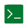

# SecuBox Eye Remote - Icons Reference

> **CyberMind** - SecuBox Eye Remote Touchscreen Controller
> Hardware: RPi Zero W + HyperPixel 2.1 Round (480x480)

---

## Overview

The Eye Remote uses a radial menu system with 6 slices, each displaying an icon and label. Icons are rendered at 40x40 pixels from source files stored at `/usr/lib/secubox-eye/assets/icons/`.

---

## Icon Locations

| Path | Description |
|------|-------------|
| `/usr/lib/secubox-eye/assets/icons/` | Primary system install |
| `remote-ui/round/assets/icons/` | Source repository |

---

## Icon Sizes

Each icon is provided in multiple sizes for different use cases:

| Size | Usage |
|------|-------|
| 22px | Small UI elements |
| 48px | **Primary** - Radial menu (resized to 40px) |
| 96px | Large displays, exports |
| 128px | High-DPI displays |

---

## ROOT Menu Icons (Main Menu)

| Icon | Name | Label | Description |
|------|------|-------|-------------|
|  | `devices` | DEVICES | Connected SecuBox devices |
|  | `secubox` | SECUBOX | Active SecuBox status |
|  | `local` | LOCAL | Pi Zero W local settings |
|  | `network` | NETWORK | Network configuration |
|  | `security` | SECURITY | Security & alerts |
|  | `exit` | EXIT | Exit menu / system actions |

---

## Navigation Icons

| Icon | Name | Usage |
|------|------|-------|
|  | `back` | Return to previous menu |
|  | `dashboard` | Return to dashboard |

---

## Action Icons

| Icon | Name | Action |
|------|------|--------|
|  | `scan` | Scan for devices |
|  | `plus` | Add / Pair new |
|  | `refresh` | Refresh data |
|  | `restart` | Restart service |
|  | `update` | Check updates |
|  | `trash` | Delete / Forget |

---

## System Icons

| Icon | Name | Category |
|------|------|----------|
|  | `cpu` | CPU status |
|  | `memory` | RAM usage |
|  | `disk` | Storage |
|  | `temp` | Temperature |
|  | `clock` | Uptime / Time |

---

## Display Icons

| Icon | Name | Function |
|------|------|----------|
|  | `display` | Display settings |
|  | `brightness` | Brightness control |
|  | `theme` | Theme selection |
|  | `rotate` | Screen rotation |
|  | `timeout` | Screen timeout |
|  | `test` | Display test |

---

## Network Icons

| Icon | Name | Function |
|------|------|----------|
|  | `interfaces` | Network interfaces |
|  | `routes` | Routing table |
|  | `dns` | DNS settings |
|  | `wifi` | WiFi config |
|  | `usb` | USB network |
|  | `hostname` | Hostname |
|  | `traffic` | Traffic monitor |

---

## Security Icons

| Icon | Name | Function |
|------|------|----------|
|  | `alert` | Alerts |
|  | `ban` | Banned IPs |
|  | `rules` | Firewall rules |
|  | `audit` | Audit log |
|  | `lock` | Lockdown mode |

---

## System Control Icons

| Icon | Name | Action |
|------|------|--------|
|  | `sleep` | Sleep mode |
|  | `reboot` | Reboot Pi |
|  | `shutdown` | Shutdown |

---

## SecuBox Module Icons

These icons represent SecuBox security modules:

| Icon | Name | Module |
|------|------|--------|
|  | `auth` | AUTH - CrowdSec IDS |
|  | `wall` | WALL - Firewall |
|  | `boot` | BOOT - Boot security |
|  | `mind` | MIND - DPI Analysis |
|  | `root` | ROOT - DNS Vortex |
|  | `mesh` | MESH - WireGuard VPN |

---

## Menu Slice Colors

| Slice | Module | Hex Color | Preview |
|-------|--------|-----------|---------|
| 0 | AUTH | `#C04E24` |  |
| 1 | WALL | `#9A6010` |  |
| 2 | BOOT | `#803018` |  |
| 3 | MIND | `#3D35A0` |  |
| 4 | ROOT | `#0A5840` |  |
| 5 | MESH | `#104A88` |  |

---

## Icon File Naming Convention

Icons follow this naming pattern:
```
{name}-{size}.png
```

Examples:
- `devices-48.png` - Devices icon, 48px
- `security-22.png` - Security icon, 22px
- `auth-96.png` - AUTH module icon, 96px

---

## Adding New Icons

1. Create icon in all sizes (22, 48, 96, 128px)
2. Use PNG format with RGBA (transparency support)
3. Place in `remote-ui/round/assets/icons/`
4. Reference in `menu_definitions.py` by base name (without size/extension)

Example:
```python
MenuItem("NEW ITEM", "newicon", action="module.action")
```

---

## Technical Notes

### Icon Loading Priority

The renderer searches for icons in this order:
1. `Path(__file__).parent.parent / "assets" / "icons"` (relative to module)
2. `/usr/lib/secubox-eye/assets/icons/` (system install)
3. `/usr/share/secubox-eye/icons/` (alternative)

### Size Preference

Icons are loaded in this size priority:
1. 48px (preferred for radial menu)
2. 22px (fallback)
3. 96px (fallback)

All icons are resized to 40x40px for display in the radial menu.

---

## Full Icon List

| # | Name | Sizes Available |
|---|------|-----------------|
| 1 | alert | 22, 48 |
| 2 | audit | 22, 48 |
| 3 | auth | 22, 48, 96, 128 |
| 4 | back | 22, 48 |
| 5 | ban | 22, 48 |
| 6 | boot | 22, 48, 96, 128 |
| 7 | brightness | 22, 48 |
| 8 | clock | 22, 48 |
| 9 | cpu | 22, 48 |
| 10 | dashboard | 22, 48 |
| 11 | devices | 22, 48 |
| 12 | disk | 22, 48 |
| 13 | display | 22, 48 |
| 14 | dns | 22, 48 |
| 15 | exit | 22, 48 |
| 16 | hostname | 22, 48 |
| 17 | info | 22, 48 |
| 18 | interfaces | 22, 48 |
| 19 | local | 22, 48 |
| 20 | lock | 22, 48 |
| 21 | logs | 22, 48 |
| 22 | memory | 22, 48 |
| 23 | mesh | 22, 48, 96, 128 |
| 24 | mind | 22, 48, 96, 128 |
| 25 | modules | 22, 48 |
| 26 | network | 22, 48 |
| 27 | plus | 22, 48 |
| 28 | reboot | 22, 48 |
| 29 | refresh | 22, 48 |
| 30 | restart | 22, 48 |
| 31 | root | 22, 48, 96, 128 |
| 32 | rotate | 22, 48 |
| 33 | routes | 22, 48 |
| 34 | rules | 22, 48 |
| 35 | scan | 22, 48 |
| 36 | secubox | 22, 48 |
| 37 | security | 22, 48 |
| 38 | shutdown | 22, 48 |
| 39 | sleep | 22, 48 |
| 40 | status | 22, 48 |
| 41 | system | 22, 48 |
| 42 | temp | 22, 48 |
| 43 | test | 22, 48 |
| 44 | theme | 22, 48 |
| 45 | timeout | 22, 48 |
| 46 | traffic | 22, 48 |
| 47 | trash | 22, 48 |
| 48 | update | 22, 48 |
| 49 | usb | 22, 48 |
| 50 | wall | 22, 48, 96, 128 |
| 51 | wifi | 22, 48 |

---

*CyberMind - SecuBox Eye Remote - Documentation*
*Last updated: 2026-04-25*
