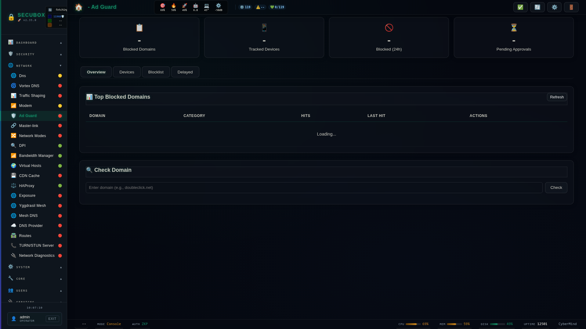

<!--
  SPDX-License-Identifier: LicenseRef-CMSD-1.0
  Copyright (c) 2026 CyberMind — Gérald Kerma <devel@cybermind.fr>
  Source-Disclosed License — All rights reserved except as expressly granted.
  See LICENCE-CMSD-1.0.md for terms.
-->

# 🚫 AdGuard

AdGuard Home DNS blocking

**Category:** DNS

## Screenshot



## Features

- Ad blocking
- Tracking protection
- Parental control
- Statistics

## Installation

```bash
# Add SecuBox repository
curl -fsSL https://apt.secubox.in/install.sh | sudo bash

# Install package
sudo apt install secubox-ad-guard
```

## Configuration

Configuration file: `/etc/secubox/ad-guard.toml`

## API Endpoints

- `GET /api/v1/ad-guard/status` - Module status
- `GET /api/v1/ad-guard/health` - Health check

## License

LicenseRef-CMSD-1.0 (Source-Disclosed License) — CyberMind © 2024-2026.
See [LICENCE-CMSD-1.0.md](../../LICENCE-CMSD-1.0.md).


## POC « DNS AdBlock TV » (1.2.0, #1943)

Mesure ce que le filtrage DNS bloque réellement pour des appareils choisis (Freebox TV) : **OBSERVE** (rien n'est bloqué, on compte ce qui l'aurait été) ou
**BLOCK**. Formulation : *réduction des domaines publicitaires/tracking résolus par DNS* — pas une suppression de publicités. Ni MITM, ni cookie, ni URL.
**Inactif par défaut.** Conception et audit : `docs/poc-dns-adblock-tv.md` ; résultats : `docs/poc-dns-adblock-tv-results.md`.

| Pièce | Rôle |
|---|---|
| `api/dnstv.py`, `api/dnstv_routes.py` | bibliothèque (analyseur du journal d'Unbound, classeur, état, SQLite, configuration Unbound) et routes `/api/v1/ad-guard/adblock-tv/*` |
| `sbin/secubox-adguard-tv` | **seule porte root** : `apply` / `disable` / `status` ; relit et revalide l'état, refuse les liens symboliques, `unbound-checkconf` avant de garder |
| `sbin/secubox-adguard-dnsfeed` | démon (`secubox`) : compteurs par jour / appareil / domaine / décision (`ALLOWED`, `BLOCKED`, `UPSTREAM_ERROR`) depuis `journalctl -u unbound` |
| `lists/` | jeu de test versionné (`# version:`, `MANIFEST.json`) : advertising, tracking, telemetry, social, custom |
| `tools/dns-tv-test.py` | test côté client : résolution, temps, statut ; `BLOCKED` seulement avec un résolveur de référence |
| `tools/dns-limits-lab.py` | banc local (vrai Unbound) qui **démontre** les limites A–G |
| `tools/tv-before-after.py` | procédure A/B/C sur un appareil réel, par différence de relevés |

Routes (`require_lecture` en lecture, `require_jwt` pour agir) : `status`, `etat`, `clients`, `mode`, `stats`, `export`, `clients/vus`, `custom`, `sonde`, `path-test`, `bypass`, `limites`.

```
# activer
(onglet « DNS AdBlock TV » : ajouter l'appareil, cocher Activé)   puis   systemctl enable --now secubox-ad-guard-dnsfeed
# tests
cd packages/secubox-ad-guard && python3 -m pytest tests          # le banc Unbound se saute si `unbound` est absent
python3 tools/dns-limits-lab.py --rapport reports/dns-limits.json
python3 tools/dns-tv-test.py --serveur 192.168.1.200 --reference 1.1.1.1 --list tools/test-domains.txt --rapport reports/dns-test.json
# retour arrière (le retrait du paquet le fait aussi)
sudo secubox-adguard-tv disable && sudo systemctl disable --now secubox-ad-guard-dnsfeed
```

### Fichier d'échange pour le DPI (1.6.0, #1960)

`dpi-feed.json` (`0600`) : un résumé par appareil du LAN (MAC) pour le jour courant — requêtes, blocages, noms, **top 10 des services** (organisation + type) et types. Recalculé au plus
toutes les 5 minutes par `secubox-adguard-auto`. Aucun nom de domaine demandé n'y figure ; pas de volumes. Lu par `secubox-dpi` (`GET /api/v1/dpi/lan_dns`).

### Mode auto (1.4.0, #1954)

Un appareil en mode `auto` voit ses domaines publicitaires **appris** (comparaison des requêtes pendant les coupures et en lecture normale), proposés comme
*candidats*, puis **essayés 24 h** et **confirmés** par l'administrateur ; un essai non confirmé est retiré. Retour arrière : bouton « Ça ne marche plus » et
signaux indirects. Spécification : `docs/superpowers/specs/2026-10-03-adguard-tv-auto-design.md`.

| Pièce | Rôle |
|---|---|
| `api/dnstv_regles.py` | règle (appareil, domaine, état), machine à états, `regles.json` (écriture atomique, lecture sans lien symbolique) |
| `api/dnstv_detect.py` / `api/dnstv_signaux.py` | détection des candidats et signaux de casse (seuils de départ, à calibrer) |
| `api/dnstv_auto.py`, `sbin/secubox-adguard-auto` | moteur d'un passage, lancé chaque minute par `secubox-ad-guard-auto.timer` |
| `secubox-adguard-tv regles-appliquer` | application **à chaud** (`unbound-control view_local_zone`), repli sur rechargement complet |

### Autorisations par appareil (1.6.2, #1965)

Le puits complet peut refuser un nom nécessaire à un service (cas réel : `licensing.bitmovin.com` empêchait le replay RMC). `etat.json` porte `autorisations` {identifiant de l'appareil -> domaines} :
un `local-zone-override` par adresse exempte l'appareil de CE nom, sans toucher aux autres clients (mesuré sur Unbound 1.17.1, y compris dans une vue `view-first`). Routes : `POST auto/appareils/{nom}/autoriser`
(`AutoriserIn{domaine, actif}`), `GET auto/appareils/{nom}/refus?minutes=` ; panneau : bouton « Autorisations » par appareil. Un changement recharge Unbound (≈ 7 s sans DNS) et s'audite.

### Suivi des IPv6 de confidentialité et plafond (1.7.3, #2146)

Le suivi rattache à un appareil (par sa MAC) ses nouvelles adresses vues par le DNS, dans la limite de 4 adresses par appareil. Quand le plafond est atteint, une **IPv6 qui n'a plus été vue
depuis 6 heures**, et plus ancienne que la nouvelle, lui cède sa place, même si elle avait été déclarée : sans cela, les IPv6 de confidentialité périmées occupaient les quatre places pour toujours, la TV
sortait de sa vue au premier changement d'adresse et perdait ses exemptions (cas réel : replay Free qui tournait sans fin, `imasdk.googleapis.com` bloqué). Jamais l'IPv4, jamais une adresse encore vue.

### Ajout automatique, puits complet et agrégation (1.5.0, #1959)

Un appareil qui interroge des serveurs d'insertion publicitaire ET au moins deux services de contenu est reconnu (« TV/streamer probable »), regroupé par **MAC**, puis ajouté en
mode par défaut avec le **profil de base** (`lists/profil-tv-base.txt`, 35 domaines validés). `ajout_auto` est **faux par défaut** ; l'administrateur l'active dans le panneau.
Garde-fous : 3 appareils par jour, un changement du périmètre par heure (rechargement d'Unbound ≈ 10 s), 32 adresses, liste `ignores`, audit. En mode `auto` la vue Unbound porte
`view-first: yes` : l'appareil **garde le puits de production** et ses règles s'y ajoutent (réglage `puits` par appareil ; faux = ancien comportement transparent).
Le DNS ne distingue pas une TV d'un téléphone qui regarde le même replay : « Retirer et ne plus ajouter » suffit. Seuils : section `[adblock_tv_auto]` (valeurs de départ).

| Pièce | Rôle |
|---|---|
| `api/dnstv_detecteur.py` | détection par comportement, compteurs par jour regroupés par MAC |
| `api/dnstv_ajout.py` | ajout, suivi des adresses (IPv6 qui change), plafonds, `suivi-ajout.json` |
| `api/dnstv_profil.py` | graine, profil agrégé (`profil-agrege.json`), candidats communs |

Routes : `auto/detection`, `auto/detection/reglage`, `auto/appareils/{nom}/ignorer`, `auto/appareils/{nom}/puits`, `auto/profil`. Modèle Pydantic : `ReglageDetectionIn{ajout_auto?, mode_defaut?}`, `PuitsIn{actif}`.
L'état gagne `mode_defaut`, `ajout_auto`, `ignores` ; chaque appareil `mac`, `origine`, `ajoute`, `preuve`, `puits` (écrits seulement hors défaut).

Le contrôleur root range son instantané, sa marque « désactivé » et son verrou dans `/var/lib/secubox-adguard-tv/` (root, 0700), **hors** de l'arbre de
`secubox`. `sudo secubox-adguard-tv disable` est **durable** : il retire le drop-in et pose la marque ; la minuterie ne réactive pas le POC (seul `apply` le fait).
Pour tout arrêter : `sudo secubox-adguard-tv disable && sudo systemctl disable --now secubox-ad-guard-auto.timer`.
En mode `auto`, l'appareil sort du puits DNS de production (vue transparente propre à lui) : seules ses règles s'appliquent. Le NOM de l'appareil est son
identité : deux appareils auto ne doivent pas avoir des noms qui ne diffèrent que par la casse ou la ponctuation (refusé).

Routes (`require_lecture` / `require_jwt`) : `auto/regles`, `auto/regles/{id}/{essayer|confirmer|rejeter|retirer|rouvrir}`, `auto/appareils/{appareil}/ca-ne-marche-plus`,
`auto/reglage`, `auto/reglage/auto-essai`, et `dns-box` (fiche en lecture seule des adresses DNS de la box, #1938). TOML : section `[adblock_tv_auto]` (`declencheurs`, `seuil_refus_min`, `duree_rafale_min`, `min_requetes_actif`).
Modèle Pydantic : `AutoEssaiIn{actif}`. L'état gagne `auto_essai` (faux par défaut).

Limite connue du module existant : l'exemption d'un client par une vue Unbound **vide** (allowlist d'IP de `secubox-adblock-sync`) ne fonctionne pas ;
une vue doit contenir une zone transparente (`local-zone: "." transparent`). Voir l'audit, §5.
