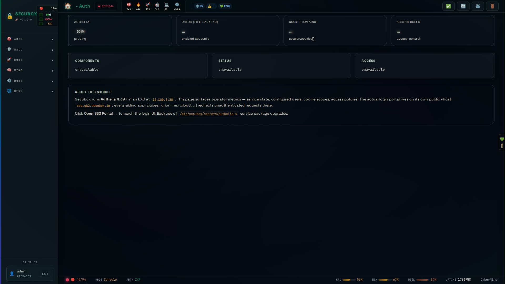

# 🔐 Authelia SSO

Single sign-on identity provider (AUTH-BRIDGE)

**Category:** Access

## Screenshot



## Features

- SSO
- 2FA / TOTP
- Access policies
- LDAP / file backend

## Installation

```bash
# Add SecuBox repository
curl -fsSL https://apt.secubox.in/install.sh | sudo bash

# Install package
sudo apt install secubox-authelia
```

## Configuration

Configuration file: `/etc/secubox/authelia.toml`

## API Endpoints

- `GET /api/v1/authelia/status` - Module status
- `GET /api/v1/authelia/health` - Health check

## License

LicenseRef-CMSD-1.0 (Source-Disclosed License) — CyberMind © 2024-2026.
See [LICENCE-CMSD-1.0.md](../../LICENCE-CMSD-1.0.md).
