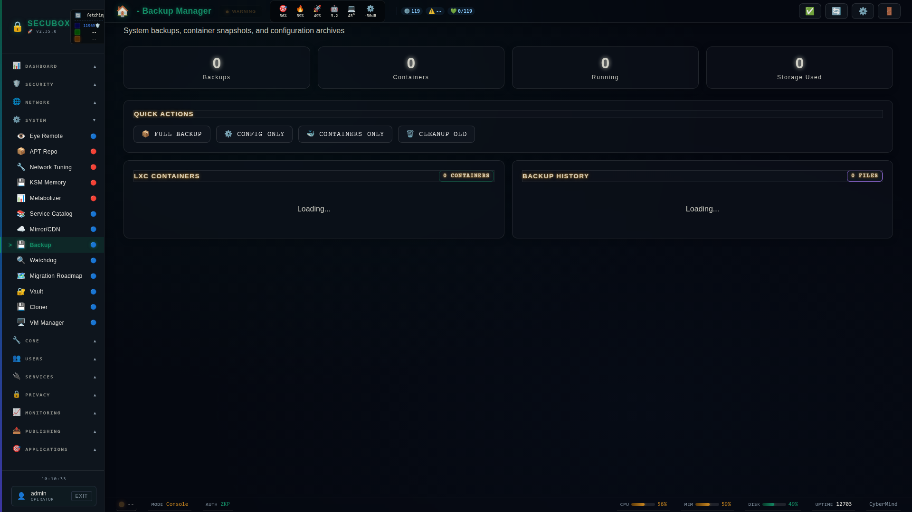

<!--
  SPDX-License-Identifier: LicenseRef-CMSD-1.0
  Copyright (c) 2026 CyberMind — Gérald Kerma <devel@cybermind.fr>
  Source-Disclosed License — All rights reserved except as expressly granted.
  See LICENCE-CMSD-1.0.md for terms.
-->

# 💾 Backup Manager

System and LXC backup

**Category:** System

## Screenshot



## Features

- Config backup
- LXC snapshots
- Restore
- Scheduling

## Installation

```bash
# Add SecuBox repository
curl -fsSL https://apt.secubox.in/install.sh | sudo bash

# Install package
sudo apt install secubox-backup
```

## Configuration

Configuration file: `/etc/secubox/backup.toml`

## API Endpoints

- `GET /api/v1/backup/status` - Module status
- `GET /api/v1/backup/health` - Health check

## License

LicenseRef-CMSD-1.0 (Source-Disclosed License) — CyberMind © 2024-2026.
See [LICENCE-CMSD-1.0.md](../../LICENCE-CMSD-1.0.md).


## Chiffrement par défaut (#1903)

Les sauvegardes sont **chiffrées par défaut** avec la clé publique de la box
(`/etc/secubox/backup-encryption.json`, age `age1…` ou identifiant GPG). Sans destinataire, ou si le
chiffrement échoue, la sauvegarde **échoue** et l'archive en clair est détruite. `encrypt: false`
reste possible, explicitement ; le choix est journalisé. Dossiers 0750, fichiers 0640.

Outil root `backupctl` :

| Commande | Effet |
|---|---|
| `backupctl etat` | destinataire, clé privée, archives encore en clair |
| `backupctl init-key` | génère la paire age ; la privée (`/etc/secubox/secrets/backup-age.key`, 0600 root) est à **copier hors de la box** |
| `backupctl chiffrer-existantes [--supprimer-clair]` | chiffre les anciennes archives ; le clair n'est supprimé qu'après un déchiffrement vérifié, deux fichiers distincts |
| `backupctl restaurer FICHIER.age [-C /]` | déchiffre (temporaire privé) puis extrait |

Une clé privée gardée sur la même box ne protège que les copies qui en sortent (envoi distant, disque de
sauvegarde, copie manuelle). La restauration d'une archive chiffrée par l'API répond 409 et renvoie à
`backupctl restaurer` : l'API est sans privilège et ne lit pas la clé.
