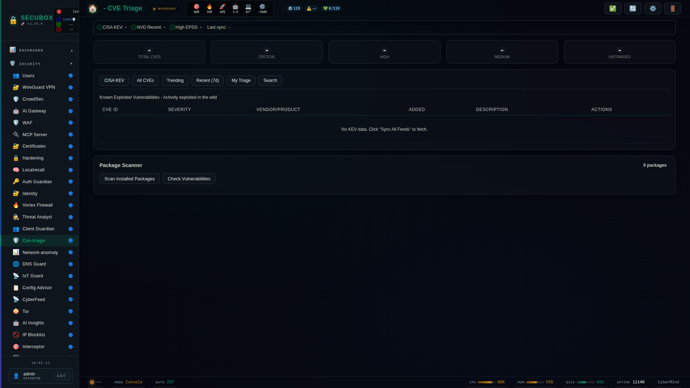

<!--
  SPDX-License-Identifier: LicenseRef-CMSD-1.0
  Copyright (c) 2026 CyberMind — Gérald Kerma <devel@cybermind.fr>
  Source-Disclosed License — All rights reserved except as expressly granted.
  See LICENCE-CMSD-1.0.md for terms.
-->

# 🔴 CVE Triage

CVE vulnerability tracking and triage

**Category:** Security

## Screenshot



## Features

- CVE database
- Affected packages
- Risk scoring
- Remediation

## Installation

```bash
# Add SecuBox repository
curl -fsSL https://apt.secubox.in/install.sh | sudo bash

# Install package
sudo apt install secubox-cve-triage
```

## Configuration

Configuration file: `/etc/secubox/cve-triage.toml`

## API Endpoints

- `GET /api/v1/cve-triage/status` - Module status
- `GET /api/v1/cve-triage/health` - Health check

## Générateur de règles WAF « product-absent »

`secubox-cvectl` orchestre un pipeline en quatre étapes sur un petit
sous-ensemble vendored de templates Nuclei (`nuclei-subset/`, MIT,
`nuclei-subset/LICENSE`) :

1. **KEV** (`api/wafgen/extract.is_kev`) — ne garde que les CVE réellement
   exploitées (tag `kev`).
2. **Extraction** (`api/wafgen/extract.extract`) — ne garde que les sondes à
   chemin d'URL déterministe (`{{BaseURL}}/...` fixe, pas de `raw:`/`unsafe`,
   pas de placeholder autre que `BaseURL`).
3. **Oracle de présence** (`api/wafgen/presence.should_generate`) — deux
   barrières indépendantes : famille d'appliance connue-absente
   (`f5`, `paloaltonetworks`, `ivanti`, `citrix`, `fortinet`, `cisco`,
   `vmware`, `sonicwall`, `zyxel`, `dlink`, `netgear`, `juniper`), ET absence
   de l'union de présence (dpkg + vhosts routés + modules secubox) — union
   qui doit être **complète** (`api/wafgen/inventory.gather_present`) : dans
   le doute, présent, on ne génère rien.
4. **Émission** (`api/wafgen/emit.write_category`) — écrit uniquement la
   catégorie `product_absent_probes` dans `/etc/secubox/waf/waf-rules.json`,
   toujours en mode `detect` (jamais escalate/block), additif et atomique.

```bash
# Dry-run (défaut) : montre ce qui SERAIT généré, n'écrit rien.
secubox-cvectl waf-rules generate

# Écrit la catégorie product_absent_probes (mode detect) ; refuse si
# l'inventaire de présence est incomplet (fail-safe, code retour 3).
secubox-cvectl waf-rules generate --apply
```

Le sous-ensemble vendored est rafraîchi hors-ligne par
`scripts/curate-nuclei-subset.sh` (mainteneur uniquement, jamais exécuté par
le service).

## License

LicenseRef-CMSD-1.0 (Source-Disclosed License) — CyberMind © 2024-2026.
See [LICENCE-CMSD-1.0.md](../../LICENCE-CMSD-1.0.md).
