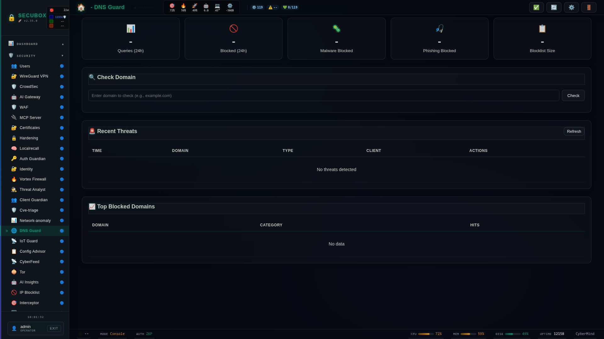

<!--
  SPDX-License-Identifier: LicenseRef-CMSD-1.0
  Copyright (c) 2026 CyberMind — Gérald Kerma <devel@cybermind.fr>
  Source-Disclosed License — All rights reserved except as expressly granted.
  See LICENCE-CMSD-1.0.md for terms.
-->

# 🛡️ DNS Guard

DNS-based threat protection

**Category:** DNS

## Screenshot



## Features

- Malware blocking
- Phishing protection
- Analytics
- Whitelist

## Installation

```bash
# Add SecuBox repository
curl -fsSL https://apt.secubox.in/install.sh | sudo bash

# Install package
sudo apt install secubox-dns-guard
```

## Configuration

Configuration file: `/etc/secubox/dns-guard.toml`

## API Endpoints

- `GET /api/v1/dns-guard/status` - Module status
- `GET /api/v1/dns-guard/health` - Health check

## License

LicenseRef-CMSD-1.0 (Source-Disclosed License) — CyberMind © 2024-2026.
See [LICENCE-CMSD-1.0.md](../../LICENCE-CMSD-1.0.md).


## Métriques du panneau (#1978)

`GET /status` (`require_lecture`) porte `queries_24h`, `blocked_24h` et `blocklist_size`. Sources : les compteurs DNS d'ad-guard
(`/var/lib/secubox/ad-guard/dnstv/dnstv.db`, ouvert en lecture seule, fenêtre « aujourd'hui (UTC) ») et l'état du puits
(`/var/lib/secubox/ad-guard/sinkhole-status.json`) : le blocage réel vit dans Unbound, pas dans la liste propre au module. Un chiffre
indisponible vaut `null` (le panneau écrit « — »). `malware_blocked` et `phishing_blocked` valent toujours `null` : le puits ne distingue pas ces
catégories. `GET /top-blocked?limit=1..50` (`require_lecture`, aucun client dans la réponse) et `GET /threats?limit=1..100` (`require_jwt`, porte
l'adresse du client).
