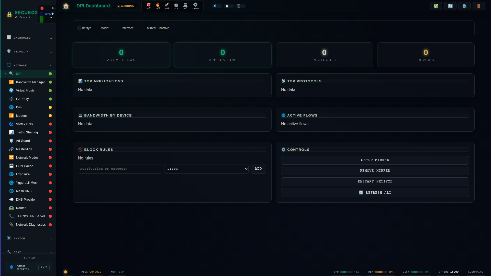

<!--
  SPDX-License-Identifier: LicenseRef-CMSD-1.0
  Copyright (c) 2026 CyberMind — Gérald Kerma <devel@cybermind.fr>
  Source-Disclosed License — All rights reserved except as expressly granted.
  See LICENCE-CMSD-1.0.md for terms.
-->

# 🔬 Deep Packet Inspection

DPI with nDPId

**Category:** Monitoring

## Screenshot



## Features

- Protocol detection
- App identification
- Flow analysis
- Statistics

## Installation

```bash
# Add SecuBox repository
curl -fsSL https://apt.secubox.in/install.sh | sudo bash

# Install package
sudo apt install secubox-dpi
```

## Données d'ad-guard (1.5.0, #1960)

Le DPI lit, en lecture seule, les fichiers de données d'`secubox-ad-guard` (`/usr/share/secubox/ad-guard/lists/`) et son fichier d'échange `/var/lib/secubox/ad-guard/dnstv/dpi-feed.json`.

- `GET /api/v1/dpi/usage` : les entrées `unknown` portent `etiquette` (`organisation`, `type`, `categorie`, `source: "ad-guard"`) quand ad-guard les connaît ; champ `adguard: {etiquetes, total}`. Une règle du DPI gagne toujours.
- `GET /api/v1/dpi/lan_dns` (JWT) : `{disponible, age_s, fenetre, appareils:[{nom, mac, adresses, mode, origine, requetes, bloquees, domaines, services, types}]}` ; `disponible: false` avec `raison` (`absent`, `périmé`, `illisible`).
- **Vue DNS, pas une mesure** : les noms demandés par les appareils du LAN, jamais de volumes ni de contenu. Le DPI ne voit pas le trafic qui ne traverse pas gk2 (par exemple les TV).

## Configuration

Configuration file: `/etc/secubox/dpi.toml`

## API Endpoints

- `GET /api/v1/dpi/status` - Module status
- `GET /api/v1/dpi/health` - Health check

## License

LicenseRef-CMSD-1.0 (Source-Disclosed License) — CyberMind © 2024-2026.
See [LICENCE-CMSD-1.0.md](../../LICENCE-CMSD-1.0.md).
