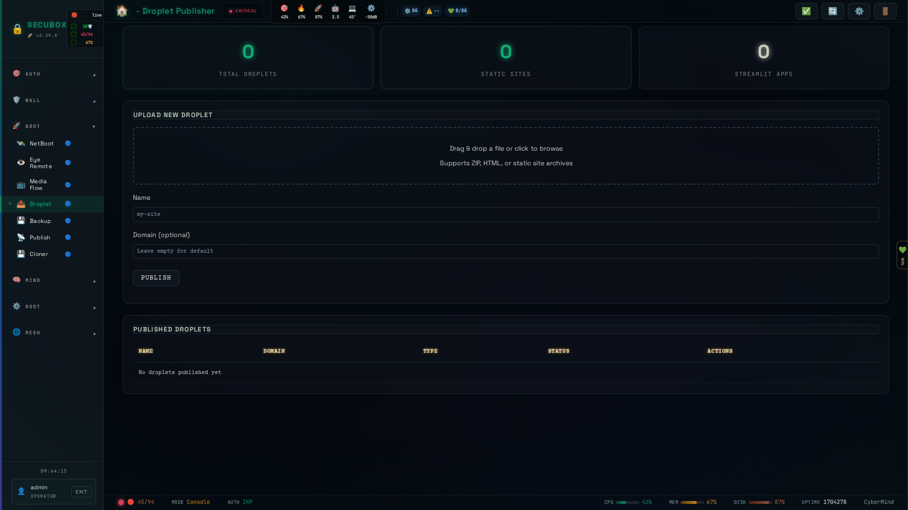

# 💧 Droplet

File upload and publish

**Category:** Publishing

## Screenshot



## Features

- File upload
- Share links
- Expiration
- Password protection

## Installation

```bash
# Add SecuBox repository
curl -fsSL https://apt.secubox.in/install.sh | sudo bash

# Install package
sudo apt install secubox-droplet
```

## Configuration

Configuration file: `/etc/secubox/droplet.toml`

## API Endpoints

- `GET /api/v1/droplet/status` - Module status
- `GET /api/v1/droplet/health` - Health check

## License

LicenseRef-CMSD-1.0 (Source-Disclosed License) — CyberMind © 2024-2026.
See [LICENCE-CMSD-1.0.md](../../LICENCE-CMSD-1.0.md).
