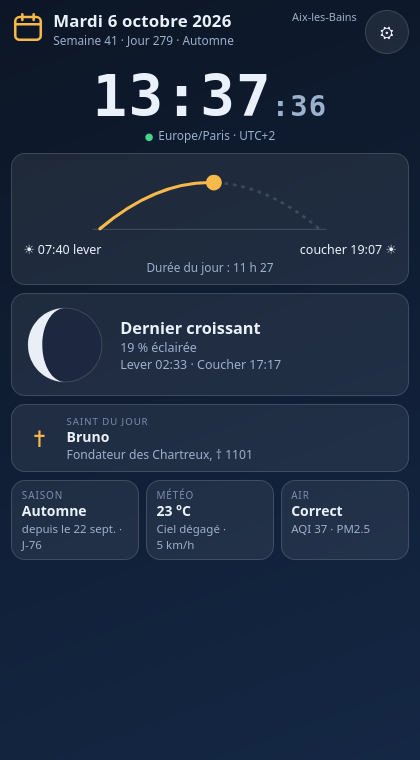

<!-- SPDX-License-Identifier: LicenseRef-CMSD-1.0 -->
# secubox-ephemeride — la cardlet « Éphéméride » du Hall SBXOS

> Le Hall donne en un regard la sensation de savoir **où** et **quand** nous sommes.

Date, heure du fuseau de la box, saison, lever et coucher du soleil, phase de la Lune, saint du jour, météo, qualité de
l'air et une note d'observation. **L'astronomie et le calendrier sont calculés localement, sans réseau** : la carte reste
complète sans Internet. Seules la météo et la qualité de l'air (facultatives) interrogent un fournisseur, par un cache.



## Architecture

| Pièce | Rôle |
|---|---|
| `api/astro.py` | soleil, lune, phases, lever/coucher (balayage de l'altitude : jour/nuit polaires sans cas spécial), sans dépendance |
| `api/calendrier.py` | date, semaine ISO, jour de l'année, saison (hémisphère nord/sud) |
| `api/saints.py` | `SaintProvider` : données livrées + fichier d'administrateur prioritaire jour par jour |
| `api/fournisseurs.py` | `WeatherProvider`, `AirQualityProvider` (Open-Meteo), cache JSON, repli hors-ligne |
| `api/observations.py` | notes de l'utilisateur, SQLite, requêtes paramétrées, historique plafonné (500) |
| `api/config.py` | `/etc/secubox/ephemeride.toml`, lieu explicite puis repli par fuseau |
| `api/modeles.py` / `api/main.py` | modèles Pydantic (`EphemerideData`) et routes FastAPI |
| `secubox-webos` : `www/hall/cardlets/ephemeride.html` | la carte (un composant, trois niveaux), entrée `FEATURED` du Hall, route nginx |

Données en quatre régimes : **temps réel** (l'horloge tourne dans le navigateur, sur l'heure du serveur dans le fuseau de la
box, sans appel à l'API), **calculées** (date, saison, soleil), **périodiques** (phase de la lune, météo : cache 15 min, air :
30 min), **statiques** (saints).

## API (socket `/run/secubox/ephemeride.sock`, route `/api/v1/ephemeride/`)

| Méthode | Route | Garde | Rôle |
|---|---|---|---|
| GET | `/` | `require_lecture` | `EphemerideData` : heure, fuseau, lieu, calendrier, soleil, lune (+ prochaine phase), saints, météo, air, observations |
| GET | `/observations?limite=20` | `require_lecture` | historique |
| POST | `/observations` | `require_jwt` | ajouter `{"texte": "…"}` (1 à 2000 caractères) |
| PUT | `/observations/{id}` | `require_jwt` | modifier |
| DELETE | `/observations/{id}` | `require_jwt` | supprimer |
| GET | `/health` | publique | vivacité |

Le Hall n'inclut pas `secubox-routes.d` : `secubox-webos` ouvre `/api/v1/ephemeride/` vers la socket (`hall.vhost.conf`).

## Configuration

`/etc/secubox/ephemeride.toml` (jamais écrasé par une mise à jour ; modèle : `/usr/share/secubox/ephemeride/ephemeride.toml`).

```toml
[ephemeride]
enabled = true
timezone = "Europe/Paris"
format_24h = true

[ephemeride.location]
name = "Aix-les-Bains"
latitude = 45.69
longitude = 5.91

[ephemeride.weather]
enabled = true
provider = "auto"        # auto | open-meteo | none (aucun appel sortant)

[ephemeride.air_quality]
enabled = true
provider = "auto"

[ephemeride.saint]
enabled = true
file = "/etc/secubox/ephemeride/saints.json"

[ephemeride.observations]
enabled = true
```

**Localisation** : coordonnées explicites ; sinon la ville de référence du fuseau (signalée « approximatif ») ; sinon Paris.
Aucune géolocalisation précise n'est exigée et rien n'est demandé au navigateur. Vers le fournisseur de météo, les
coordonnées sont **arrondies à 0,01°** (≈ 1 km).

**Saints** : `data/saints.json` (usage français, 366 jours, **à relire avant publication**) ; un fichier d'administrateur
`{"saints": {"10-06": [{"nom": "Bruno", "description": "…", "citation": "…"}]}}` l'emporte jour par jour.

## Sécurité

Utilisateur dédié `secubox-ephemeride` (groupe `secubox`), durcissement systemd complet (`NoNewPrivileges`, `ProtectSystem=strict`,
aucune capacité), écriture seulement dans `/var/lib/secubox/ephemeride`. Lecture gardée, écriture réservée à
l'administrateur. La page n'injecte jamais de HTML (tout passe par `textContent`). TLS vérifié vers le fournisseur.
Les erreurs réseau ne sont jamais montrées : « Météo indisponible », avec l'heure de la dernière mise à jour connue.

## Installation, tests, essai local

```bash
sudo apt install secubox-ephemeride           # recommandé par le service « Hall » (secubox-service-hall)
systemctl status secubox-ephemeride
python3 -m pytest packages/secubox-ephemeride/tests -q     # 123 tests
python3 -m pytest packages/secubox-webos/tests/test_ephemeride_cardlet.py -q
```

## Dépend d'un service externe (facultatif)

Météo et qualité de l'air : Open-Meteo (`api.open-meteo.com`, `air-quality-api.open-meteo.com`, HTTPS). `provider = "none"`
supprime tout appel sortant ; la carte affiche alors « Désactivée ». Un fournisseur de saints par API n'est pas fourni : la
interface `SaintProvider` le permet (voir `api/saints.py`).
