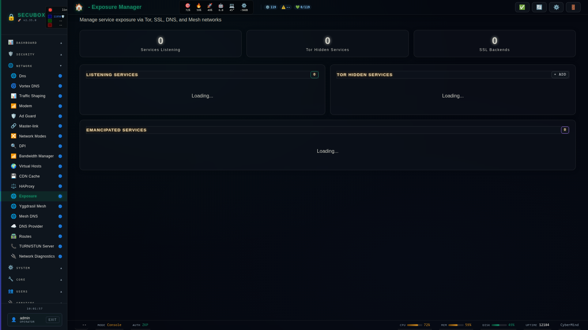

# 🌐 Exposure Settings

Unified exposure management

**Category:** Privacy

## Screenshot



## Features

- Tor exposure
- SSL certs
- DNS records
- Mesh access

## Installation

```bash
# Add SecuBox repository
curl -fsSL https://apt.secubox.in/install.sh | sudo bash

# Install package
sudo apt install secubox-exposure
```

## Configuration

Configuration file: `/etc/secubox/exposure.toml`

## API Endpoints

- `GET /api/v1/exposure/status` - Module status
- `GET /api/v1/exposure/health` - Health check
- `GET /api/v1/exposure/{vhost}` - Read the current reach/mesh state for a vhost
- `POST /api/v1/exposure/{vhost}` - Set the reach/mesh state for a vhost (fail-safe apply, audited)

## Exposure switch

Each vhost carries a per-vhost **reach** setting that controls who may
reach it, independent of the global Tor/DNS/Mesh (Punk Exposure) channels
documented above.

### Reach levels

| Reach       | Meaning                                              |
|-------------|-------------------------------------------------------|
| `localhost` | Only reachable from 127.0.0.1 (loopback)               |
| `lan`       | Reachable from the local network/mesh CIDR (default)   |
| `wan`       | Reachable from anywhere (public)                       |

The default reach for a newly-adopted vhost is **`lan`**. A vhost that is
**already public** at adoption time is seeded to **`wan`** instead — the
switch never silently re-confines a currently-public service.

An independent boolean, **`mesh`**, additionally allows the Gondwana mesh
CIDR through regardless of `reach` (useful for `localhost`/`lan` vhosts
that should still be reachable from other mesh nodes).

### Snippet

Each vhost's reach state is rendered as an nginx snippet at:

```
/etc/nginx/snippets/exposure/<vhost>.conf
```

The snippet contains the `allow`/`deny` rules matching the selected reach
(plus the mesh CIDR `allow` line when `mesh` is enabled). It is written
atomically (write-temp + rename) so nginx never observes a half-written
file.

### Wiring a vhost

A vhost opts into the switch by adding a single `include` line inside its
gated `location` block (typically `location /`), **after** any existing
auth/ACL directives it already enforces:

```nginx
location / {
    include /etc/nginx/snippets/exposure/<vhost>.conf;
    ...
}
```

If the snippet file is missing (e.g. the package has not yet adopted the
vhost), the fail-safe default applies — always run `nginx -t` after wiring
and before reload.

### real_ip dependency

For the `wan`-deny rules to be effective, nginx must see the **real
client IP**, not the upstream proxy's IP (HAProxy in the default SecuBox
topology). This requires `secubox-hub`'s lan-geo real_ip configuration —
`set_real_ip_from` (trusting the HAProxy/proxy hop) and `real_ip_header`
(e.g. `X-Forwarded-For` or `proxy_protocol`) — to be active in the nginx
config. Without it, all requests appear to originate from the proxy's
address and reach/deny rules will not behave as expected.

## License

LicenseRef-CMSD-1.0 (Source-Disclosed License) — CyberMind © 2024-2026.
See [LICENCE-CMSD-1.0.md](../../LICENCE-CMSD-1.0.md).
