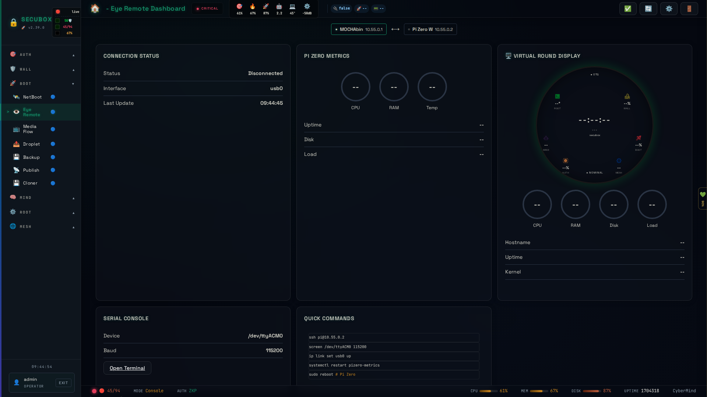

# 👁️ Eye Remote

Remote management interface

**Category:** System

## Screenshot



## Features

- USB gadget
- Serial console
- Boot media
- Recovery

## Installation

```bash
# Add SecuBox repository
curl -fsSL https://apt.secubox.in/install.sh | sudo bash

# Install package
sudo apt install secubox-eye-remote
```

## Configuration

Configuration file: `/etc/secubox/eye-remote.toml`

## API Endpoints

- `GET /api/v1/eye-remote/status` - Module status
- `GET /api/v1/eye-remote/health` - Health check

## License

LicenseRef-CMSD-1.0 (Source-Disclosed License) — CyberMind © 2024-2026.
See [LICENCE-CMSD-1.0.md](../../LICENCE-CMSD-1.0.md).
