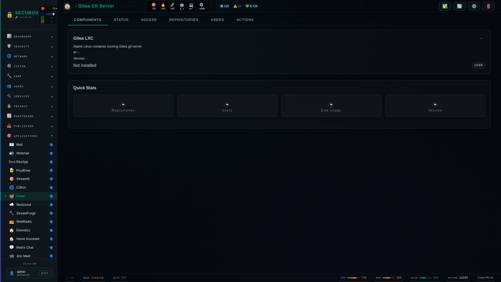

# 🦊 Gitea

Git server (LXC)

**Category:** Services

## Screenshot



## Features

- Repositories
- Users
- SSH/HTTP
- LFS
- Actions

## Public endpoints

| Service | URL |
|---------|-----|
| Gitea web | `https://gitea.gk2.secubox.in/` |
| Git over SSH | `ssh://git@gitea.gk2.secubox.in:2222/<user>/<repo>.git` |

TLS is provided by the wildcard cert `*.gk2.secubox.in` loaded by HAProxy; no
per-host certbot is needed.

The package's `postinst` installs the nginx vhost + HAProxy ACLs + TCP
frontend for SSH. The install is idempotent; re-running `apt install
--reinstall secubox-gitea` will not duplicate routes.

## Operator runbook

If `gitea.gk2.secubox.in` stops responding:

1. `ssh root@<host> 'systemctl status haproxy nginx'` — both must be active.
2. `ssh root@<host> 'curl -sI http://10.100.0.40:3000/'` — confirms the LXC is up.
3. `ssh root@<host> 'lxc-attach -n gitea -- systemctl status gitea'` — Gitea inside the LXC.
4. `bash tests/scripts/test-gitea-routing.sh` from this repo runs the full gate suite.

## Installation

```bash
# Add SecuBox repository
curl -fsSL https://apt.secubox.in/install.sh | sudo bash

# Install package
sudo apt install secubox-gitea
```

## Configuration

Configuration file: `/etc/secubox/gitea.toml`

## API Endpoints

- `GET /api/v1/gitea/status` - Module status
- `GET /api/v1/gitea/health` - Health check

## License

MIT License - CyberMind © 2024-2026
