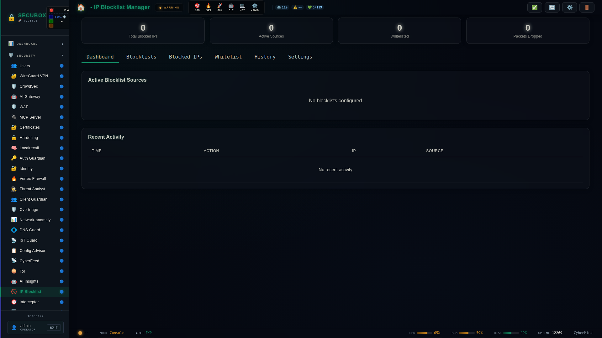

# 🚫 IP Block Manager

IP and network blocking management

**Category:** Security

## Screenshot



## Features

- IP blocklists
- Network ranges
- Temporary bans
- Import/Export

## Installation

```bash
# Add SecuBox repository
curl -fsSL https://apt.secubox.in/install.sh | sudo bash

# Install package
sudo apt install secubox-ipblock
```

## Configuration

Configuration file: `/etc/secubox/ipblock.toml`

## API Endpoints

- `GET /api/v1/ipblock/status` - Module status
- `GET /api/v1/ipblock/health` - Health check

## License

MIT License - CyberMind © 2024-2026
