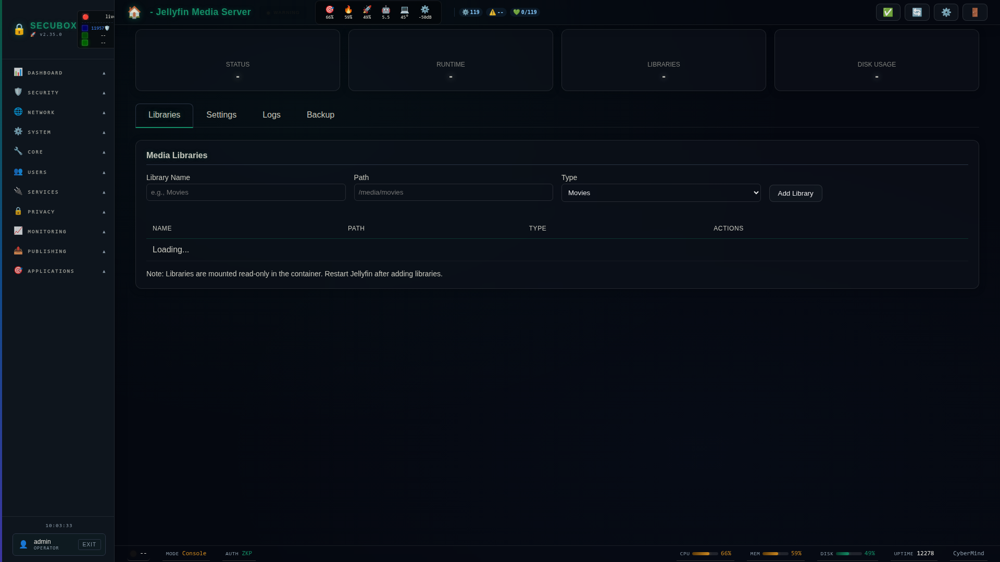

<!--
  SPDX-License-Identifier: LicenseRef-CMSD-1.0
  Copyright (c) 2026 CyberMind — Gérald Kerma <devel@cybermind.fr>
  Source-Disclosed License — All rights reserved except as expressly granted.
  See LICENCE-CMSD-1.0.md for terms.
-->

# 🎬 Jellyfin

Media server

**Category:** Media

## Screenshot



## Features

- Video streaming
- Live TV
- Transcoding
- Mobile apps

## Installation

```bash
# Add SecuBox repository
curl -fsSL https://apt.secubox.in/install.sh | sudo bash

# Install package
sudo apt install secubox-jellyfin
```

## Configuration

Configuration file: `/etc/secubox/jellyfin.toml`

### Playback policy (`[playback]`)

On boards without hardware video acceleration (no `/dev/dri`), Jellyfin
transcodes every stream in software on the CPU. Combined with other media
services (e.g. PeerTube) running their own `ffmpeg` encodes, this can starve
playback to the point a single film only plays intermittently.

`[playback]` in `jellyfin.toml` declares the transcoding policy pushed onto
every Jellyfin user by `jellyfinctl playback apply`:

```toml
[playback]
allow_video_transcoding = false
allow_audio_transcoding = false
allow_remuxing          = true
```

**Tradeoff — read before changing:** disabling transcoding is not "plays
worse", it is "plays or does not play". A file the client cannot decode
natively (wrong codec, container, profile, or bit depth) will refuse to
play at all instead of degrading through a software re-encode. Remuxing
(repackaging into a compatible container without re-encoding) stays
independently enabled by default — its CPU cost is negligible and it
widens what plays without a full transcode. Set `allow_video_transcoding`
and/or `allow_audio_transcoding` back to `true` if that tradeoff is not
acceptable for your library/clients; the change takes effect on the next
`jellyfinctl playback apply` (manual, on package (re)install, or via the
periodic `secubox-jellyfin-playback-policy.timer`).

Jellyfin stores this policy **per user**, with no server-wide default: a
user created after the fact starts from Jellyfin's own default (transcoding
enabled) until reconciled — `jellyfinctl playback status` shows per-user
compliance, and the periodic timer re-applies the declared policy so this
does not require a human to remember.

```bash
jellyfinctl playback status   # current per-user policy vs. declared config
jellyfinctl playback apply    # push the declared config to every user
```

## API Endpoints

- `GET /api/v1/jellyfin/status` - Module status
- `GET /api/v1/jellyfin/health` - Health check

## License

LicenseRef-CMSD-1.0 (Source-Disclosed License) — CyberMind © 2024-2026.
See [LICENCE-CMSD-1.0.md](../../LICENCE-CMSD-1.0.md).
