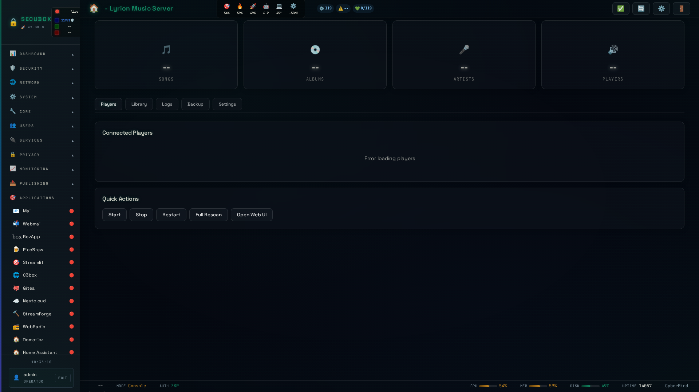

# 🎵 Lyrion Music

Music streaming server

**Category:** Media

## Screenshot



## Features

- Music library
- Playlists
- Radio
- Multi-room

## Installation

```bash
# Add SecuBox repository
curl -fsSL https://apt.secubox.in/install.sh | sudo bash

# Install package
sudo apt install secubox-lyrion
```

## Configuration

Configuration file: `/etc/secubox/lyrion.toml`

## API Endpoints

- `GET /api/v1/lyrion/status` - Module status
- `GET /api/v1/lyrion/health` - Health check

## License

LicenseRef-CMSD-1.0 (Source-Disclosed License) — CyberMind © 2024-2026.
See [LICENCE-CMSD-1.0.md](../../LICENCE-CMSD-1.0.md).

## Lecteur web + agent de cast (2026-08-31)

Deux ajouts autour de la carte Hall « Lyrion » :

- **Cast** — `POST /player/{id}/play-url {"url"}` (LMS `playlist play`). Le Hall
  relaie SON audio (radio / diffusion du parc, bouton 📡 de la carte) vers un
  lecteur Squeezebox physique. URL en valeur JSON (pas de shell), schéma
  `http(s)` validé, LAN-only comme les autres transports.

> **Lecteur web « SBX-Web » — décommissionné.** La brique lecteur web du Hall
> (squeezelite headless `-o null` enregistré comme client LMS, écouté dans le
> navigateur via le relais `/lyrion-stream.mp3`) a été retirée : unité
> `sbx-lyrion-webplayer.service`, conffile `/etc/secubox/lyrion-webplayer.env`,
> dépendance `squeezelite` et relais nginx supprimés. Le `postinst` coupe et
> désinstalle l'unité résiduelle sur les box déjà déployées. Le **contrôle des
> lecteurs Squeezebox/Squeezelite** et le **cast 📡** (ci-dessus) restent en
> place.
