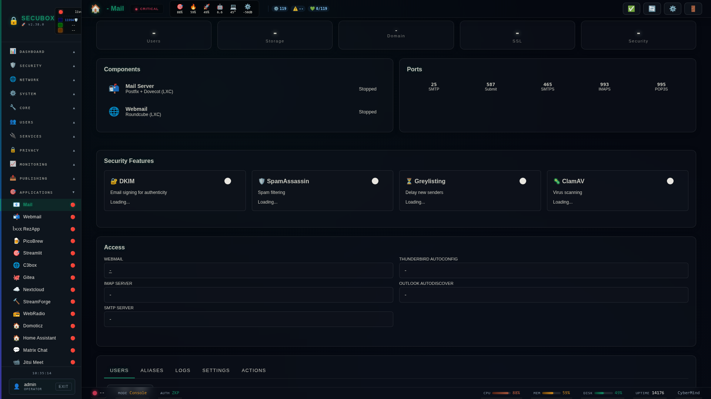

<!--
  SPDX-License-Identifier: LicenseRef-CMSD-1.0
  Copyright (c) 2026 CyberMind — Gérald Kerma <devel@cybermind.fr>
  Source-Disclosed License — All rights reserved except as expressly granted.
  See LICENCE-CMSD-1.0.md for terms.
-->

# 📧 Mail Server

Postfix/Dovecot mail server

**Category:** Email

## Screenshot



## Features

- Domains
- Mailboxes
- DKIM
- SpamAssassin
- ClamAV

## Installation

```bash
# Add SecuBox repository
curl -fsSL https://apt.secubox.in/install.sh | sudo bash

# Install package
sudo apt install secubox-mail
```

## Configuration

Configuration file: `/etc/secubox/mail.toml`

## API Endpoints

- `GET /api/v1/mail/status` - Module status
- `GET /api/v1/mail/health` - Health check

## License

LicenseRef-CMSD-1.0 (Source-Disclosed License) — CyberMind © 2024-2026.
See [LICENCE-CMSD-1.0.md](../../LICENCE-CMSD-1.0.md).

## Gestes mailctl — socle (#1169)

| Commande | Effet |
|----------|-------|
| `mailctl maildir-reconcile` | Bascule idempotente mbox→Maildir (backup préalable obligatoire, no-op si déjà Maildir) |
| `mailctl sieve enable\|status` | Active Pigeonhole/ManageSieve (:4190) ; sieve par défaut spam→Junk |
| `mailctl antivirus on\|off\|status` | ClamAV optionnel (off par défaut, câblé mais dormant) |
| `mailctl ssl renew` | Renouvelle le cert LE mail + redéploie + reload (timer hebdo auto) |
| `mailctl backup` / `restore <archive>` | Filet de sûreté (tar horodaté de vmail+config+dovecot.conf) |

### Options TOML ajoutées

```toml
[mail.antivirus]
enabled = false   # true → clamav-daemon + freshclam + module antivirus Rspamd
```

Le paquet livre aussi l'autoconfig RFC 6186 (`config-v1.1.xml`) et les
enregistrements SRV Unbound (`_imaps`/`_submission`/`_submissions`/`_pop3s`),
posés idempotemment à l'installation.
