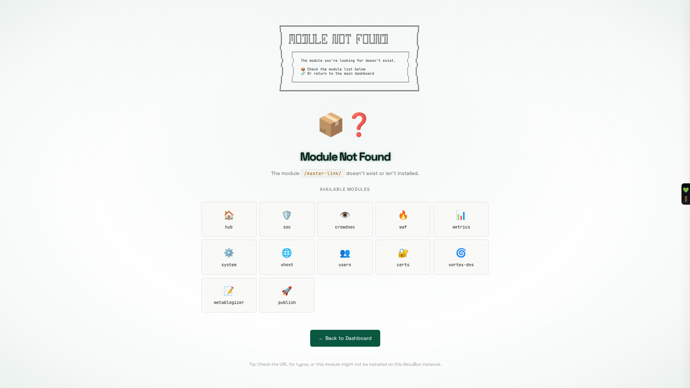

# 🔗 MasterLink

SecuBox mesh federation

**Category:** VPN

## Screenshot



## Features

- Box discovery
- Federation
- Shared policies
- Sync

## Installation

```bash
# Add SecuBox repository
curl -fsSL https://apt.secubox.in/install.sh | sudo bash

# Install package
sudo apt install secubox-master-link
```

## Configuration

Configuration file: `/etc/secubox/master-link.toml`

## API Endpoints

- `GET /api/v1/master-link/status` - Module status
- `GET /api/v1/master-link/health` - Health check

## License

LicenseRef-CMSD-1.0 (Source-Disclosed License) — CyberMind © 2024-2026.
See [LICENCE-CMSD-1.0.md](../../LICENCE-CMSD-1.0.md).
