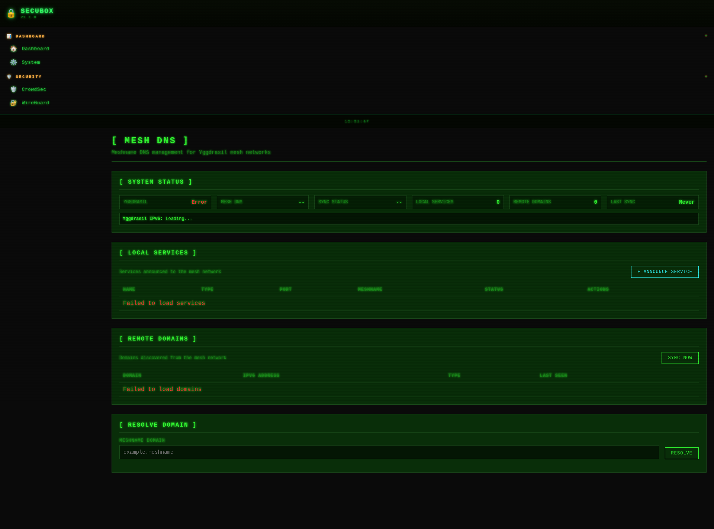

# 🕸️ Mesh Network

Mesh networking (Yggdrasil)

**Category:** VPN

## Screenshot



## Features

- Peer discovery
- Routing
- Encryption

## Installation

```bash
# Add SecuBox repository
curl -fsSL https://apt.secubox.in/install.sh | sudo bash

# Install package
sudo apt install secubox-mesh
```

## Configuration

Configuration file: `/etc/secubox/mesh.toml`

## API Endpoints

- `GET /api/v1/mesh/status` - Module status
- `GET /api/v1/mesh/health` - Health check

## License

MIT License - CyberMind © 2024-2026
