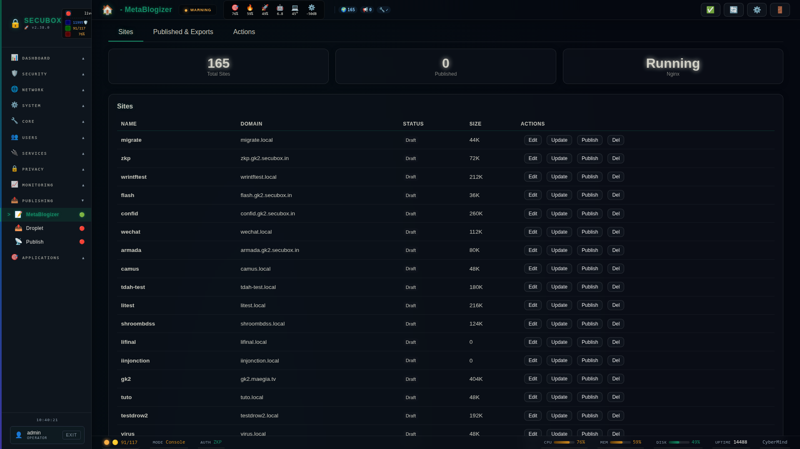

# 📝 Metablogizer

Static site publisher with Tor

**Category:** Publishing

## Screenshot



## Features

- Static sites
- Tor publishing
- Templates
- Markdown

## Gitea ingest

The 166 sites under `/srv/metablogizer/sites/*` are tracked in Gitea at
`https://gitea.gk2.secubox.in/gandalf/?tab=repositories&q=metablog`
as `gandalf/metablog-<sitename>` repositories, each with a `v1.0.0` tag
on the initial state.

Initial ingest is driven by three scripts in `scripts/`:

```bash
bash scripts/metablog-ingest-gitea-config.sh   # one-time: enables push-create
bash scripts/lib/gitea-ssh-preflight.sh --check  # verify SSH path
bash scripts/metablog-ingest.sh                # full run
```

Flags on `metablog-ingest.sh`: `--dry-run`, `--limit N`, `--site <name>`, `--halt-on-fail`.

Idempotent — re-running picks up new sites and skips ones already in sync.
Per-site outcome lands in `output/ingest-report.json`. Important: the SSH
URL uses `gitea@` (NOT `git@`) because Gitea's built-in SSH server validates
the username against the OS user it runs as.

## Version metadata (site.json)

Every site under `/srv/metablogizer/sites/` carries a `site.json` describing it.
The formal schema lives at `packages/secubox-metablogizer/schema/site.json.schema.json`.

Required fields: `name`, `domain`, `published`.
Optional: `version`, `title`, `description`, `category`, `streamlit_app`,
`tags`, `last_updated`.

If `version` and/or `last_updated` are absent, the API derives them from the
local git state (`git describe --tags --exact-match` and
`git log -1 --format=%cI`).

The `/api/v1/metablogizer/sites` endpoint returns the enriched form;
consumers (e.g. the upcoming sub-D dashboard) see one consistent shape.

### Backfill

To create or merge `site.json` files in bulk:

```bash
bash scripts/metablog-site-backfill.sh --dry-run        # preview
bash scripts/metablog-site-backfill.sh                  # create missing
bash scripts/metablog-site-backfill.sh --force          # merge missing fields
bash scripts/metablog-site-backfill.sh --site <name>    # one site only
```

Per-run JSON report at `output/metablog-backfill-report.json`. The backfill
auto-detects `streamlit_app` by probing the Gitea repo
`gandalf/streamlit-<name>.git` (sub-F).

## Installation

```bash
# Add SecuBox repository
curl -fsSL https://apt.secubox.in/install.sh | sudo bash

# Install package
sudo apt install secubox-metablogizer
```

## Configuration

Configuration file: `/etc/secubox/metablogizer.toml`

## API Endpoints

- `GET /api/v1/metablogizer/status` - Module status
- `GET /api/v1/metablogizer/health` - Health check

## License

MIT License - CyberMind © 2024-2026
