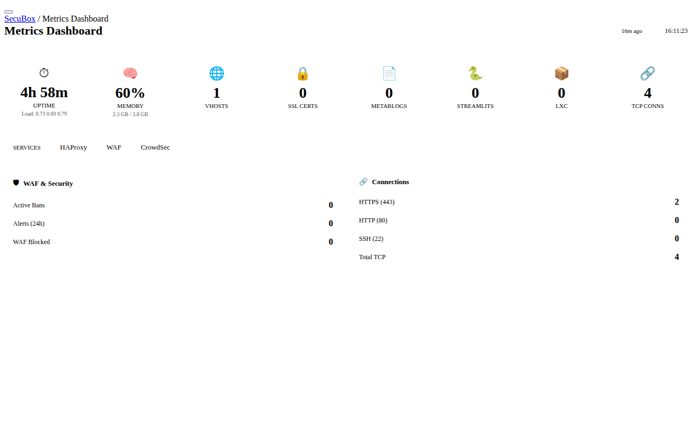

# 📊 Metrics Dashboard

Real-time system metrics dashboard

**Category:** Monitoring

## Screenshot



## Features

- System overview (uptime, load, memory)
- Service status monitoring (HAProxy, WAF, CrowdSec)
- Connection statistics
- WAF/CrowdSec metrics
- vHost, certificate, and container counts
- Live updates with caching
- Freshness indicators

## Installation

```bash
# Add SecuBox repository
curl -fsSL https://apt.secubox.in/install.sh | sudo bash

# Install package
sudo apt install secubox-metrics
```

## Configuration

Configuration file: `/etc/secubox/metrics.toml`

## API Endpoints

- `GET /api/v1/metrics/status` - Module status
- `GET /api/v1/metrics/health` - Health check
- `GET /api/v1/metrics/overview` - System overview
- `GET /api/v1/metrics/waf_stats` - WAF/CrowdSec statistics
- `GET /api/v1/metrics/connections` - Connection statistics
- `GET /api/v1/metrics/all` - All metrics data
- `POST /api/v1/metrics/refresh` - Force cache refresh
- `GET /api/v1/metrics/certs` - SSL certificate info
- `GET /api/v1/metrics/vhosts` - Virtual hosts list

## License

MIT License - CyberMind © 2024-2026
