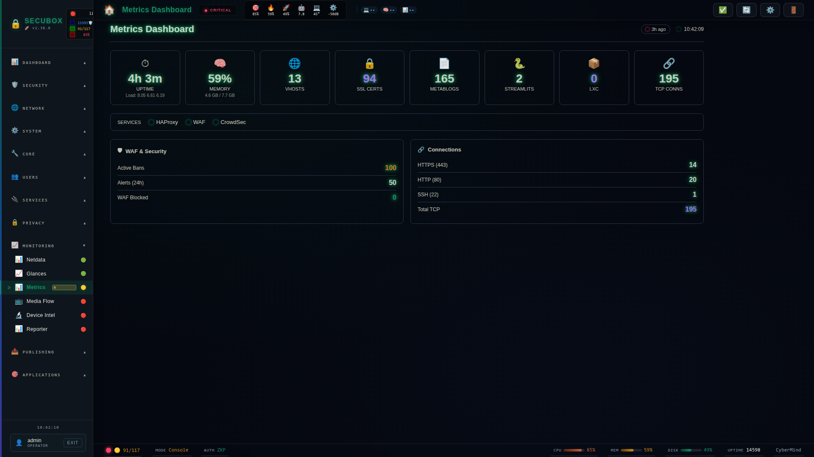

# 📈 System Metrics

Real-time system metrics dashboard

**Category:** Dashboard

## Screenshot



## Features

- CPU/Memory
- Network stats
- Disk I/O
- Historical data

## Installation

```bash
# Add SecuBox repository
curl -fsSL https://apt.secubox.in/install.sh | sudo bash

# Install package
sudo apt install secubox-metrics
```

## Configuration

Configuration file: `/etc/secubox/metrics.toml`

## API Endpoints

- `GET /api/v1/metrics/status` - Module status
- `GET /api/v1/metrics/health` - Health check

## Endpoints — live panel (issue #92)

Three public endpoints feed the health-banner live panel. All are
unauthenticated, CORS-open, and `Cache-Control: public, max-age=300`.

| Method | Path                              | Schema (high-level)                                  |
|--------|-----------------------------------|------------------------------------------------------|
| GET    | `/api/v1/metrics/visitor-origin`  | `{enabled, window_minutes, entries:[{asn,org,count}]}`|
| GET    | `/api/v1/metrics/live-hosts`      | `{enabled, window_minutes, entries:[{host,count}]}`   |
| GET    | `/api/v1/metrics/cert-status`     | `{enabled, summary, next_renewal, warnings}`          |

Config blocks live in `/etc/secubox/secubox.conf`:

```toml
[visitor_origin]
enabled = true
min_count = 5

[live_hosts]
enabled = true

[cert_status]
enabled = true
warn_days = 30
```

MaxMind GeoLite2-ASN refresh: install `geoipupdate` (available in Debian
bookworm's `contrib` repository; `secubox-metrics` lists it as a
`Recommends`, not `Depends`, so `apt install secubox-metrics` succeeds
without `contrib` enabled). Drop a license file at
`/etc/secubox/secrets/maxmind.conf` (mode 0600, owner `secubox`).
The `secubox-geoipupdate.timer` runs weekly; if either the binary or the
key is absent, the unit is a silent no-op and the VisitorOrigin banner
section stays hidden.

## License

LicenseRef-CMSD-1.0 (Source-Disclosed License) — CyberMind © 2024-2026.
See [LICENCE-CMSD-1.0.md](../../LICENCE-CMSD-1.0.md).
