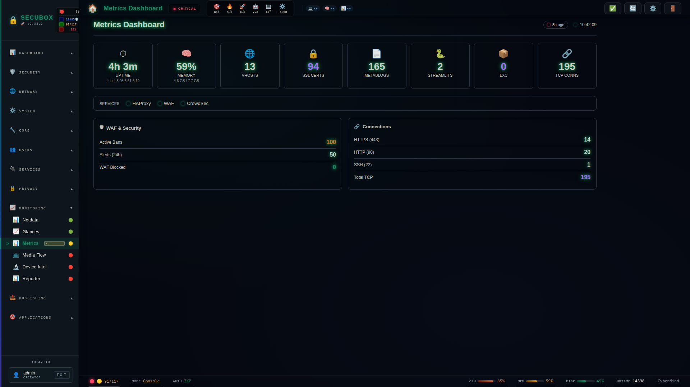

<!--
  SPDX-License-Identifier: LicenseRef-CMSD-1.0
  Copyright (c) 2026 CyberMind — Gérald Kerma <devel@cybermind.fr>
  Source-Disclosed License — All rights reserved except as expressly granted.
  See LICENCE-CMSD-1.0.md for terms.
-->

# 📈 System Metrics

Real-time system metrics dashboard

**Category:** Dashboard

## Screenshot



## Features

- CPU/Memory
- Network stats
- Disk I/O
- Historical data

## Installation

```bash
# Add SecuBox repository
curl -fsSL https://apt.secubox.in/install.sh | sudo bash

# Install package
sudo apt install secubox-metrics
```

## Configuration

Configuration file: `/etc/secubox/metrics.toml`

## API Endpoints

- `GET /api/v1/metrics/status` - Module status
- `GET /api/v1/metrics/health` - Health check
- `GET /api/v1/metrics/summary` - cpu / mem / load du widget de la barre
  laterale (admin, `require_jwt`) ; ne lance aucun sous-processus

## Endpoints — live panel (issue #92)

These endpoints feed the health-banner live panel. They are CORS-open and
guarded by `require_lecture` since #1256 (a token, or the LAN dashboard mode).

| Method | Path                              | Schema (high-level)                                  |
|--------|-----------------------------------|------------------------------------------------------|
| GET    | `/api/v1/metrics/visitor-origin`  | `{enabled, window_minutes, entries:[{asn,org,count}]}`|
| GET    | `/api/v1/metrics/live-hosts`      | `{enabled, window_minutes, entries:[{host,count}], total_requests}` |
| GET    | `/api/v1/metrics/cert-status`     | `{enabled, summary, next_renewal, warnings}`          |

`live-hosts` counts requests per vhost from `/var/log/nginx/<vhost>_access.log`
(the service user joins the `adm` group). `total_requests` is the denominator of
the WAF block rate (`waf.blocked_pct`, `waf.blocks_1h` in `/health/summary`).

## Endpoints — audit des cookies (RGPD / ePrivacy, #159)

Relayed by nginx through `/etc/nginx/secubox-routes.d/metrics-cookie-audit.conf`.
Disabled by default (`[cookie_audit] enabled = false`).

| Method | Path                            | Guard             | Content                                   |
|--------|---------------------------------|-------------------|-------------------------------------------|
| POST   | `/api/v1/cookie-audit/ingest`   | `require_lecture` | browser snapshot (hashed values), 5 MB cap per host |
| GET    | `/api/v1/cookie-audit/report`   | `require_jwt`     | per-vhost detail (`?host=` for one)       |
| GET    | `/api/v1/cookie-audit/summary`  | `require_lecture` | counters only, no host names              |

Config blocks live in `/etc/secubox/secubox.conf`:

```toml
[visitor_origin]
enabled = true
min_count = 5

[live_hosts]
enabled = true

[cert_status]
enabled = true
warn_days = 30
```

ASN database refresh (#194): `secubox-geoipupdate.timer` runs
`/usr/bin/secubox-geoipupdate-fetch` weekly. With `geoipupdate` installed and a
MaxMind licence at `/etc/secubox/secrets/maxmind.conf` it uses MaxMind;
otherwise it falls back to the free DB-IP ASN lite database (no signup).

## Endpoint — historique de la memoire (#2146)

| Methode | Route | Garde | Role |
|---|---|---|---|
| GET | `/api/v1/metrics/memory/history?heures=24` | `require_lecture` | serie des releves (5 min, 7 jours max), alertes, croissance de la memoire noyau en Mo/h |

Un timer (`secubox-metrics-memoire.timer`, 5 min) ecrit `/var/lib/secubox/metrics/memoire.jsonl`. Il surveille la memoire
**noyau non recuperable** (`SUnreclaim`) — c'est elle qui avait atteint 4,2 Go sur gk2 sans que rien ne le releve — la
memoire disponible et le swap, en part de la RAM, et signale une croissance soutenue du noyau avant le seuil. Les alertes
(`ALERTE memoire : ...`) vont au journal du service.

## License

LicenseRef-CMSD-1.0 (Source-Disclosed License) — CyberMind © 2024-2026.
See [LICENCE-CMSD-1.0.md](../../LICENCE-CMSD-1.0.md).
