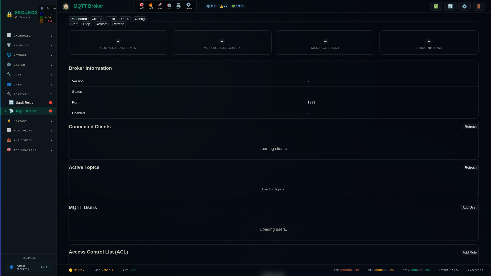

# 📡 MQTT Broker

Mosquitto MQTT broker

**Category:** IoT

## Screenshot



## Features

- Topics
- ACL
- TLS
- WebSocket

## Installation

```bash
# Add SecuBox repository
curl -fsSL https://apt.secubox.in/install.sh | sudo bash

# Install package
sudo apt install secubox-mqtt
```

## Configuration

Configuration file: `/etc/secubox/mqtt.toml`

## API Endpoints

- `GET /api/v1/mqtt/status` - Module status
- `GET /api/v1/mqtt/health` - Health check

## License

MIT License - CyberMind © 2024-2026
