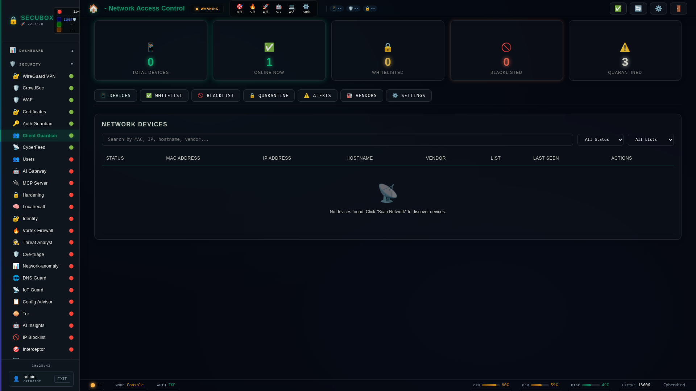

<!--
  SPDX-License-Identifier: LicenseRef-CMSD-1.0
  Copyright (c) 2026 CyberMind — Gérald Kerma <devel@cybermind.fr>
  Source-Disclosed License — All rights reserved except as expressly granted.
  See LICENCE-CMSD-1.0.md for terms.
-->

# 🛡️ Network Access Control

Client guardian and NAC with quarantine

**Category:** Security

## Screenshot



## Features

- Device control
- MAC filtering
- Quarantine
- VLAN assignment

## Installation

```bash
# Add SecuBox repository
curl -fsSL https://apt.secubox.in/install.sh | sudo bash

# Install package
sudo apt install secubox-nac
```

## Configuration

Configuration file: `/etc/secubox/nac.toml`

## API Endpoints

- `GET /api/v1/nac/status` - Module status
- `GET /api/v1/nac/health` - Health check

## License

LicenseRef-CMSD-1.0 (Source-Disclosed License) — CyberMind © 2024-2026.
See [LICENCE-CMSD-1.0.md](../../LICENCE-CMSD-1.0.md).


## Application réseau du blocage et des zones (#1766)

L'API tourne sans privilège (`NoNewPrivileges`, aucune capacité) : elle n'appelle jamais `nft`.

1. Bloquer / mettre en quarantaine / changer de zone écrit l'**état voulu** dans
   `/var/lib/secubox/nac/nft-desired.json` (écriture atomique, verrouillée).
2. `secubox-nac-apply.path` voit le changement et lance `secubox-nac-apply` (root, étroit :
   `CAP_NET_ADMIN` seul). Il **valide chaque MAC et chaque nom d'ensemble**, puis charge en une
   transaction les règles `/etc/nftables.d/secubox-nac.nft` et les éléments.
3. Au démarrage de nftables (et à chaque redémarrage), le service reconstruit la table.

| Ensemble | Effet |
|---|---|
| `blocked` | rien n'entre ni ne sort, ni vers la box ni à travers elle |
| `quarantine_zone` | rien à travers la box ; vers la box seulement DHCP et DNS |
| `iot_zone`, `guest_zone` | internet oui ; LAN et conteneurs (RFC 1918) non |
| `lan_allowed`, `lxc_zone` | aucune restriction |

Statut réel : `/var/lib/secubox/nac/nft-applied.json` (repris par `/status`). Les chaînes tournent à
`priority filter - 5` : un drop est final, un oubli ne rend rien accessible. `GET /sync_zones`
redemande l'application. Preuve de bout en bout : topologie client/routeur/serveur en espaces de noms.
