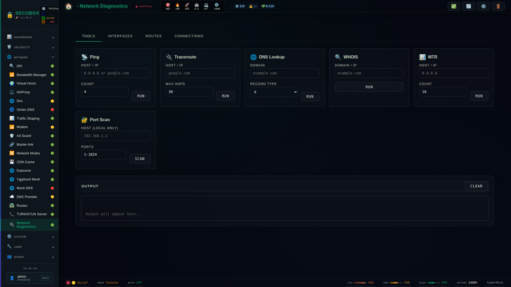

<!--
  SPDX-License-Identifier: LicenseRef-CMSD-1.0
  Copyright (c) 2026 CyberMind — Gérald Kerma <devel@cybermind.fr>
  Source-Disclosed License — All rights reserved except as expressly granted.
  See LICENCE-CMSD-1.0.md for terms.
-->

# 🔍 Network Diagnostics

Network troubleshooting tools

**Category:** Network

## Screenshot



## Features

- Ping/Traceroute
- DNS lookup
- Port scan
- Speed test

## Installation

```bash
# Add SecuBox repository
curl -fsSL https://apt.secubox.in/install.sh | sudo bash

# Install package
sudo apt install secubox-netdiag
```

## Configuration

Configuration file: `/etc/secubox/netdiag.toml`

## API Endpoints

- `GET /api/v1/netdiag/status` - Module status
- `GET /api/v1/netdiag/health` - Health check

## License

LicenseRef-CMSD-1.0 (Source-Disclosed License) — CyberMind © 2024-2026.
See [LICENCE-CMSD-1.0.md](../../LICENCE-CMSD-1.0.md).


## secubox-dhcp-probe — qui sert le DHCP, et que promet-il ?

`secubox-dhcp-probe -i eth2 --attendu 192.168.1.200` (root). Lecture seule : un DISCOVER en diffusion, écoute des OFFER, jamais de
REQUEST (aucun bail). Affiche serveur, passerelle, DNS, bail ; code de sortie 0 conforme, 1 aucune réponse, 2 plusieurs serveurs
ou DNS inattendu, 3 erreur. N'agit sur aucun réseau : il sert à décider d'un changement de DHCP, pas à le faire.
