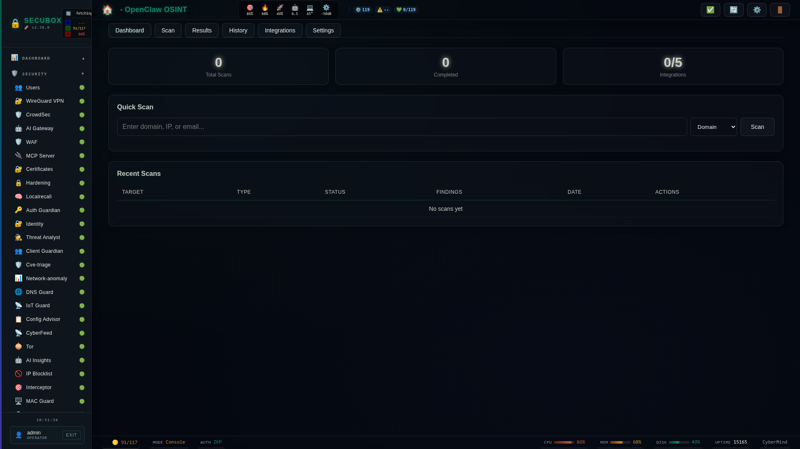

# 🦞 OpenClaw Scanner

Network vulnerability scanner

**Category:** Security

## Screenshot



## Features

- Port scanning
- Service detection
- Vulnerability checks
- Reports

## Installation

```bash
# Add SecuBox repository
curl -fsSL https://apt.secubox.in/install.sh | sudo bash

# Install package
sudo apt install secubox-openclaw
```

## Configuration

Configuration file: `/etc/secubox/openclaw.toml`

## API Endpoints

- `GET /api/v1/openclaw/status` - Module status
- `GET /api/v1/openclaw/health` - Health check

## License

MIT License - CyberMind © 2024-2026
