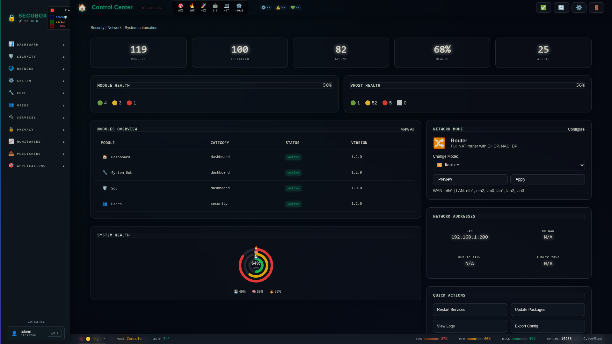

<!--
  SPDX-License-Identifier: LicenseRef-CMSD-1.0
  Copyright (c) 2026 CyberMind — Gérald Kerma <devel@cybermind.fr>
  Source-Disclosed License — All rights reserved except as expressly granted.
  See LICENCE-CMSD-1.0.md for terms.
-->

# 🔗 P2P Network

Peer-to-peer networking

**Category:** VPN

## Screenshot



## Features

- Direct connections
- NAT traversal
- Encryption
- DHT

## Installation

```bash
# Add SecuBox repository
curl -fsSL https://apt.secubox.in/install.sh | sudo bash

# Install package
sudo apt install secubox-p2p
```

## Configuration

Configuration file: `/etc/secubox/p2p.toml`

## API Endpoints

- `GET /api/v1/p2p/status` - Module status
- `GET /api/v1/p2p/health` - Health check

## Evolutions (#774): DHT discovery, service federation health-checks, hierarchical master-link

Three additional subsystems, built on top of the existing WireGuard mesh and
the annuaire-backed identity/registry. **All three are OFF by default** and
are OPAD opt-in (enable explicitly in `/etc/secubox/p2p.toml`) — with every
section absent or disabled, `secubox-p2p` behaves exactly as before.

### DHT discovery (`api/dht.py`)

A custom Kademlia DHT (asyncio/UDP, JSON wire protocol) that lets nodes
publish and resolve **signed reachability records** (`{did, id_pubkey,
wg_pubkey, endpoint, ts, sig}`, Ed25519-signed) without depending on the
central annuaire being reachable. It implements standard Kademlia buckets
(k=20, alpha=3, 160-bit id space via SHA1(did)), an iterative `find_node` /
`find_value` lookup, bootstrap from annuaire nodes and/or seed addresses, and
persists its routing table to disk across restarts. It also carries an
advisory (unsigned) key/value store used to mirror federation health
snapshots (see below).

- `GET /dht/peers` — public read; routing-table snapshot (`enabled`, `peers`,
  `buckets`). Returns `{"enabled": false, "peers": [], "buckets": 0}` when the
  DHT is disabled.
- `POST /dht/announce` — JWT required; signs and publishes this node's own
  reachability record to the DHT (k nodes closest to its own id). Returns
  `{"ok": true, "key": <node_id_hex>}`. 400 if DHT is disabled.
- `GET /dht/find/{did}` — public read; resolves a DID to its verified
  reachability record via an iterative lookup. 404 if not found, 400 if DHT
  is disabled.

### Service federation health-checks (`api/federation.py`)

An opt-in async health-checker that sweeps the services published in the
local annuaire catalog and records debounced up/down status (a service only
flips to "down" after `fail_threshold` consecutive failures, avoiding flapping
on a single blip). The default probe (`default_probe`) does an HTTP(S)
`GET <endpoint><health_path>` when the service exposes an http(s) endpoint, or
a plain TCP connect otherwise; probes run concurrently under a semaphore cap.
When the DHT is also enabled, every sweep additionally mirrors the health
snapshot into the DHT's advisory store (`make_dht_publisher`), so health
status becomes visible to other DHT nodes too.

- `GET /federation/services` — public read; the federated service list (from
  the annuaire) with each entry's current health status. Always returns the
  service list even when health-checks are disabled (health reported as
  `"unknown"`); `enabled` reflects whether the background checker is running.
- `POST /federation/healthcheck` — JWT required; forces an immediate
  health-check sweep. Returns `{"ok": true, "probed": <n>}`. 400 if
  health-checks are disabled.

### Hierarchical master-link (`api/masterlink.py`)

A deterministic master-election and heartbeat-based failover state machine
for a small hierarchy of nodes (e.g. designating one mesh node as the
service-federation "master"). Election picks the candidate with the lowest
`(priority, node_id_hex)` tuple; a monotonic term (persisted to disk,
`TermStore`) guards against split-brain, and equal-term collisions between
two self-elected masters are resolved with the same deterministic tie-break so
exactly one survives. Heartbeats are Ed25519-signed (bound to the sender's
identity key) and broadcast over UDP to the configured peer addresses; a
satellite that stops hearing valid heartbeats for `election_timeout` seconds
starts a new election.

- `GET /masterlink/topology` — public read; this node's view of the topology
  (`master`, `term`, `self_role`, `self_id`, `peers`). Returns
  `{"enabled": false}` when master-link is disabled.
- `POST /masterlink/promote` — JWT required; forces an on-demand promotion
  attempt (bumps the term and re-runs the election immediately, rather than
  waiting for `election_timeout`). Returns `{"promoted", "term", "master",
  "role"}`. 400 if master-link is disabled.

### Configuration (`/etc/secubox/p2p.toml`)

Each subsystem has its own section in `p2p.toml`, all disabled by default.
The real defaults, from `api/mesh.py` (`DHT_DEFAULTS` / `FEDERATION_DEFAULTS`
/ `MASTERLINK_DEFAULTS`):

```toml
[dht]
enabled = false
port = 51823
bootstrap = []            # list of "host:port" seed addresses
announce = false
announce_interval = 900
rps = 50

[federation]
health_checks = false
interval = 30             # seconds between sweeps
probe_timeout = 5
max_concurrency = 20
fail_threshold = 3        # consecutive failures before marking a service "down"

[masterlink]
enabled = false
role_preference = "auto"
priority = 100            # lower priority value wins the election
heartbeat_interval = 5
election_timeout = 15
port = 51824
peer_addrs = []           # list of "host:port" masterlink peer endpoints
```

Startup for all three subsystems is best-effort: if a section is disabled, if
the node has no annuaire identity yet, or if the transport fails to bind, the
subsystem is simply left off (`app.state.dht` / `app.state.masterlink` /
`app.state.health_checker` stay `None`) and the rest of `secubox-p2p` starts
normally.

### Audit log

Two security-relevant events are appended to `/var/log/secubox/p2p-audit.log`
(JSON lines, best-effort/append-only): `dht_announce` (when a node publishes
its own reachability record) and `masterlink_promote` (every on-demand
promotion attempt, successful or not).

## License

LicenseRef-CMSD-1.0 (Source-Disclosed License) — CyberMind © 2024-2026.
See [LICENCE-CMSD-1.0.md](../../LICENCE-CMSD-1.0.md).
