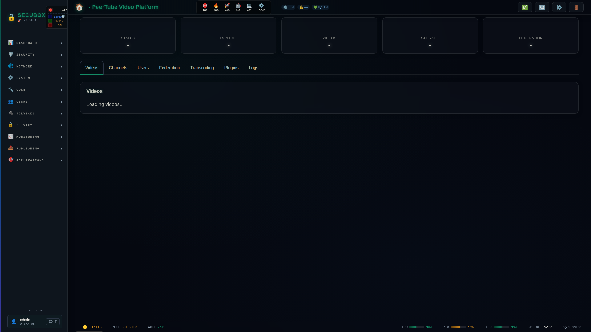

# 📺 PeerTube

Federated video platform

**Category:** Media

## Screenshot



## Features

- Video hosting
- Federation
- Live streaming
- Comments

## Installation

```bash
# Add SecuBox repository
curl -fsSL https://apt.secubox.in/install.sh | sudo bash

# Install package
sudo apt install secubox-peertube
```

## Configuration

Configuration file: `/etc/secubox/peertube.toml`

## API Endpoints

- `GET /api/v1/peertube/status` - Module status
- `GET /api/v1/peertube/health` - Health check

## License

MIT License - CyberMind © 2024-2026
