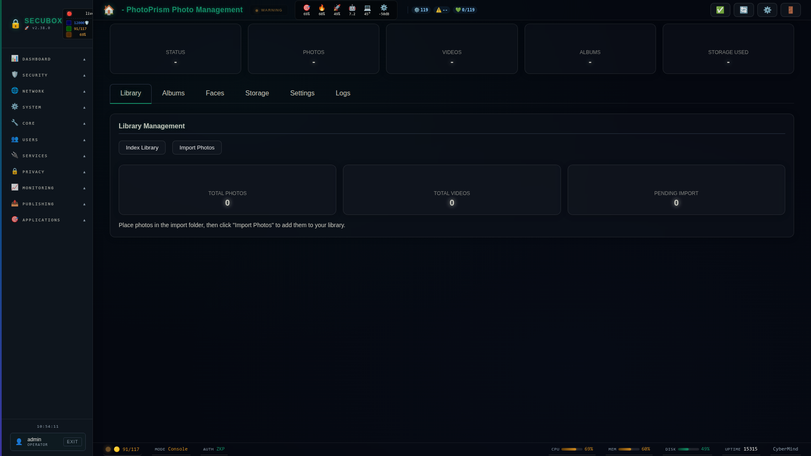

# 📸 PhotoPrism

AI-powered photo management

**Category:** Media

## Screenshot



## Features

- Face recognition
- Auto-tagging
- Search
- Albums

## Installation

```bash
# Add SecuBox repository
curl -fsSL https://apt.secubox.in/install.sh | sudo bash

# Install package
sudo apt install secubox-photoprism
```

## Configuration

Configuration file: `/etc/secubox/photoprism.toml`

## API Endpoints

- `GET /api/v1/photoprism/status` - Module status
- `GET /api/v1/photoprism/health` - Health check

## License

MIT License - CyberMind © 2024-2026
