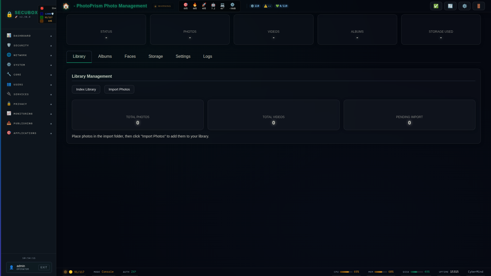

<!--
  SPDX-License-Identifier: LicenseRef-CMSD-1.0
  Copyright (c) 2026 CyberMind — Gérald Kerma <devel@cybermind.fr>
  Source-Disclosed License — All rights reserved except as expressly granted.
  See LICENCE-CMSD-1.0.md for terms.
-->

# 📸 PhotoPrism

AI-powered photo management

**Category:** Media

## Screenshot



## Features

- Face recognition
- Auto-tagging
- Search
- Albums

## Installation

```bash
# Add SecuBox repository
curl -fsSL https://apt.secubox.in/install.sh | sudo bash

# Install package
sudo apt install secubox-photoprism
```

## Runtime

PhotoPrism runs **natively** in a dedicated Debian LXC (`photoprism`, 10.100.0.130):
the official build from `dl.photoprism.app` in `/opt/photoprism`, unit
`photoprism.service`, user `photoprism`, SQLite index. No podman, no docker
(`.claude/PATTERNS.md` Pattern 11).

```bash
photoprismctl install     # provision / repair (idempotent; purges an old podman install)
photoprismctl update      # re-download the official build
photoprismctl index       # incremental index (also run every 15 min by a timer)
photoprismctl import      # import from /data/photoprism/import
photoprismctl sso         # "SecuBox" OIDC login (issuer = hall.<box domain>/oidc)
```

Re-running `install` keeps what the package does not own in the LXC config:
`lxc.start.*` / `lxc.cgroup2.*` (on-demand lifecycle, tuning) and extra mounts.

## Configuration

Configuration file: `/etc/secubox/photoprism.toml` — `http_port`, `auto_index`,
`workers` (absent = auto), `originals`.

## API Endpoints

- `GET /api/v1/photoprism/status` - Module status
- `GET /api/v1/photoprism/health` - Health check

## License

LicenseRef-CMSD-1.0 (Source-Disclosed License) — CyberMind © 2024-2026.
See [LICENCE-CMSD-1.0.md](../../LICENCE-CMSD-1.0.md).
