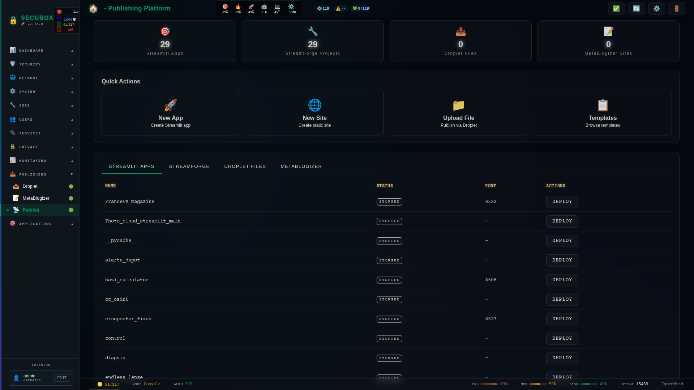

# 📰 Publishing Platform

Unified publishing dashboard with ISP Home Publish

**Category:** Publishing

## Screenshot



## Features

- **ISP Home Publish** — Upload ZIP → Auto-detect → Publish → Download
- Multi-platform orchestration (Streamlit, MetaBlogizer, Droplet)
- Plugin injection system for extensibility
- Bundle downloads with QR codes
- Webhook notifications
- Content type auto-detection

## ISP Home Publish

One-click publishing for home ISP users:

```bash
# Upload and auto-publish
curl -X POST https://secubox.local/api/v1/publish/isp/upload \
  -H "Authorization: Bearer $TOKEN" \
  -F "file=@my-site.zip" \
  -F "name=mysite" \
  -F "auto_publish=true"
```

**Supported content types:**
- Static HTML sites
- Streamlit apps
- Hugo/Jekyll/Hexo sites
- Any ZIP/TAR archive

**Auto-detection:**
The system automatically detects content type based on file signatures:
- `app.py` → Streamlit
- `index.html` → Static site
- `config.toml` → Hugo
- `_config.yml` → Jekyll/Hexo

## Installation

```bash
# Add SecuBox repository
curl -fsSL https://apt.secubox.in/install.sh | sudo bash

# Install package
sudo apt install secubox-publish
```

## Configuration

Configuration file: `/etc/secubox/publish.toml`

```toml
[publish]
default_publisher = "metablogizer"
enable_streamlit = true
enable_streamforge = true
enable_droplet = true
enable_metablogizer = true
```

## API Endpoints

### Core
- `GET /api/v1/publish/health` - Health check
- `GET /api/v1/publish/status` - Module status
- `GET /api/v1/publish/summary` - Platform summary

### ISP Home Publish
- `POST /api/v1/publish/isp/upload` - Upload ZIP and auto-publish
- `GET /api/v1/publish/bundle/{name}.zip` - Download published content
- `GET /api/v1/publish/bundle/{name}/qrcode` - QR code for download
- `GET /api/v1/publish/bundles` - List all bundles
- `DELETE /api/v1/publish/bundle/{name}` - Delete bundle

### Banner Integration
- `GET /api/v1/publish/banner/links` - Links for eyemote banner

### Orchestration
- `GET /api/v1/publish/overview` - All content overview
- `GET /api/v1/publish/stats` - Publishing statistics
- `POST /api/v1/publish/quick-publish` - Quick publish action

### Plugins
- `GET /api/v1/publish/plugins` - List loaded plugins
- `POST /api/v1/publish/plugins/reload` - Reload plugins

## Plugin System

Create custom plugins in `/srv/secubox/modules/publish/plugins/`:

```python
# my_plugin.py
PLUGIN_INFO = {
    "name": "my_plugin",
    "version": "1.0.0",
    "description": "My custom plugin",
    "author": "Me",
    "hooks": ["pre_upload", "post_publish"],
}

def hook_pre_upload(file=None, name=None, **kwargs):
    # Validate, log, or modify upload
    return {"validated": True}

async def hook_post_publish(name=None, url=None, **kwargs):
    # Notify, update external systems
    return {"notified": True}
```

**Available hooks:**
- `pre_upload` — Before file processing
- `post_upload` — After upload complete
- `pre_publish` — Before publishing
- `post_publish` — After publish success
- `content_detect` — Custom content detection
- `bundle_create` — Bundle generation
- `bundle_extract` — Bundle extraction

## License

MIT License - CyberMind © 2024-2026
