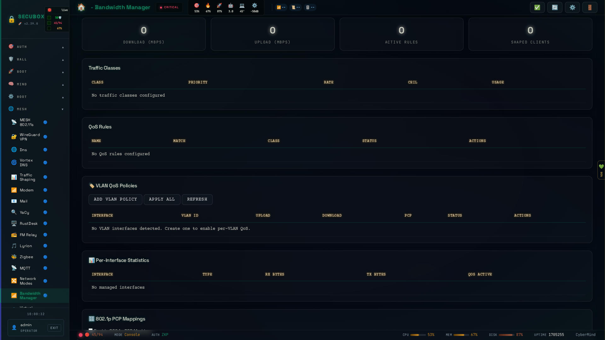

# 📊 QoS Manager

Quality of Service with HTB/VLAN

**Category:** Network

## Screenshot



## Features

- Bandwidth control
- VLAN policies
- 802.1p PCP
- Per-user limits

## Installation

```bash
# Add SecuBox repository
curl -fsSL https://apt.secubox.in/install.sh | sudo bash

# Install package
sudo apt install secubox-qos
```

## Configuration

Configuration file: `/etc/secubox/qos.toml`

## API Endpoints

- `GET /api/v1/qos/status` - Module status
- `GET /api/v1/qos/health` - Health check

## License

LicenseRef-CMSD-1.0 (Source-Disclosed License) — CyberMind © 2024-2026.
See [LICENCE-CMSD-1.0.md](../../LICENCE-CMSD-1.0.md).
