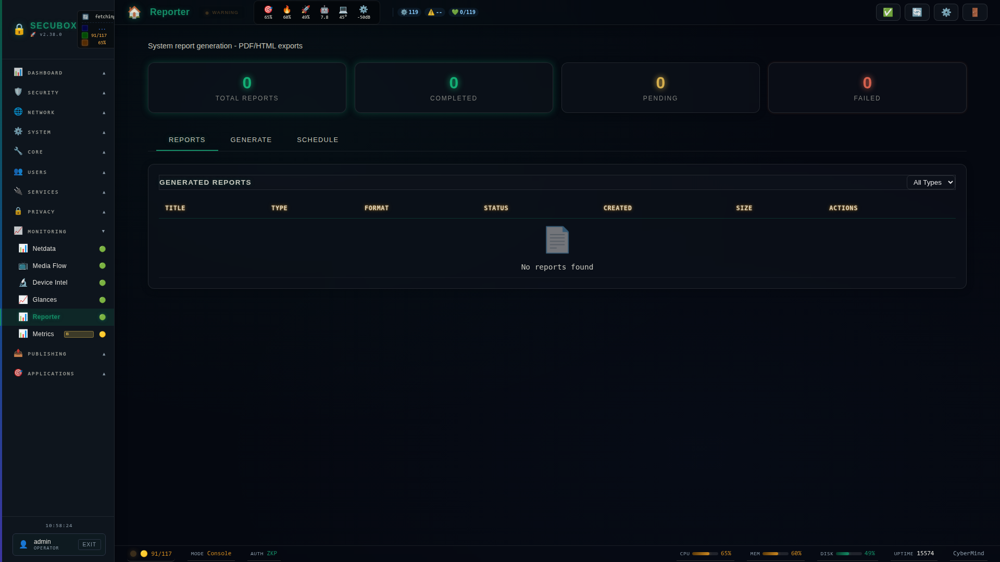

# 📊 Reporter

System reporting and analytics

**Category:** System

## Screenshot



## Features

- Reports
- Scheduling
- Export
- Email

## Installation

```bash
# Add SecuBox repository
curl -fsSL https://apt.secubox.in/install.sh | sudo bash

# Install package
sudo apt install secubox-reporter
```

## Configuration

Configuration file: `/etc/secubox/reporter.toml`

## API Endpoints

- `GET /api/v1/reporter/status` - Module status
- `GET /api/v1/reporter/health` - Health check

## License

MIT License - CyberMind © 2024-2026
