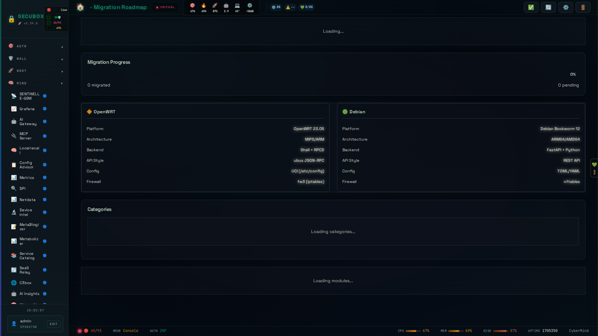

# 📋 Migration Roadmap

OpenWRT to Debian migration tracking

**Category:** Dashboard

## Screenshot



## Features

- Progress tracking
- Module status
- Category view

## Installation

```bash
# Add SecuBox repository
curl -fsSL https://apt.secubox.in/install.sh | sudo bash

# Install package
sudo apt install secubox-roadmap
```

## Configuration

Configuration file: `/etc/secubox/roadmap.toml`

## API Endpoints

- `GET /api/v1/roadmap/status` - Module status
- `GET /api/v1/roadmap/health` - Health check

## License

LicenseRef-CMSD-1.0 (Source-Disclosed License) — CyberMind © 2024-2026.
See [LICENCE-CMSD-1.0.md](../../LICENCE-CMSD-1.0.md).
