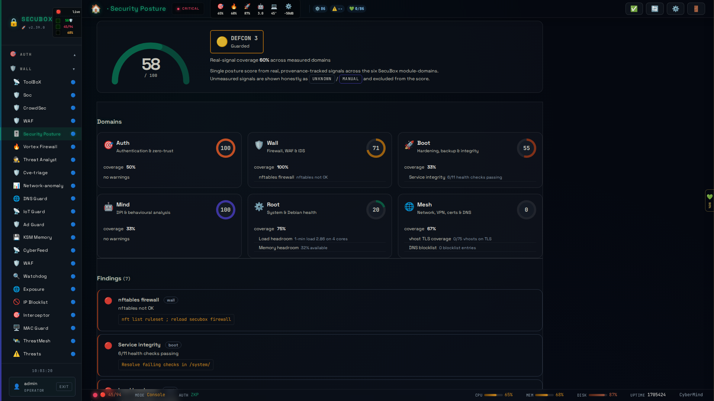

# 🎯 Security Posture

Honest board-truthful security scorecard

**Category:** Security

## Screenshot



## Features

- Scorecard
- Control checks
- Gaps
- Trend

## Installation

```bash
# Add SecuBox repository
curl -fsSL https://apt.secubox.in/install.sh | sudo bash

# Install package
sudo apt install secubox-security-posture
```

## Configuration

Configuration file: `/etc/secubox/security-posture.toml`

## API Endpoints

- `GET /api/v1/security-posture/status` - Module status
- `GET /api/v1/security-posture/health` - Health check

## License

LicenseRef-CMSD-1.0 (Source-Disclosed License) — CyberMind © 2024-2026.
See [LICENCE-CMSD-1.0.md](../../LICENCE-CMSD-1.0.md).
