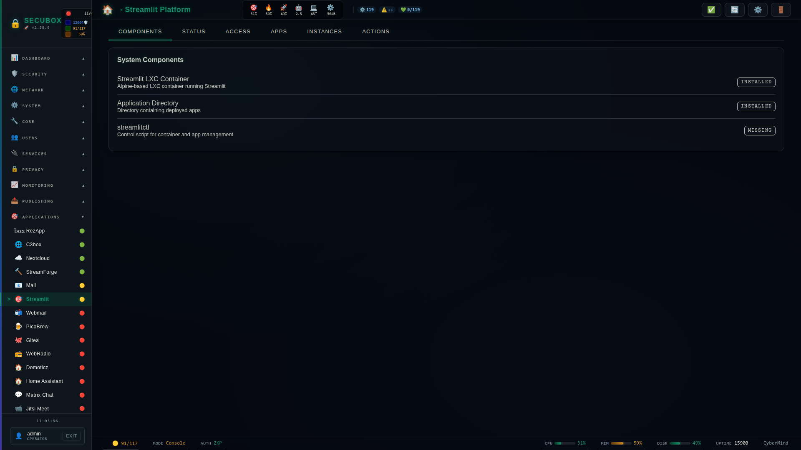

<!--
  SPDX-License-Identifier: LicenseRef-CMSD-1.0
  Copyright (c) 2026 CyberMind — Gérald Kerma <devel@cybermind.fr>
  Source-Disclosed License — All rights reserved except as expressly granted.
  See LICENCE-CMSD-1.0.md for terms.
-->

# 🎨 Streamlit

Streamlit app platform

**Category:** Apps

## Screenshot



## Features

- App hosting
- Deployment
- Management
- Logs

## Installation

```bash
# Add SecuBox repository
curl -fsSL https://apt.secubox.in/install.sh | sudo bash

# Install package
sudo apt install secubox-streamlit
```

## Configuration

Configuration file: `/etc/secubox/streamlit.toml`

## API Endpoints

- `GET /api/v1/streamlit/status` - Module status
- `GET /api/v1/streamlit/health` - Health check
- `GET /api/v1/streamlit/apps/audit` - Fleet-wide inventory (disk/declared/running), feeds the Mosaïque tab, cached every 5 min
- `POST /api/v1/streamlit/apps/{name}/wake` - Wake an idle-stopped app; also fires a lazy thumbnail capture if stale
- `GET /api/v1/streamlit/apps/{name}/screenshot` - Serve the conserved thumbnail (public, no JWT)
- `POST /api/v1/streamlit/apps/{name}/recapture` - Manually trigger a thumbnail recapture (detached, returns immediately)

Thumbnails are captured on event only (first registration, source update,
or a manual recapture) — never on a timer, and never for an app that isn't
already running. See `api/shots.py` for the capture orchestration and
`sbin/streamlit-shotter` for the detached capture process.

## License

LicenseRef-CMSD-1.0 (Source-Disclosed License) — CyberMind © 2024-2026.
See [LICENCE-CMSD-1.0.md](../../LICENCE-CMSD-1.0.md).
