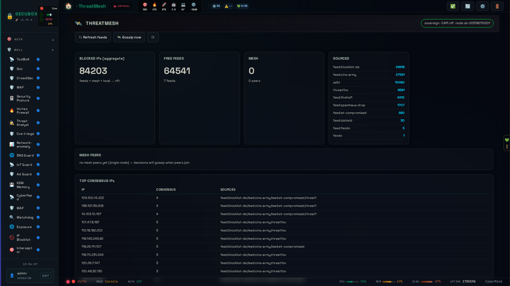

# 🕸️ ThreatMesh

Sovereign threat-intel mesh (CrowdSec CAPI replacement)

**Category:** Security

## Screenshot



## Features

- P2P intel sharing
- Sovereign feed
- Confidence gating
- Blocklist sync

## Installation

```bash
# Add SecuBox repository
curl -fsSL https://apt.secubox.in/install.sh | sudo bash

# Install package
sudo apt install secubox-threatmesh
```

## Configuration

Configuration file: `/etc/secubox/threatmesh.toml`

## API Endpoints

- `GET /api/v1/threatmesh/status` - Module status
- `GET /api/v1/threatmesh/health` - Health check

## License

LicenseRef-CMSD-1.0 (Source-Disclosed License) — CyberMind © 2024-2026.
See [LICENCE-CMSD-1.0.md](../../LICENCE-CMSD-1.0.md).
