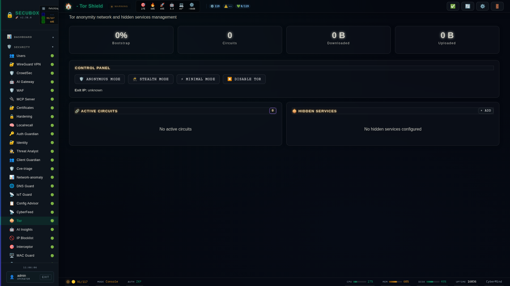

# 🧅 Tor Network

Tor anonymity and hidden services

**Category:** Privacy

## Screenshot



## Features

- Circuits
- Hidden services
- Bridges
- Transparent proxy

## Installation

```bash
# Add SecuBox repository
curl -fsSL https://apt.secubox.in/install.sh | sudo bash

# Install package
sudo apt install secubox-tor
```

## Configuration

Configuration file: `/etc/secubox/tor.toml`

## API Endpoints

- `GET /api/v1/tor/status` - Module status
- `GET /api/v1/tor/health` - Health check

## PAC .onion → Tor (client)

Configure le navigateur/OS en « URL de configuration automatique du proxy » :

    http://<box>/tor.pac

Le PAC dévie les `.onion` vers le SOCKS Tor du box (`192.168.1.200:9050`), tout
le reste passe en DIRECT.

**Firefox :** active `network.proxy.socks_remote_dns = true` (`about:config`),
sinon Firefox tente de résoudre le `.onion` en DNS local et échoue avant
d'atteindre Tor. Chrome fait le remote DNS pour un SOCKS5 issu d'un PAC par
défaut.

Le SOCKS est **fermé à l'extérieur** (`SocksPolicy` : LAN + wg-toolbox
uniquement) : ce n'est jamais un relais SOCKS ouvert.

## License

LicenseRef-CMSD-1.0 (Source-Disclosed License) — CyberMind © 2024-2026.
See [LICENCE-CMSD-1.0.md](../../LICENCE-CMSD-1.0.md).
