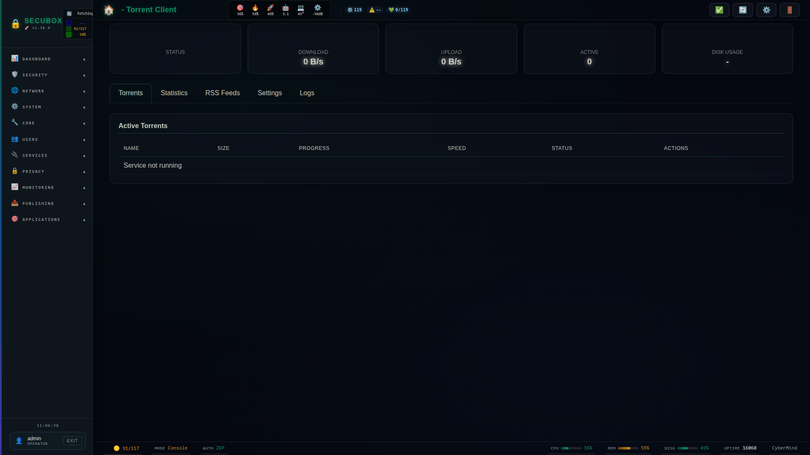

# 🌊 Torrent

WebTorrent streaming, LXC-native (v2.0.0). Paste a magnet and stream it in
the browser over HTTP Range while it downloads. Ephemeral by default, with
an optional Keep into a persistent library on `/data`.

**Category:** Media

## Screenshot



## Architecture

The hybrid WebRTC+BitTorrent engine (`webtorrent` + `fastify` +
`better-sqlite3`) runs isolated inside a dedicated LXC (`torrent`,
`10.100.0.160`). The host only ships:

- the public vhost `torrent.gk2.secubox.in` (nginx, proxies to the LXC's
  `:8090`, streamed via HTTP Range with no buffering),
- an nft egress visibility scope for the LXC's veth,
- `install-lxc.sh`, which provisions the container and deploys the app.

v1 (Transmission via Docker/Podman, host FastAPI on
`/api/v1/torrent/*`) was removed in 2.0.0 — see `debian/changelog`.

## Installation

```bash
# Add SecuBox repository
curl -fsSL https://apt.secubox.in/install.sh | sudo bash

# Install package
sudo apt install secubox-torrent
```

## Configuration

Configuration file: `/etc/secubox/torrent.toml` (LXC network, engine
`max_active`/`webrtc`, ephemeral retention `ephemeral_ttl_hours`/
`disk_floor_gb`). Edit then re-run
`/usr/lib/secubox/torrent/install-lxc.sh` to apply.

## License

LicenseRef-CMSD-1.0 (Source-Disclosed License) — CyberMind © 2024-2026.
See [LICENCE-CMSD-1.0.md](../../LICENCE-CMSD-1.0.md).
